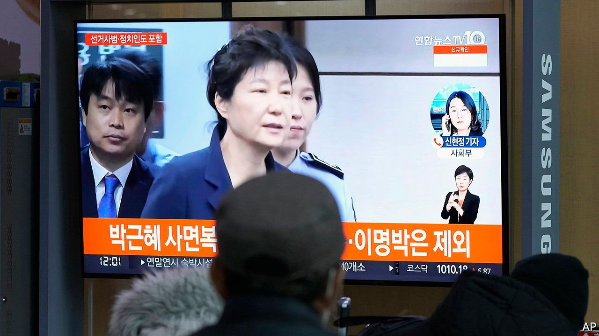

###### Merciful Moon

# A presidential pardon catches South Korea by surprise 

##### Moon Jae-in will release Park Geun-hye, his disgraced predecessor 

 

> Jan 1st 2022 

OFFICE WORKERS around Gwanghwamun Square in central Seoul breathed a collective sigh of relief just before Christmas. Ever since Park Geun-hye, a former president, was sent to prison for corruption and abuse of power in 2017 her supporters had been staging noisy protests in the middle of South Korea’s capital, calling for her release. Even after mass rallies were banned in a bid to stem the spread of covid-19, lone protesters with megaphones or speakers mounted on vans continued to make the rounds of the square. Now silence prevails. On December 24th Moon Jae-in, Ms Park’s successor as president, announced he would pardon her and set her free on New Year’s Eve.

Few observers expected Mr Moon to make that decision. The president, who has only a couple of months left in office before his successor is elected on March 9th, was swept into power in 2017 after months of protests against Ms Park’s administration. The protests, known as the candlelight movement, led to her being impeached as well as indicted for such offences as extorting bribes from conglomerates and pressing a university into admitting a close friend’s daughter.


When Mr Moon took office, he promised to honour the spirit of the movement and break with the old ways of the political establishment, including abandoning the custom of pardoning former presidents who had been convicted of corruption. He stuck to the promise for most of his term in office, pardoning people more sparingly than his predecessors.

Yet Ms Park’s deteriorating health and the approaching end of his term seem to have prompted Mr Moon to change his mind. His office said he hoped the decision would heal political divisions and help usher in an era of national unity, and asked those who opposed the pardon for their understanding, given Ms Park’s ailments.

As it turned out, the left-wing base in Mr Moon’s Minjoo Party showed little such understanding. Left-wing newspaper editorials and spokes people for organisations that led the protests against Ms Park accused him of betraying the candlelight movement. His party, which was apparently not privy to the decision before it was announced, issued a terse statement noting that pardons were the president’s prerogative. Lee Jae-myung, the Minjoo party candidate to succeed Mr Moon, who had been noisily against a pardon, said that while there was no point in opposing a decision that had already been made, Ms Park ought to apologise once more to those who were harmed by her crimes.

The conservative opposition welcomed the pardon. But it complained that Mr Moon had also released Lee Seok-ki, a pro-North Korean firebrand who was serving time for treason, and restored the civic rights of Han Myeong-sook, a former left-wing prime minister who served a two-year sentence for bribery from 2015 to 2017.

Despite the taint to Mr Moon’s legacy as the “candlelight president”, the political benefits for the outgoing president and his camp may well end up outweighing the costs of pardoning Ms Park. Reports of the disgraced former president’s ill health are credible; she is likely to remain in hospital for several weeks before being sent home. Had she died a prisoner on Mr Moon’s watch just a few weeks before the presidential election, the resulting outrage might well have tipped the scales against his party’s candidate.

Besides the fate of his political successors, Mr Moon may also have had his own future in mind. South Korean presidents often find themselves being investigated for corruption after leaving office. Lee Myung-bak, Ms Park’s predecessor, is in prison serving a long sentence for graft. Roh Moo-hyun, who preceded him, committed suicide shortly after leaving office, during a corruption probe into close aides and family members. Mr Moon’s efforts to curb the power of the prosecution service have not endeared him to prosecutors, one of whom is now the presidential candidate for the opposition. He may be hoping his successor remembers his act of mercy. ■

