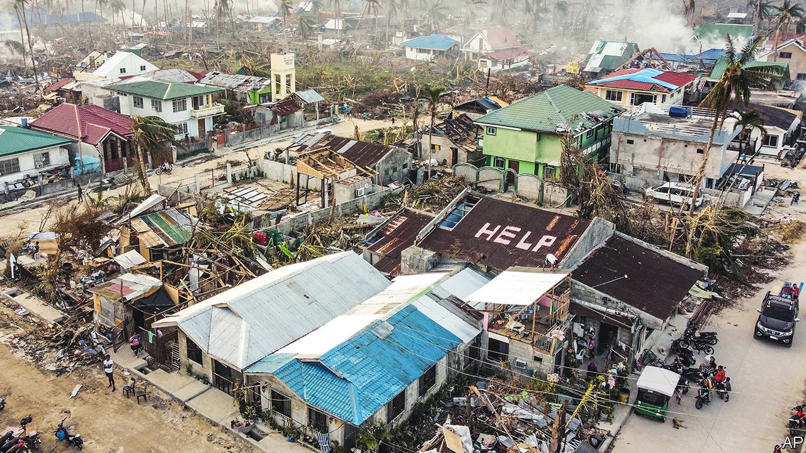

###### Prayin’ won’t do you no good

# Extreme weather in South-East Asia is a harbinger of worse to come 

##### A typhoon tears through the Philippines and epic floods submerge Malaysia 

 

> Jan 1st 2022 

ON DECEMBER 16TH Typhoon Rai made landfall in Siargao in the south-eastern Philippines. With sustained winds of 195kph and gusts of up to 240kph, the storm barged westward and slightly northward, the eye making eight more landfalls in the Philippine archipelago, where it is known as Typhoon Odette, before sweeping out over the South China Sea, spinning just as violently as when it first hit land. It was the strongest storm to batter the Philippines in 2021.

The blasts of wind and the storm surges they whipped up onto the seashore, along with drenching rain that turned watercourses into torrents, flooding lowlands and setting off landslides, combined to gouge out a path of death and destruction across the southern and western Philippines. Half a million homes were damaged: flimsily built buildings were blown down; more sturdy structures had their roofs wrenched off. Trees were uprooted, crops flattened and livestock killed. Fishing boats were smashed. Bridges were washed away and roads covered in debris. Water, power and phone lines were cut off.


By December 29th Typhoon Rai had disrupted the lives of 4.2m people. The storm had spurred more than 720,000 people to flee their homes, and 560,000 were still displaced. Nearly 400 people had been killed and more than 1,100 injured. Another 83 remained missing. Official estimates put the cost of damage to infrastructure at 16.7bn pesos (about $330m) and to agriculture at 5.3bn pesos.

Meanwhile, Malaysia is experiencing its worst flooding in decades. Torrential rain since December 16th has caused rivers to overflow their banks, leaving vast tracts submerged, houses damaged and people stranded without food, medical attention or, ironically, water. The floods have left nearly 70,000 people displaced in 430 evacuation centres in eight states and had killed at least 48 by December 28th. An official at the environment ministry described the downpour as something that “only occurs once every hundred years”.

The two events are not directly related. The floods in Malaysia were caused by a mix of a tropical depression, the seasonal monsoon and Typhoon Rai, Azizan Abu Samah, a meteorologist at Universiti Malaya in Kuala Lumpur, told ChannelNewsAsia, a regional news website and channel.

But Philippine typhoons and Malaysian floods are connected in that both are likely to become more intense. As climate change causes temperatures to rise, the warming atmosphere will hold more moisture, leading to more rain and making floods more common. Typhoons, which draw their strength from energy stored as heat in the oceans below them, will intensify too: most of the heat gained by the planet as a result of climate change is stored in the oceans. The latest report by the Intergovernmental Panel on Climate Change, a UN-backed body, found that it was likely that the proportion of storms in categories 3, 4 and 5 has increased over the past 40 years. The trend is projected to worsen as the earth warms.

Yet the reaction in both countries has, depressingly, centred more on political point-scoring than preparing for future disasters. In Malaysia an opposition lawmaker claimed that a motion to discuss the floods in the lower house had been rejected. The speaker denies ever having received such a motion in the first place.

In the Philippines Rodrigo Duterte, the president, visited Siargao and warned locals not to trust politicians who visited to be photographed against the backdrop of destruction and suffering. (An election to choose his successor is due in May.) He jokingly urged displaced islanders to squat on private property and scavenge wood from coconut trees felled by the storm to build new homes. His speech drew cheers and laughter from his audience.

Yet in all likelihood, Filipinos living along the path carved by Typhoon Rai will soon set about doing just what Mr Duterte suggested, and what many in the south have done before: rummaging through the debris for materials to build new homes strong enough to last only until the next typhoon comes along to blow them down. ■

