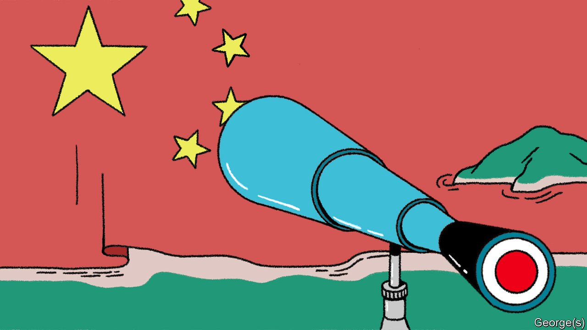
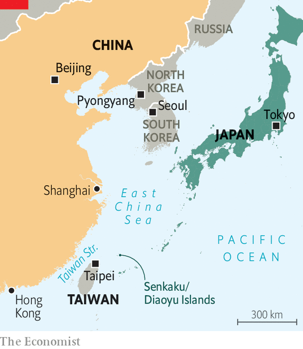

###### The view from Tokyo

# How Japan sees China 

##### Mighty, but also dangerously overconfident 

 

> Jan 1st 2022 

THE FIRST reliable records of an official mission from Japan to China date to 238AD, when Himiko, a Japanese queen, dispatched a delegation to China’s Wei kingdom, offering as tribute ten slaves and two 20-foot-long textiles. By the 7th century the Yamato, a clan that ruled much of Japan at the time, was regularly sending envoys with tributes to the Sui and Tang courts. Japan adopted China’s system of writing; Japanese monks and scholars absorbed China’s religions.

Japan has remained a close, if wary, observer of its bigger neighbour over the centuries. In the late 1970s and 1980s, motivated in part by guilt over wartime atrocities, Japan helped China modernise. Japanese firms were among the first to tap into its growing market. Japanese leaders also raised early alarms over Chinese expansionism, especially after the two clashed between 2010 and 2012 over some uninhabited rocks in the East China Sea, which Japan calls the Senkaku Islands and China calls Diaoyu. “We warned the US: this is not a small compartmentalised issue between Japan and China, but a sign of a growing power in the region,” says Sasae Kenichiro, a former Japanese ambassador to America.


Such views fell on deaf ears in America and Europe, where leaders were focused on the benefits of integrating China into the global economy. Yet in recent years Chinese aggression in Hong Kong, repression in Xinjiang and sabre-rattling around Taiwan have made many Western governments more suspicious, too. As they enter an era of competition with China, Japan’s perspective is being sought anew. Some prominent American and British officials have begun to talk of bringing Japan (and others in the region, including South Korea) into the Five Eyes, an Anglophone intelligence-sharing network, in the hopes of improving their understanding of China. “Fifteen years ago, if I talked to [Western colleagues] about the negative aspects of China, I was treated as a right-wing, China-hating, Japanese scholar,” says Matsuda Yasuhiro, a China specialist at the University of Tokyo. “Now people listen to us.”

 


Japanese observers of China now speak of three worrying trends. The first is Chinese overconfidence. “They truly believe that the West is in decline,” says Kanehara Nobukatsu, a former Japanese deputy national-security adviser. Japanese scholars reckon that Chinese leaders are not posturing when they claim their political system is superior to America’s messy democracy. Some notice worrying parallels with Japan’s own cocksure stance in the run-up to the second world war. “We are always reminding them of our past mistakes before the war,” says one former senior Japanese diplomat. “They say, ‘Are you joking, we are totally different.’ But in our eyes there are increasing similarities.”

The second is a shift from collective to individual leadership under Xi Jinping, China’s president. Japanese officials fret that in its dependence on the decisions of one man, China is becoming more like North Korea. Indeed, Mr Xi, in this view, may be even more isolated than the Swiss-educated Kim Jong Un, North Korea’s dictator. “Xi doesn’t know the free world at all—I’m sure that Kim knows our world better,” says Mr Kanehara.

Lastly, there is the state of the Chinese economy. Mr Xi’s recent crackdown on large private companies amid a push for “common prosperity” has left many in Tokyo worried about the future of Chinese growth. “The Chinese are coming to us and encouraging us to invest more, they are saying don’t miss the boat,” says an adviser to a major Japanese bank. “But when the Chinese say this, it means they have a problem.” China’s support for overseas infrastructure projects through its signature Belt and Road Initiative has dropped dramatically in recent years—a sign the Chinese economy faces “serious problems” at home, argues Maeda Tadashi, governor of the Japan Bank for International Cooperation, the state-owned overseas development-finance body.

A slowdown in China would have drastic implications for Japan’s own economy: China sucks in 22% of its exports, more than any other country. Japanese China-watchers fear it may also push Mr Xi to divert attention from a faltering economy by stirring up nationalist passions with adventurism around Taiwan or the Senkaku/Diaoyu Islands. Still, many Japanese scholars remain more sceptical than those in America that war over Taiwan is imminent, says Aoyama Rumi of Waseda University in Tokyo. Japanese experts assume Mr Xi will not endanger his own power by launching a risky all-out invasion of Taiwan’s main island any time soon.

As elsewhere, military and security types tend to be more worried than political analysts about Mr Xi’s possible willingness to use force to take Taiwan. Yet even they tend to be more equivocal than their American counterparts. “The timeframe could range significantly,” says General Yoshida Yoshihide, chief of staff of Japan’s ground forces. “It’s difficult to say something definite, like ‘within six years’,” as one American admiral suggested to Congress in 2021. Japanese observers worry more about “grey zone” activities that fall short of a full-on invasion, from cyber attacks to incursions into Taiwan’s waters by the Chinese coast guard or a land-grab of Taiwan’s outlying islands.

Those worries have fuelled a shift in Japan’s own China policy. Before the pandemic, Japan and China had been enjoying a period of relative bonhomie. Abe Shinzo, Japan’s prime minister at the time, sought to stabilise relations after the Senkaku/Diaoyu clashes, and invited Mr Xi for a state visit in April 2020. Covid-19 halted those plans. Kishida Fumio, Japan’s new prime minister, has tried to tread carefully, but has nonetheless taken several hawkish early steps. His cabinet includes a new minister for “economic security”, charged in part with lessening reliance on China for critical supplies. He also appointed Nakatani Gen, a former defence minister known as a China hawk, as a human-rights tsar, with an eye towards taking a tougher stance on Chinese abuses in Xinjiang and Hong Kong. A stimulus package passed in November included an unusual ¥774bn ($6.8bn) earmarked for additional defence spending to accelerate purchases of new missiles and aircraft.

In 2022 Japan and China will mark the 50th anniversary of the normalisation of post-war relations. There is little appetite for celebrations. In 2021 some 71% of Japanese said China posed a “threat”, up from 63% in 2020. Likewise, 66% of Chinese had negative views of Japan, up from 53%.

The two militaries agreed this week to improve their communications channels—a welcome step, but also a sign of how worrying tensions have become. Mr Kishida has demurred at a visit by Mr Xi, while stopping short of officially rescinding the invitation. He also decided that Japan will not send any cabinet ministers to the Beijing Olympics in February, only a handful of sporting officials. Japan will not call the move a “diplomatic boycott”, as America and other allies have. But no one in China will mistake the slimmed-down delegation for the tributary missions of yore. The next phase of Japan’s and China’s long history is likely to be turbulent. ■

