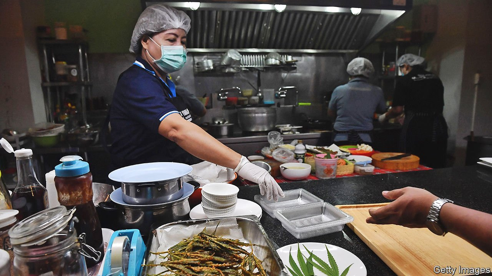

###### Pot cuisine

# Thai restaurants are cooking with cannabis 

##### THC is the new MSG 

 

> Jan 1st 2022 

BAN LAO RUENG does not resemble a den of iniquity. A two-hour drive from Bangkok, the Thai capital, the restaurant caters to families and old folk. Gauzy curtains frame the windows and doilies decorate bags of cookies on sale at the counter. The menu features such classics as tom yum soup and khanom pang na moo (crispy pork toast). Yet a closer look reveals the presence of an illicit ingredient: cannabis.

Illicit, that is, until recently. For decades Thailand, like many other Asian countries, harshly punished anyone caught with the demon weed. But the government has turned over a new leaf. In 2019 the country became the first in Asia to legalise pot for medical purposes. A year later the government announced that parts of the plant containing less than 0.2% THC, the psychoactive compound in cannabis, could legally be used in cosmetics and food. In November last year Ban Lao Rueng became the first restaurant in the country to serve cannabis-infused dishes. At least a dozen more have since sprung up.


What accounts for the reversal? There is growing awareness in government that Thailand’s punitive drug-control regime is ineffective. Relaxing cannabis laws was also politically expedient. In order to make up the numbers to form a coalition, Thailand’s ruling party needed the support of Anutin Charnvirakul, the leader of a small party that campaigned to have the green stuff partially decriminalised. He was appointed deputy prime minister and health minister, and allowed to keep his promise.

There is a long tradition in Thailand of cooking with cannabis. Thais began mixing the plant, which is native to Asia, into herbal remedies and then food centuries ago. Even after it was criminalised in 1934, many Thais carried on cooking with it. Chakree Lapboonruang, a 30-something Bangkokian, says his father regularly tossed cannabis leaves into the pad gaprao (basil chicken stir-fry) he cooked for the family. “When you have something tasty, [cannabis] makes it better,” Mr Chakree says. “It’s just like MSG, except it’s natural.”

Food-and-drink companies are seeing green. In April Ichitan, Thailand’s biggest teamaker, launched two drinks infused with terpene, a compound responsible for cannabis’s pong. The Pizza Company, a Thai fast-food chain, recently introduced “Crazy Happy Pizza”; its toppings include one deep-fried cannabis leaf. Weed is good for business, says Mr Chakree, an owner of Kiew Kai Ka, a trendy restaurant in Bangkok. There is not enough THC in the food to make people high. Yet when customers eat dishes from his restaurant’s cannabis menu, he laughs, they “get hungrier”.

