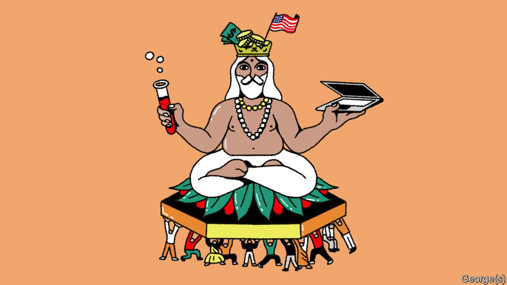

###### Banyan

# Why Brahmins lead Western firms but rarely Indian ones 

##### India’s big businesses are dominated by traditional merchant and trader castes 

 

> Jan 1st 2022 

WHAT DO THE chief executives of Adobe, Alphabet, IBM, Match Group (which owns Tinder), Microsoft, OnlyFans (a subscription service featuring content creators in various stages of undress) and Twitter have in common? All seven happen to be of Indian origin. That is not surprising considering the abundance of subcontinental talent drifting into Western companies: in recent years Indians have been granted well over two-thirds of America’s H-1B visas for highly skilled workers.

But these particular bosses share something else, too. They are all top-caste Hindus. Four are Brahmins. Traditionally associated with the priesthood and learning, this pinnacle of the caste pyramid’s 25,000-plus sub-groups makes up just 50m or so of India’s 1.4bn people. The other three CEOs come from castes traditionally associated with commerce or “scribal” professions such as book-keeping. These groups account for a similarly slim section of the pyramid’s capstone: the 30% of Hindus that the government classes as “forward” castes, as opposed to the 70% who fall among such categories as “backward” or “scheduled” castes (Dalits, formerly known as untouchables) and “scheduled tribes”.


And that is surprising, because across India’s own boardrooms it is not Brahmins who predominate. Members of the former priestly caste tend to excel less in business than in fields such as academia, science and the law. A quarter of Supreme Court judges in the past 15 years have been Brahmins, and three of India’s four Nobel prizes in science have been won not just by Brahmins, but by a smaller subset of Tamil Brahmins.

India’s business bigwigs have instead come largely from traditional trading communities of the Vaishya or merchant castes. Consider the first 20 entries in the Forbes list of India’s wealthiest in 2021. Twelve happen to be Banias, a Vaishya sub-caste of Hindu or Jain moneylenders and traders from north-western India that accounts for less than 1% of the country’s population. Five of those Bania billionaires also happen to be Marwaris, a tightly intermarried group of merchant families, originally from Rajasthan, that includes many of India’s earliest industrialists.

Of the non-Banias, nearly all come from groups with a similarly long association with commerce. Three of the top 20 are Parsis (Zoroastrians), a tiny minority that has long packed an oversized entrepreneurial punch. Among them is Cyrus Poonawalla, whose Serum Institute of India is the world’s biggest maker of vaccines. The sole Muslim on the list (and India’s most generous philanthropist), Azim Premji, also comes from a traditional merchant group, the Khojas, Nizari Ismaili Shias originally from Gujarat. Only one, India’s third-richest man, Shiv Nadar, is from an officially “backward” class, but his rural South Indian Nadar caste has been upwardly mobile for a century, having long ago shed its traditional association with tapping palm wine.

The hold of traditional merchant groups extends deeper into India’s business world than the top tier. A study from 2010 of the country’s 1,000 biggest companies found that some 93% of board members came from “forward” castes. Fully 46% were Vaishyas. Another study in 2016, looking at a database of 1,530 listed companies, revealed that just five upper-caste, mostly Vaishya, surnames accounted for a tenth of 10,078 company directors. After eliminating repetitions and adjusting for varied spelling, the researchers found that some 500 were either Agrawals or Guptas, among the two most common Bania surnames.

So why are Indian Brahmins doing better in business abroad? One answer is that because business in India favours those with established networks, talented Brahmins have tended to emigrate. A tradition of bookishness has made it easier for them to pass exams and enter the countries with the greatest opportunities. Affirmative action in India has pushed them away, too. When the mother of Kamala Harris, America’s vice-president, was seeking a college education, quotas for lower castes had made it far harder for Tamil Brahmins to gain admission. So she applied for a scholarship in America, earned a PhD and became a cancer researcher.

If India has conferred on other countries an immense amount of talent, it has also exported some of the most troubling aspects of caste. For the past 18 months a California court has been hearing a suit filed by a Dalit employee at a Silicon Valley firm, demanding compensation for alleged discriminatory treatment by higher-caste bosses.

Read more from Banyan, our columnist on Asia:

 (Dec 18th) (Dec 11th)

 (Dec 4th)

