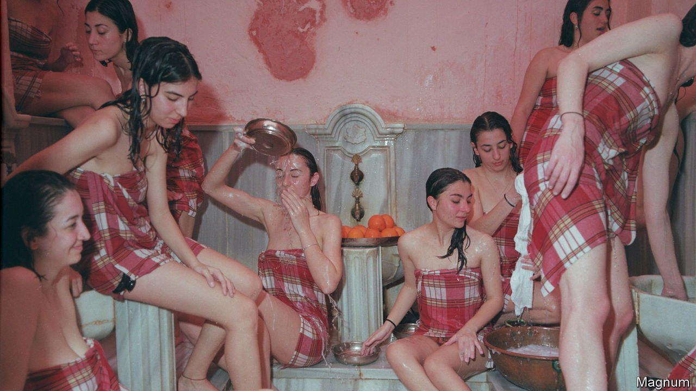

###### Bathhouse culture

# Covid-19 has imperilled the hammams of north Africa and the Levant 

##### To survive, the communal bathhouses must draw deep on a venerable past 

 

> Jan 1st 2022 

YENI HAMMAM in Antakya, Turkey’s southernmost city, is hard to find. Would-be bathers must search the maze-like streets for the tell-tale arched entrance. Locals can help; after all, the hammam has been there for over 300 years.

The name means “new bath”, and Yeni Hammam is indeed much newer than other bathhouses in Antakya, some of which date back to the Mamluks. Inside, the architecture is lofty and monumental. Customers strip off in the entrance hall, before beginning the ritual of steam, scrub and oil massage, progressing through three marble chambers of gradually increasing humidity. Light from star-shaped chinks in the domed ceilings filters through the vapour. Old hands use the shafts cast on the walls to tell the time of day.


Like many cities, Antakya (Antioch in antiquity) once boasted many more hammams, and before that, lavishly mosaicked Roman baths. Over 2,000 years communal bathing never went out of fashion. Now, though, the tradition is under threat. Yeni is one of only four functioning hammams in Antakya—and in March 2020 it shut for the first time in living memory. Across north Africa and the Levant, from Morocco to Istanbul, covid-19 closed historic bathhouses. Not all have reopened. To survive, they must draw deep on a venerable past.

Historically, hammams fulfilled a practical function as communal washing facilities. They were a fixture of the Islamic urban landscape, built close to mosques and with similar architecture—a place to purify the body before focusing on the soul. Strictly segregated by gender, under Ottoman rule hammams became hubs for business, socialising and gossip. They were vital for women in times when they could not meet freely in public. As Lady Mary Wortley Montagu, a British traveller, rhapsodised in the early 18th century, “’tis the women’s coffee-house, where all the news of the town is told [and] scandal invented”.

Mariem, a Tunisian student, affirms that, before the pandemic, she and her pals would visit the hammam about once a month for dedicated girl time: wrapped in foutas (linen towels), they ate oranges and laughed in the steam. For most clients, the trip is now a treat not a necessity. Bathing in the Hammam Nur al-Din, one of the oldest in Damascus, is a retro thrill, says Bashar, one of its erstwhile patrons. Besides the steam and the massage, “I connect with my roots.” His forebears “all washed on these same stones, under these same domes”.

When governments forced hammams to close in 2020, the copper boilers simmered down and ran dry. Even between lockdowns, fear kept people away—especially the elderly, often among the most dedicated clients, having grown up with the tradition and benefiting most from assisted washing. Tourists vanished. Even the great hammams of Istanbul felt the pinch. Many operators feared the worst.

But though the pandemic accelerated the decline of hammams, it began much earlier. Since the widespread advent of domestic hot water 70 years ago, their utility and profits have been eroded. Only a few of the poorest clients still rely on them for routine washing; the wealthy have largely forsaken them for Western-style spas. Telephones and the internet undermined their social purpose. In the 20th century many closed across the Middle East (occasionally becoming museums). Of those that survived these changes—as well as wars, earthquakes and revolutions—some have been finished off by the coronavirus.

Legend has it that Cairo once boasted a hammam for each day of the year; today it has fewer than a dozen. Of the 50 in the ancient Medina of Tunis in the 19th century, only half cling on. In Damascus two-thirds have closed since the 1940s. A handful operate in the whole of Lebanon. In Turkey hammam culture remains strong, but the downturn is showing. Yeni Hammam is clean but crumbling. Amid the trickle of water, the eerie green hue of the peeling plaster suggests an underwater cave.

And yet in places such as Tripoli in northern Lebanon, the steam still rises. A worker at Hammam el Abed confides that it never closed during lockdown. (The steam kills the virus anyway, he insists.) A fuel and electricity crisis had left many Lebanese without hot water at home—but hammams elsewhere are reviving too. In Antakya attendance is growing as temperatures fall and vaccination rates increase.

One aspect of hammam culture proving resistant to the pressures of both modernity and covid-19 is its role in wedding rituals. Traditionally, brides bathed before weddings, and grooms’ mothers came to inspect them: it might be the only chance to see them unveiled. Recently Yeni Hammam hosted a modern-day bridal party. A group of 30, including pensioners and babies, danced in sodden slips and towels, beating drums and singing in the tepid chamber, before piling into the steam room for a scrub by an attendant. (These can be eye-watering: in Syrian Arabic, the word for the scrub— takyees—is also used when the regime snatches someone for interrogation.) Aunts washed their nieces’ hair amid a cacophony of chatter. In the cooling room, picnic rugs were laid out on the central marble slab.

Bridal parties are an example of the intergenerational socialising hammams have always hosted: mothers brought daughters to the baths, where they could observe the bodies of other women at different stages of life, unselfconscious and unposed. Today these parties, and the male equivalents, are a vital part of both tradition and modern business plans—as, against the odds, enterprising hammams struggle into a post-covid world. No longer an essential part of daily life, they can still connect bathers to their heritage, their cities and a deep part of their identity, which the steam brings out of their pores. ■

