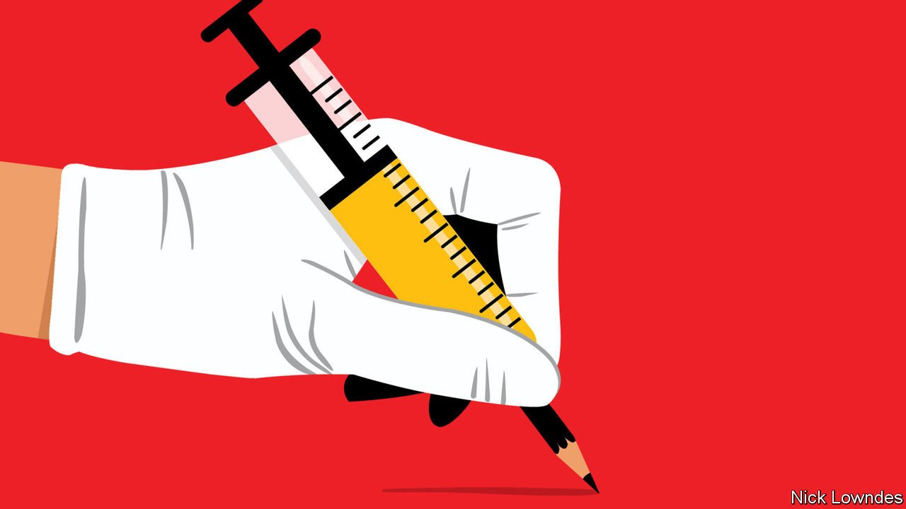

###### Johnson

# What is The Economist’s word of the year for 2021? 

##### Our choice honours scientific ingenuity and edges out financial jargon and political buzzwords 

 

> Jan 1st 2022 

IF 2020 WAS the year of the covid-19 explosion, 2021 will go down as the one in which the world struggled to get back to normal. The words of the year—chosen by dictionary publishers, other linguistic outfits and sometimes this column—reflect the disconcerting mix of familiarity and strangeness.

Getting back to business meant, for some, returning to the dreariness of politics. Dictionary.com chose allyship as its word of the year, to describe the practice of people outside oppressed groups aiding and trying to understand those in them. Some have detected and decried woke-washing, the ruse of polishing a brand—usually a company’s—by talking allyship while doing the opposite. Woke-washing is a mutation of the older virtue-signalling. Signalling virtue is no bad thing, but the phrase has come to mean merely parading purity and doing little.


For others, “back to business” was more literal. The economy generated several contenders for the word of 2021. In the traditional economy, inflation was the talk of central bankers and commentators, and transitory became the buzzword associated with it—until America’s Federal Reserve abruptly stopped reassuring people that it would soon pass. People who had never thought much about supply chains began doing so as they were disrupted worldwide.

But nontraditional finance produced more new words—or new uses for existing ones—than the boring old economy. DeFi, or decentralised finance, is the widest term for a group of phenomena including blockchains, cryptocurrencies and non-fungible tokens or NFTs, a kind of title deed over a digital asset such as an artwork. (Collins, a dictionary publisher, chose NFT as its word of the year.) When the parent company of Facebook changed its name to Meta, the metaverse, a parallel digital reality in which users play and work—and can buy and sell in cryptocurrencies—shot up in online searches.

DeFi jargon only gets weirder. Stonks and hodl are jokey misspellings for stocks and hold; stonks can be a one-word commentary on market gyrations, hodl an expression of willingness to hang on to crypto-assets even as prices drop. Enthusiasts add laser eyes to their avatars on Twitter, representing their laser focus on getting rich with crypto, and talk of diamond hands, meaning unwillingness to sell in a panic (the opposite of paper hands). They are sure their assets are going to the moon—a catchphrase invariably followed by two rocket emoji.

Those who don’t get it are right-clickers: failing to grasp the worth of things like NFTs, they think they can right-click and save a digital image on their computer with the same value. Crypto-adepts revel in obscurity. Take one website’s welcome: “ $WAGMI embodies the heart and soul of diamond handed apes. No plebs, no jeets, and no rugs—just moon, ser.”

But the year’s most significant words were once again covid-related. A pingdemic, unleashed by Britain’s track-and-trace app notifying countless people that they had to self-isolate, showed the frustrating shortcomings of technological fixes. Variant made its way into everyday parlance, as the world started learning the Greek alphabet. Delta rampaged in the middle of the year, and the highly contagious Omicron was on everyone’s lips as it ended—albeit with some confusion about how to pronounce it. While some English-speaking classicists put the stress on the second syllable, most people converged on the first syllable favoured by the media (which is closer to how modern Greeks say their 15th letter).

Omicron means “little o”, in contrast to omega, “big o”, the final letter of the Greek alphabet. Sadly, even the Omega variant is unlikely to be the last. But Johnson’s word of 2021 is a brighter one. Oscar-hopeful producers like to release their films at the end of the year, the better to make them fresh in voters’ minds at selection time. But the most important word of the past year came right at the start. It is not a new word, but unquestionably 2021’s most resonant. Derived from the Latin vacca for cow, and named after an early example used to treat cowpox, vaccines finally bent the curve of the covid pandemic.

With frequent use comes change: vaccine was shortened to vax. That can be used as a verb, especially in participle form (vaxxed), and has spawned variations including double-vaxxed and anti-vax, and portmanteaus like vaxophobia or vaxication (for people’s first trip after getting their jabs). More variations are sure to come in 2022, much like new vaccines themselves—another testament to human irrepressibility.

Read more from Johnson, our columnist on language: (Nov 27th 2021)

 (Nov 13th 2021) (Oct 30th 2021)

