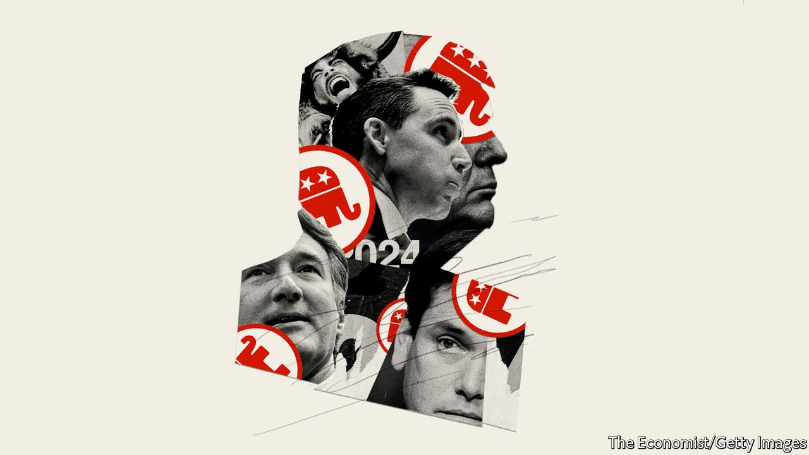
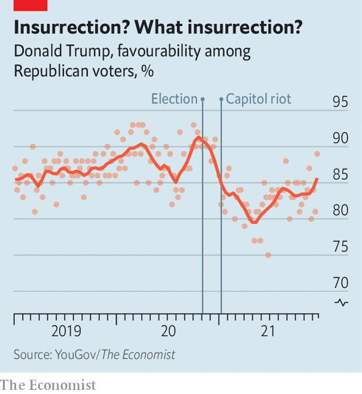
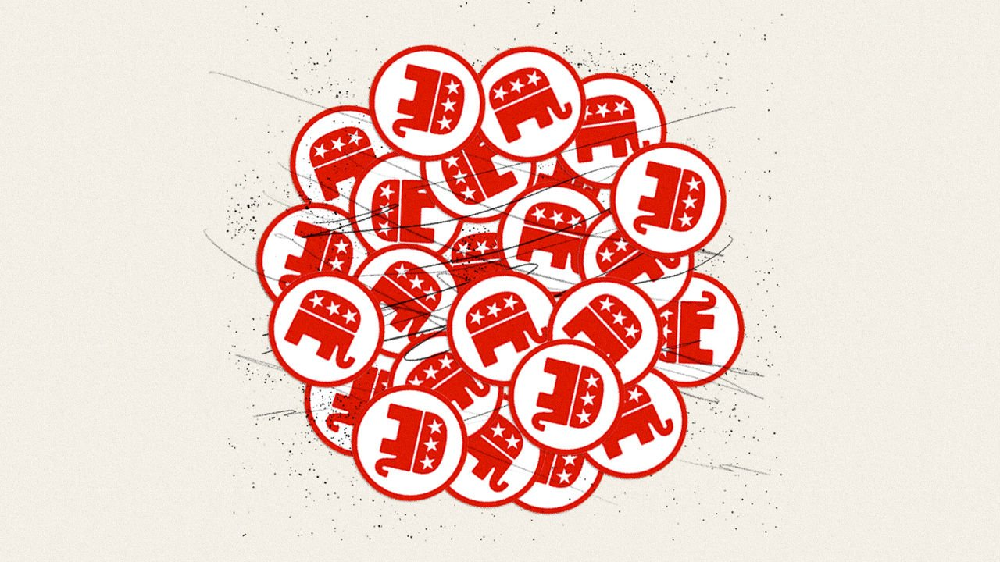

###### The nasty new GOP

# The Republicans are still Donald Trump’s party, and they can still win 

##### Asymmetric polarisation is a powerful thing 

 

> Jan 1st 2022 

DICK CHENEY, Wyoming’s sole member of the House of Representatives during Ronald Reagan’s presidency, was rarely inconvenienced by its voters. In his memoirs, the former vice-president described a typical campaign interaction in the deeply conservative state. “An old cowboy at the bar looked me over and asked, ‘Son, are you a Democrat?’ I said, ‘No sir.’ ‘Are you a lawyer?’ he asked. I said nope, and he said, ‘Then I’ll vote for you!’”

When Mr Cheney’s daughter and political mini-me, Liz Cheney, decided to contest her father’s old seat in 2016 she had even less trouble. She won over 60% of the vote, despite having a law degree. But Wyoming conservatives have lately adopted a new political standard—Do you agree with Donald Trump that the general election was stolen?—which she has flunked.


A vocal critic of the former president’s Big Lie from the start, she was one of ten Republican House members who voted to impeach him over the attack on the Capitol it inspired. “Republicans must decide whether we are going to choose truth and fidelity to the Constitution…[or] abandon the rule of law,” she wrote after he was exonerated by Republican senators. Even after she received death threats and was demoted from the party leadership, she held firm.

It was an unprecedented stance. Some senior Republicans, such as Mitt Romney, a senator from Utah, have selectively criticised Mr Trump. Others, such as Jeff Flake, a former senator from Arizona, have quit politics because of him. Ms Cheney was the first to plant her flag and invite other conservatives to rally to it. After Mr Trump endorsed a primary challenge to her by Harriet Hageman, another lawyer, Ms Cheney tweeted: “Bring it”.

Not won, not done

Wyoming’s Republican primary is more than seven months away. But already it looks as if the Cheney dynasty is over. “I’ve never seen a politician hated in her own state as much as she is,” says a veteran Republican strategist. Ms Cheney has been expelled from the state Republican Party and hardly appeared in public in months. The biggest cheers at Wyoming’s State Fair Parade last August—a great family occasion over which a Cheney has often presided—were for a hot-rodded car with “Fuck Liz Cheney” daubed on the windscreen. Backed by a team of Trump operatives, Ms Hageman is touring the state to crowds chanting: “Trump won, Liz Cheney done!” The only way she may be able to avoid that fate is if Wyoming’s beleaguered Democrats turn out in the Republican primary to save her.

Immediately after the insurrection of January 6th 2021, during which a Trumpist mob occupied the Capitol for four hours, it was briefly possible to imagine Mr Trump’s party ditching him. Even Kevin McCarthy, the invertebrate Republican House leader, acknowledged Mr Trump’s “responsibility” for violence that claimed five lives on the day, would claim another four in police suicides and saw a Confederate flag paraded through the Capitol. But Mr McCarthy turned tail barely a week later, with most elected Republicans in hot pursuit. Mr Trump’s lock on the party now appears as strong as ever, and not despite his Big Lie but because of it.

The fiction that Democrats stole the election has become the main instrument of his grip. Over 70% of Republican voters believe it—a number that has hardly changed since the election, despite no supporting evidence having emerged from the many Republican-funded vote audits and legal challenges. Like enraptured millenarians checking their watches as they scan the night sky, over a quarter of Republicans were convinced Mr Trump would be reinstated by the end of 2021.

Most of their elected representatives know all this to be as nonsensical as the idea that covid-19 vaccines are socialist mind-control, or the QAnon fantasies that socialist paedophiles run Washington, which the millenarians also believe. “There weren’t thousands upon thousands of under-age voters and dead people who voted,” says Brad Raffensperger, the Republican secretary of state of Georgia, who was asked by Mr Trump to falsify the state’s election results. “That stuff was just spun up out of whole cloth.”

Yet few Republican politicians dare acknowledge this reality. Mr Raffensperger and his family have received many death threats, as have the other nine House Republicans who voted with Ms Cheney to impeach Mr Trump. At least two, Anthony Gonzalez and Adam Kinzinger, are leaving Congress (“Two down, eight to go!” the former president responded). The rest face Trump-backed primary challengers, as does Lisa Murkowski of Alaska, the only one of the seven Republican senators who voted to convict him who is running for re-election this year.

Arm-twisting and culture-warring

A year after the insurrection, three things can be said about the Republicans with confidence. First, though Mr Trump has not said whether he intends to run for president again in 2024, it looks fairly likely that he will and even likelier that the party will nominate him if he does. Second, even in the absence of a new Trump candidacy, the party will not revert to anything like its pre-Trump state. Grievance and conspiracy-theorising have seized the Republican base to an extent that no mainstream conservative—a phrase that still describes most of the party’s leadership—appears able to confront. Third, the party retains the support of roughly half the electorate. Given Mr Biden’s unpopularity and the narrowness of the Democratic majorities, that should be sufficient for the Republicans to win back at least one congressional chamber in November, and maybe both. With or without the former president at the helm the party will remain both extremist and highly competitive.

It is by no means clear that Mr Trump will run. The Trump Organisation, his main business vehicle, is under criminal investigation. He will be 78 in November 2024. Some indications that Mr Trump will run—his relentless fundraising, rallies in Iowa and Ohio and teasing statements—should be treated sceptically. Having raked in well over $100m from this routine he will keep it up no matter what.

But other indicators are more persuasive. He has arm-twisted potential rivals to get them to say they would not stand against him. Nikki Haley, a former governor of South Carolina, and Tim Scott, a senator from South Carolina, have done so publicly. Governor Ron DeSantis of Florida is said to have given that assurance in private. Under Bill Stepien, his efficient campaign manager, Mr Trump has also kept much of his political team on the books.

Most important—given that he clearly wants to regain the presidency—polls and betting markets suggest there is a strong chance he could do so.

History would be against such success. The last president to win a second term four years after losing at the end of his first was Grover Cleveland, 130 years ago. But given that most Republicans consider Mr Trump to be undefeated, history might not apply. Around half of Republican voters say they would renominate him tomorrow. And if that suggests he could be vulnerable to a strong challenge on behalf of the other half, it makes him so formidable that such a challenge might not arise.

 


“History is made by intense, compact minorities,” wrote the columnist George Will. The Republicans’ gun-rights and fossil-fuel lobbies have long illustrated that truth on discrete issues. Mr Trump’s success in subordinating the party to its most radical faction works the same way. Backed by Fox News and other conservative outlets, the Trumpists are more organised and aggressive than the many Republicans who have misgivings about him. And most of those Trump-sceptical conservatives will vote for him against a Democrat anyway. That is how he won 74m votes in 2020—11m more than he won in 2016—despite his deranged handling of covid-19.

Even the minority of Republicans who accept that he lost therefore do not appear to consider Trumpism a losing strategy. And given the party’s demographic advantage in the ageing, heavily white Midwest—where general elections tend to be lost and won—they might be right. Recent surveys of five key states by Mr Trump’s respected pollster, Tony Fabrizio, put him ahead of Mr Biden everywhere. Mr Trump leads the president in Michigan by 12 points and Wisconsin by ten. Such figures suggest Mr DeSantis, who at 43 has time on his side, might want to sit this one out.

In fact, he and most other ambitious Republicans do not appear to be trying to present an alternative to Mr Trump so much as emulate him. Mr DeSantis is a well-educated (Harvard and Yale) policy wonk who once made an interesting push on the environment. Yet he is popular with Republicans because of his livid attacks on the media, mask-wearing, vaccine mandates and Anthony Fauci. The country’s most prominent infectious-disease expert is indeed such a hate figure on the right that in November a Fox News commentator compared him to Josef Mengele. Senators Tom Cotton, Ted Cruz and Rand Paul, three other presidential hopefuls, have demanded he face prosecution. A senior Republican describes such grandstanding as the phoniest of phoney primaries: a scrimmage for Mr Trump’s approval in the hope of securing his endorsement if the former president decides not to run.

Mr Trump’s influence can also be seen in the only significant policy debate within the party: that between a minority which embraces in-work benefits, industrial policy and other forms of state activism and the Reaganite majority. The so-called “national conservatism” of the activist group, led by Senators Marco Rubio and Josh Hawley, is an intellectual development of Mr Trump’s populism; it is at the same time interesting in theory and very probably irrelevant. Mr Trump showed no interest in economic populism in office beyond his protectionism. He understood that his supporters wanted invective against Democrats and immigrants, not Medicaid expansions from which Democrats and immigrants might benefit.

That leaves the national conservatives with no obvious constituency—apart from the Democrats, who support much of what they advocate. Yet Mr Rubio and the rest are outlandish partisans. The senator from Florida, an advocate of paid family-leave and increased infrastructure investment, denounced Mr Biden’s spending plans, which include paid family-leave and infrastructure investment, as deficit-busting “Marxism”. Performative deficit-worrying—which Republicans have for decades forgotten in government and remembered in opposition—is a familiar source of party unity and bar to fresh thinking.

Better indications of the party’s direction include the new blood it is attracting, the campaigns Republicans are running and the priorities of Republican state legislatures up and down the country.

The first is not quite a one-way street. Governor-elect Glenn Youngkin’s victory in Virginia last November provided a big filip to mainstream conservatives. A successful financier with a wholesome family, he is as reassuringly country-club as they come. His admirers therefore hope his campaign method could be a template for navigating the Trumpist tide. Mr Youngkin provided just enough phoney populism to get through his primary (he called “election integrity” the “most important issue”). He then kept Mr Trump at arm’s length, served up small-government rhetoric and culture-warring against woke teaching and sailed to victory in a state that Mr Biden had won by ten points.

 


“It’s what I call a Trump-tolerant path,” says Senator Pat Toomey of Pennsylvania approvingly. “You don’t pick a fight with him, but you’re not sycophantic towards him.” There is little doubt Mr Youngkin’s approach could be hugely successful elsewhere. It would speak to moderates in both parties in a way that Mr Biden, a weak leader beset by multiple crises, has failed to. Yet the Virginian looks like an outlier. He got through his primary because he was too unknown to attract much populist derision, rich enough to pay his own way and, most important, because Mr Trump, fearing that the race was unwinnable, largely ignored it.

Senator Toomey himself, meanwhile, is quitting politics, as are other prominent non-Trumpists, including Senators Richard Burr and Rob Portman, of North Carolina and Ohio respectively, and Governor Charlie Baker of Massachusetts. The primary candidates vying to succeed them in office help illustrate why. The Republican favourite to succeed Mr Portman in Ohio, Josh Mandel, compares vaccine mandates to Nazism; his closest challenger, J.D. Vance, praises the “good decisions” and “manly virtue” of Kyle Rittenhouse, a teenage vigilante who shot dead two people and wounded a third at a Black Lives Matter protest in Wisconsin.

The Trumpist contingent in the House is wilder. It includes Paul Gosar of Arizona, a speaker at white-supremacist gatherings. In November he tweeted an animated depiction of himself killing a Democratic congresswoman, Alexandria Ocasio-Cortez, a charismatic left-winger with whom Trumpists are obsessed. The House has had plenty of right-wing maniacs before—including in the Tea Party influx of 2010. In the past, though, Republican leaders tried to control them. Mr McCarthy is resolutely pro-maniac. Ms Cheney and Mr Kinzinger were the only House Republicans to support a Democratic motion to censure Mr Gosar for inciting violence against Ms Ocasio-Cortez. They are also the only two serving on a House inquiry into the insurrection, with which Mr McCarthy refuses to co-operate.

Restoration tragedies

Most worrying for those who fear the party’s anti-democratic drift is the way it is being driven by Republicans in state legislatures—bodies which have huge power over general elections. Republican lawmakers were responsible for vote audits in Arizona, Wisconsin and Pennsylvania. They have passed dozens of laws to make voting harder and, in at least 16 states, have arrogated to themselves power previously vested in non-partisan election authorities. Mr Raffensperger might be unable to reprise his role as the thumb in the dyke of American democracy, because he no longer controls the state’s election board. The Republican legislature does—a change which was clearly made as a reprisal for Mr Raffensperger’s opposition to Mr Trump.

Anyone hoping the party would “snap back” to its pre-Trump state will be disappointed. They might also be misremembering what that state was. The party has been shifting towards aggrieved extremism at least since Barack Obama’s first election. In 2012 the political scientists Thomas Mann and Norm Ornstein wrote: “The Republican Party has become an insurgent outlier—ideologically extreme; contemptuous of the inherited social and economic regime; scornful of compromise; unpersuaded by conventional understanding of facts, evidence and science; and dismissive of the legitimacy of its political opposition.” Mr Trump was not the instigator, but rather a beneficiary and powerful accelerant of that long-standing drift.

The Democrats have also grown more hardline, and for some of the same reasons. Discontent with globalisation and inequality have boosted populism of both stripes. America’s primary system and the rise of non-competitive districts have reduced the rewards of moderation. Yet the Democrats’ shift is so much more modest as to be almost incomparable—a situation Messrs Mann and Ornstein termed “asymmetric polarisation”. The centre-left still runs their party, the left supports most of the centre-left’s objectives (even if begrudgingly) and Democrats are not threatening democratic norms.

The Republicans’ far greater extremism reflects their different coalition and philosophy. The Democrats are a multi-ethnic alliance of interest groups, whose diversity and commitment to policy goals foster pragmatism. The Republicans are much more racially homogenous and ideological. This makes them more unified and reactionary. Traditional conservatives fear progressive policies, while Trumpian populists fear immigrants—yet both see themselves struggling to hold back a liberal tide.

While Democrats see politics as an opportunity to implement policies, notes Matt Grossman, a political scientist, Republicans therefore see it as an existential battle between right and left. Notwithstanding his appalling treatment, Mr Raffensperger has no qualms about remaining a Republican: “I’m a conservative and so I will always be in the conservative party.” This is why so few Republicans consider Mr Trump’s unfitness to be a deal-breaker. He may be a bastard, but he is theirs.

That also explains why the party is so good at opposition politics. In government, its uninterest in policy is exposed: given an opportunity to “repeal and replace” Obamacare when, after Mr Trump’s election, they controlled the presidency and both houses of Congress, Republicans turned out not even to understand the health-care policy. Angry opposition is their natural state—and their current one. While the Democrats are consumed by their legislative agenda, the Republicans are halfway to defining Mr Biden as a hapless Bolshevik ahead of the mid-terms.

Every fundamental—including the pandemic and economy, as well as the thermostatic nature of American politics—suggests that those elections will go well for them. How well, may determine whether Mr Trump runs for president again. A poor performance by the no-name outsiders he has backed in many primary races might give him pause. But if he runs, assuredly, he could win. ■

