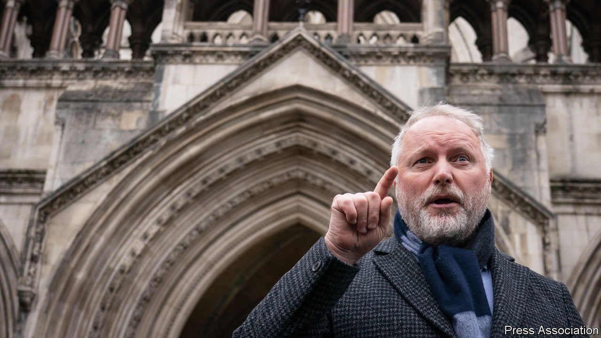

###### Unfair cop

# A legal ruling has big implications for free speech in England 

##### There will be less need to bite your tongue on controversial issues 

 

> Jan 1st 2022 

IN A LANDMARK judgment for freedom of expression, a former policeman, Harry Miller, has won his case against the national policing-standards authority, the College of Policing (COP). On December 20th the Court of Appeal declared that the body’s guidance on “hate incidents” lacked safeguards against causing a “chilling effect” on free speech and public debate, and was therefore unlawful.

Mr Miller’s legal journey started in 2019. The government was consulting on plans, later abandoned, to bring in gender self-identification—the right to change legal sex on demand. Mr Miller tweeted that he thought that a bad idea, sometimes using coarse language. His local police force, Humberside, received a complaint that this constituted transphobic hate crime.


Officers contacted Mr Miller’s workplace, questioned him by phone to “check [his] thinking” and warned him to stop tweeting about the issue. They acknowledged that he had done nothing illegal. But Mr Miller found that his tweets had been recorded as a “non-crime hate incident”. That would remain on file for six years and could be revealed to a prospective employer. “We need hardly imagine what an HR manager would make of a job applicant with a police history of hate,” wrote Lord Macdonald, a former director of public prosecutions, in an article in the Times.

At Mr Miller’s initial hearing, in 2020, the High Court found that Humberside police had unlawfully interfered with his right to freedom of expression by turning up at his place of work. “In this country we have never had a Cheka, a Gestapo or a Stasi. We have never lived in an Orwellian society,” said the judge. But he turned down a wider challenge regarding the lawfulness of the guidance, ruling that it served a “legitimate aim”. The recent judgment reversed that decision.

The guidance, drawn up in 2014, was strongly influenced by the Macpherson Report, a government investigation that followed the murder of Stephen Lawrence, a black teenager, in London in 1993. It concluded that early intervention was required if provocative or insulting speech was not to escalate into physical violence. (Lawrence had been subjected to racial taunts and slurs.) The police “cut and pasted” its conclusions into other contexts, argues Mr Miller, with the result that anyone who, like him, feels no animosity towards trans people, but says publicly that no one can literally change sex, is treated as if they might be planning violence.

The intention may have been good. But the result was that a complainant (who must be recorded as a “victim”) can report anyone for anything perceived to be hateful, with no requirement to provide evidence of objective harm. One of the judges hearing Mr Miller’s appeal remarked incredulously that it would be better to be charged with an actual hate crime, since that would mean the presumption of innocence. When Fair Cop, the campaign group Mr Miller co-founded, used freedom-of-information requests to reveal what use the police make of records of non-crime hate incidents—around 120,000 between 2014 and 2019—it found not a single force that had even analysed the data. It is now seeking to have those records expunged.

Mr Miller has not been alone in pushing back. In mid-2020 Sarah Phillimore, a barrister, discovered that an anonymous Twitter user claimed that some of her tweets had been reported to police, again for alleged transphobia. When she checked, she found that it held a record of 12 pages-worth of tweets not deemed worthy of investigation but still classified as non-crime hate incidents. In August 2020, as an experiment, she tweeted “my cat really loves Dreamies perhaps he’s a Methodist” and arranged for a friend to report her for anti-religious bias. Despite the absurd wording, that tweet was added to her file.

The Miller judgment may go some way to slow a galloping trend towards recording crimes based solely on subjective claims of harm. But the idea that words someone dislikes may be a police matter is now widely embraced. In February Merseyside Police tweeted pictures of officers posed next to a billboard showing a rainbow flag and the words “Being offensive is an offence”. When free-speech campaigners pointed out that the law did not go (quite) that far, the force apologised “for any confusion this may have caused”.

In Scotland such confusion could soon become reality. A new Hate Crimes Act, which has been delayed but is supposed to come into effect in 2022, goes beyond merely recording offensive speech: it criminalises it. An offence of “stirring up” hatred with speech that is considered insulting or inflammatory, even if no actual harm results, will be punishable by up to seven years in jail. It even covers speech within the home. Further legal challenges may be needed. ■

