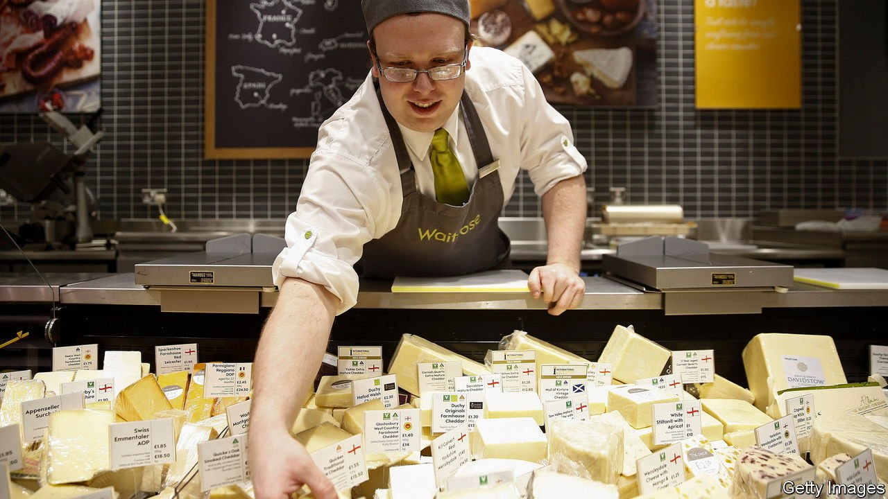
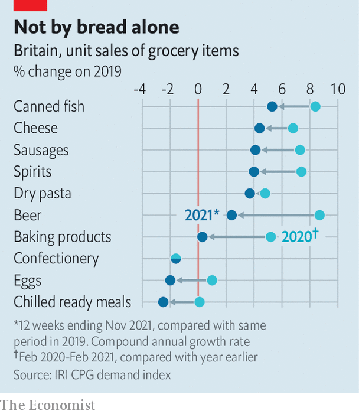

###### Eating and covid-19

# The pandemic has changed British diets in enduring ways 

##### Good news for makers of cheese, sausages and canned fish 

 

> Jan 1st 2022 

AS THE LAST remnants of turkey, trifle and Christmas pudding are purged from the nation’s refrigerators, thoughts turn inexorably to dieting and health. If this new year is like previous ones, Britons who make resolutions will most often pledge to exercise more, eat healthier food and lose weight. But the pandemic means that their diets have already changed, in broadly benign ways.

In the first 12 months after covid-19 struck, from March 2020, eating habits altered drastically. Fearing shortages, people stocked up on frozen, dried and canned food. They baked enthusiastically, either out of boredom or because they were scared: making perishable foods such as bread at home allowed them to avoid visiting the shops every few days. Tesco, Britain’s biggest grocer, was rationing flour and pasta even in the autumn of 2020.


Some changes did not last. By autumn 2021 baking products and eggs had fallen back to where they had been two years earlier (see chart). “I think people have cooked enough,” says Krishnakumar Davey, who follows the grocery market at IRI, a research firm. Sales of frozen food are back to pre-pandemic levels, too.

 


But others proved more enduring. Britons continue to purchase oddly large quantities of canned fish, cheese and sausages. They have not given up the pasta habit. The long-term winners in this national dietary shift are neither instant foods, such as breakfast cereals, snacks and ready meals, nor slow foods that demand attention, but things in the middle. The grocery items that are selling best are the ones that can be turned into meals in ten or 20 minutes.

Many people are still eating fewer meals out, and more at home, than they used to. Kantar, another research firm, estimates that the number of in-home “eating occasions” is 9% higher than in 2019. Home workers probably have enough time for cheese on toast but not for anything more complicated. Although home-made lunches are up by the most, people are also eating more breakfasts at home; the decline in commuting means that the morning fry-up has replaced the station-bought coffee and croissant.

These changes are socially uneven. Nathan Ward of Kantar says that people in the ABC1 social groups (broadly, the middle classes) account for 70% of additional in-home lunches. Perhaps as a result, more expensive groceries are especially popular. Saputo, a Canada-based dairy firm, says that almost all its British cheese products are selling well, but its Davidstow cheddar cheese, which is pricier than most, is the best performer. Saputo has marketed Davidstow at the Hampton Court Flower Show—flower shows being to the middle classes what light bulbs are to moths.

Although sales of most groceries are up, people seem to be refraining from the least healthy foods. Confectionery has fared poorly for the past two years, according to IRI. The government-run National Survey of Diet and Nutrition estimates that working-age adults sipped 79g of sugar-sweetened drinks per day in 2020, down from 100g before covid. They also downed fewer buns, cakes and pastries. Mind you, they needed to cut back. Also clear, from the same survey, is that people are exercising less and drinking more alcohol. ■

