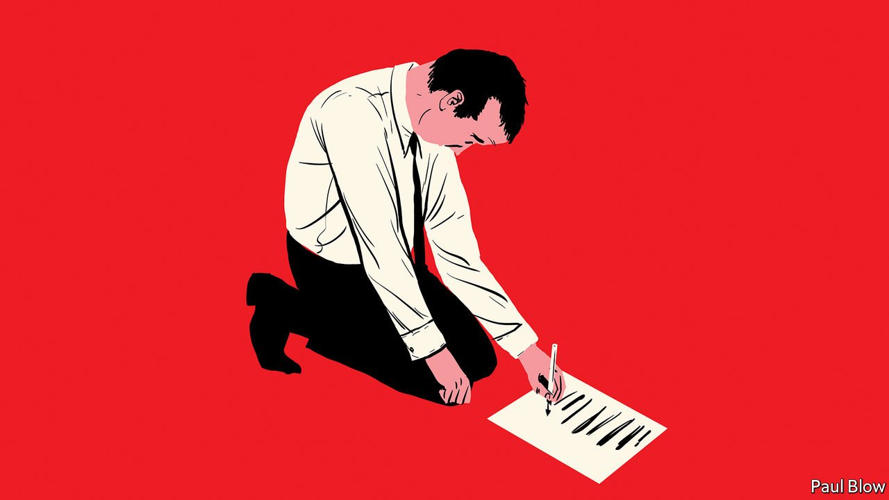

###### Bartleby

# A memo from the boss on apology inflation 

##### The sources of sorry 

 

> Jan 1st 2022 

DEAR TOP TABLE, We have discussed many of the risks that threaten us in the coming year: the pandemic, our supply-chain troubles and staff retention. But I want to raise a more personal concern: the possibility that I will have to make a public apology. Everywhere I looked over the past 12 months, executives were grovelling. The thought of promising to work on becoming a better person makes me feel physically sick.

Let me be clear. I’m not against apologies when they are warranted. Bad behaviour needs to be brought to light and investigated, however damaging the fallout. But there are reasons why fire storms have become more common. Technology records our every action. Employees have become activists. It’s harder to avoid controversy in China.


Start with technology. Almost everything we do now as leaders leaves a digital trace that can come back to haunt us. Vishal Garg’s recent decision to fire 900 members of staff at Better.com over Zoom was a terrible call, and not just for them. Private messages are liable to become public. Chris Kempczinski, the boss of McDonald’s, apologised in November after a freedom-of-information request revealed the contents of thoughtless text messages he had sent to the mayor of Chicago about two shootings in the city. (Let’s not even mention his predecessor’s personal correspondence.)

Outrage is everywhere. The boss of Sweetgreen, a salad chain, suffered a backlash earlier in the year when he wrote that hospitalisations caused by covid-19 raised questions about levels of obesity in America. He ended up apologising for his insensitivity—or, as some people like to call it, use of data—and described the episode as an opportunity to “learn forward”. Ugh.

Staff are behaving differently. According to a survey of 7,000 employees conducted by Edelman, a public-relations firm, workers now apparently think that they matter more than customers to the long-term success of their organisations. As if that were not bad enough, six in ten employees say they choose where they work based on their beliefs. The line between company and crusade has blurred.

If workers see something they do not like, they are more likely to let the world know about it. Just think about the past year. A group of Netflix employees staged a very public walkout in the autumn over a Dave Chapelle special that they regarded as transphobic. (This was handled pretty well, by the way: Ted Sarandos, the firm’s co- CEO, apologised for failing to “lead with humanity” but did not back down on artistic freedom.)

Tim Cook lamented the fact that Apple, once known for secrecy, has become more loose-lipped in a memo that was promptly leaked. Bankers at Goldman Sachs, a group of people designed to test the limits of human empathy, circulated a PowerPoint deck complaining about their workloads. A whistle-blowing product manager did huge reputational damage to Meta, Facebook’s parent company.

Like many companies, we are looking at how we can tighten the flow of information internally: employees may have to ask for permission to start new Slack channels, for instance. But there is a limit to how far we can go. In April Basecamp, a software company, banned discussion of societal and political issues on its corporate platforms. “We are not a social-impact company,” wrote one of the founders. “Our impact is contained to what we do and how we do it.” A third of the firm’s employees ended up quitting, prompting yet another apology.

China is a problem area, especially for American multinationals trying to navigate choppy geopolitical waters. In late December Intel sparked social-media uproar in China for sending a letter to suppliers telling them not to use components from Xinjiang in its semiconductors. The firm apologised, and made it clear that it was trying to remain in compliance with US laws rather than acting off its own bat.

In November Jamie Dimon expressed regret for joking that JPMorgan Chase would last longer than the Chinese Communist Party. One of the bank boss’s two apologies for this unforced error included the line: “It’s never right to joke about or denigrate any group of people, whether it’s a country, its leadership, or any part of a society and culture.” No Netflix comedy special for him.

So to keep the new year as apology-free as possible, remember the following. Nothing we say or do is private. Embrace blandness. Don’t criticise China but do act as if you live there. And for God’s sake, don’t leak this memo.

Read more from Bartleby, our columnist on management and work:

 (Dec 18th) (Dec 11th)


