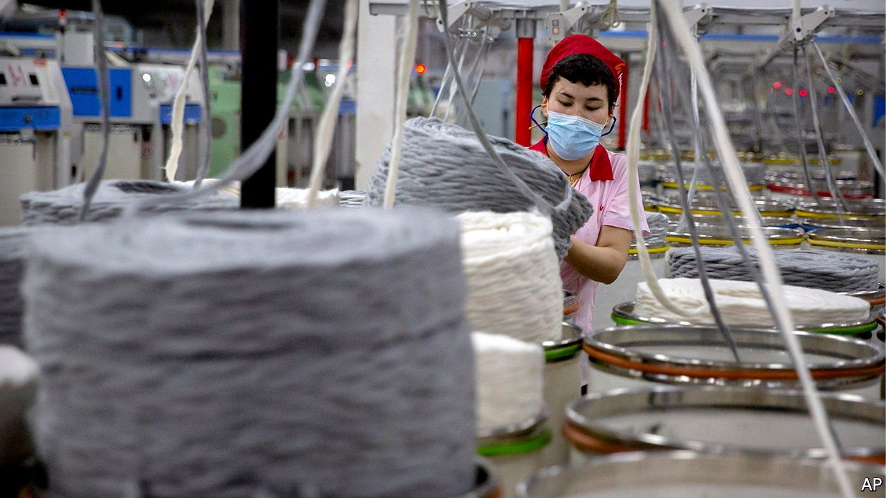

###### The quiet Americans

# Can American firms rid their supply chains of Xinjiang goods? 

##### Possibly. Just don’t tell China 

 

> Jan 1st 2022 

MOST COMPANIES prefer to talk about corporate social responsibility than to act on such pronouncements. The Uyghur Forced Labour Prevention Act, which President Joe Biden signed into law on December 23rd, is leading many to do the opposite. American businesses may be happier to try to comply with it than to admit publicly they are doing so.

The law, which goes into effect in June, was a rare victory for human-rights groups and reflects a bipartisan China hawkishness in Washington. It bans imports of products from the region of Xinjiang in China on the presumption they are made with the forced labour of Uyghurs, a mostly Muslim ethnic group enduring horrific repression. Goods from Xinjiang can be brought to America only if importers can prove that forced labour was not used in their production. That is usually rather difficult, since China (which denies the existence of forced labour) does not allow proper inspection of supply chains in the region. Suppliers outside Xinjiang can also be blacklisted if they are judged to be using forced labour.


Xinjiang does not export all that much directly to America: $596m-worth of goods in 2020, or 0.1% of total American imports from China. But some of the region’s more specialist products, such as nitrogen hetero cyclic compounds used in cancer drugs, will be hard to replace quickly. And many regional products make their way into American goods along complex global supply chains. Cotton from the region, an important export, is used in textiles made in other countries, such as Vietnam. Forensic technology exists to identify cotton’s origin but it is finicky and not yet widespread. Xinjiang’s abundant tomatoes still end up in ketchup around the world.

Now American firms must make a greater effort to rid their supply chains of any hint of Xinjiang. Those trying to do so, owing to existing import restrictions (Xinjiang cotton and tomatoes have been barred from America for the past year) and in anticipation of the new law, have had some success. The value of Xinjiang’s direct exports to America sank to less than $8m in September, down by nearly 90% year on year, according to the Observatory of Economic Complexity, a data provider.

A knottier problem for American firms is that they cannot be seen as endorsing their government’s tough stance in China, a huge and important market. Those that helped craft the forced-labour law prefer not to be identified, says a former Congressional staffer. Many big American clothing brands that are believed to have stopped bringing in products made with Xinjiang cotton have not been trumpeting this, fearing a backlash and boycotts. When Intel, a chipmaker, wrote to suppliers in mid-December stating that they must keep products free of goods or labour from Xinjiang, this sparked a nationalist furore in China, fuelled further by state media. Intel deleted the offending phrase from its letter and on December 22nd , saying it had not been making a political statement. The same week Walmart, a supermarket giant, faced local social-media opprobrium from shoppers unable to find Xinjiang products in its Chinese online store.

The new law will not end all American imports from Xinjiang. Those of the cancer-drug components have actually risen this year. In other cases, for example polysilicon used in solar panels, American firms may simply shift to suppliers in other parts of China—hardly a rebuke to the government in Beijing, which has sent tens of thousands of Uyghurs, if not more, to other regions to work under what are believed to be coercive conditions. Although other democracies, including France and Germany, have passed laws that force companies to monitor their supply chains for human-rights violations, goods from Xinjiang once destined for the West can still be sold in China or exported to places with laxer rules. In the first nine months of 2021 Xinjiang’s global exports added up to $13.5bn, nearly as much as the $13.9bn recorded in all of 2020. ■


