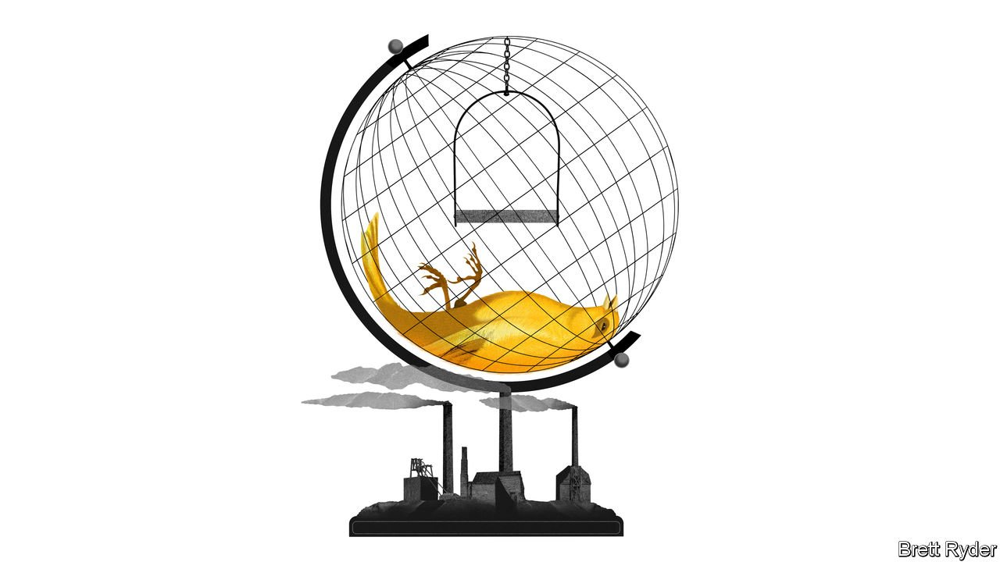

###### Schumpeter

# Glencore’s message to the planet 

##### Sorry, folks. Coal will remain alive and kicking 

 

> Jan 1st 2022 

IN “THE COAL QUESTION”, written in 1865, William Stanley Jevons, a British economist, ascribed “miraculous powers” to the fuel source powering the Industrial Revolution. Coal, he wrote, stood entirely above all other commodities. Such were its superpowers, he fretted about the consequences for Britain if it ran out of the stuff. He needn’t have worried. Not only has coal proved impossible to exhaust. More than a century and a half later, the largest source of carbon emissions is devilishly hard to kill off.

In 2021 the world, which was meant to “consign coal power to history” during the UN’s COP26 climate summit, probably consumed more coal-fired electricity than ever before, the International Energy Agency, the world’s pre-eminent energy forecaster, said in December. The strength of demand drove coal prices to record levels in October 2021. The buoyancy is expected to continue into 2022, not least because coal is a substitute for natural gas, whose price around the globe has continued to surge in the run-up to the new year.


What is bad news for the planet has been great for coal producers. With the mineral in the ascendancy, no big Western mining company has done as well for shareholders in the past 12 months as Glencore, the diversified minerals-and-metals producer valued at $66bn that since 2018 has snapped up coal assets divested by peers like Rio Tinto, BHP and Anglo American. Quietly, given coal’s increasingly grimy reputation, the Swiss-based firm is one of the unloved mineral’s most resolute champions.

That makes a campaign by a tiny activist fund, Bluebell Capital, which is trying to force Glencore to shed its coal assets, an intriguing opportunity to examine shareholder attitudes towards coal. Only a few years ago investors, especially those with environmental, social and governance (ESG) mandates, were virtually united in the opinion that big miners should withdraw from the dirtiest fossil fuel. Now they take a different view. This may be a matter of principle. It is also a sign of how fickle investors can be when ESG goals clash with the objective of maximising financial returns.

Bluebell’s diagnosis is straightforward. It says that Glencore’s decision to cling on to some coal assets until 2050 is “morally unacceptable and financially flawed”. It believes that the firm’s exposure to coal has dragged down its valuation, overshadowing the promising role that its other mining assets, such as copper and cobalt, are playing in the clean-energy revolution. It sees the appointment of Gary Nagle, only the fourth CEO in Glencore’s 47-year history following Ivan Glasenberg’s departure in June, as a unique opportunity to change course. Eliminating the “coal discount” and further simplifying the business could put an extra 40-45% into shareholders’ pockets, it reckons.

So far, so simplistic. What it misses, though, is a recent sea change in investor views on the wisdom of owning coal. After Rio Tinto became the first big miner to abandon coal in 2018, its rivals, Glencore included, all laid out plans to curb or terminate their coal exposure. In mid-2021 Anglo took the biggest step by spinning off its South African coal assets into a newly listed company, Thungela Resources. Shareholders applauded every step of the way.

Then the unexpected happened. Thungela’s shares, after a rocky start, quadrupled in value in a matter of months. Glencore, shortly after 94% of shareholders had approved its coal-reduction plans, bought out its joint-venture partners Anglo and BHP in a Colombian coal mine that will bolster its overall output from about 104m tonnes in 2021 to 122m tonnes within two years. BHP has reportedly put its retreat from thermal coal under review because of rising prices and changing investor attitudes. In a sign of the times, Bravus Mining and Resources, a subsidiary of the Adani Group, an Indian conglomerate, said on December 27th that it was about to export coal from the Carmichael mine in Australia for the first time. It has overcome a decade of opposition from environmentalists to bring the project to fruition.

Among investors, the change of heart has come from the top. In 2020 BlackRock, the world’s biggest fund manager, set out a commitment to remove mining companies that generated more than a quarter of their revenues from thermal coal from its active investment portfolio. Though it still holds huge passive stakes in coalminers (including the second biggest in Thungela), it was a powerful divestment signal. Since then, however, some investors, including BlackRock’s CEO, Larry Fink, have come to the conclusion that in private hands fossil-fuel assets are likely to be less responsibly managed and more opaque than in the public markets. Mines may be expanded, rather than gradually wound down as Glencore promises to do with its coal assets. Its defenders say this is one of the main reasons Bluebell’s campaign appears to have fallen on deaf ears.

They have a point. Yet as long as the strength of the coal price is adding billions to Glencore’s cashflow and lining shareholders’ pockets, the argument is also self-serving. It is not clear investors would be so magnanimous were prices to plunge.

Indeed, it is a fair bet that Glencore is more committed to coal than its shareholders are. Whereas many people concerned about climate change see the energy transition as a one-way street from coal power, possibly via natural gas, towards zero-carbon sources of electricity, the firm is bracingly pragmatic. It views coal as a “vital transition fuel”, especially in Asia, where China and India account for two-thirds of global coal consumption.

Pitstop

Glencore is right to be a realist. However much the world worries about coal, many developing countries will favour cheap energy over the clean sort if forced to choose. Glencore says it would spin out coal if shareholders demanded it. But it clearly prefers not to. Only concerted government action to tax carbon emissions and redesign energy systems will kill off king coal. ■

For more expert analysis of the biggest stories in economics, business and markets, , our weekly newsletter.

Read more from Schumpeter, our columnist on global business: (Dec 18th 2021) (Dec 11th)(Dec 4th 2021)

