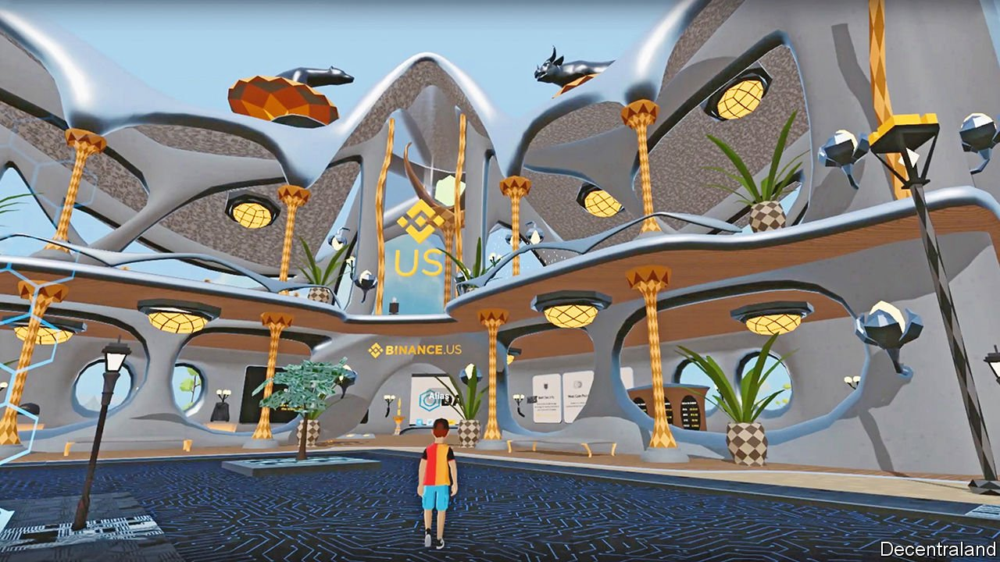

###### Metaverse landlords

# Virtual-property prices are going through the roof 

##### Investors are paying hard currency for software real estate 

 

> Jan 1st 2022 

“RIDICULOUS AND cool.” That is the architectural brief for a new office tower under construction in the Crypto Valley, a business district of Decentraland, a virtual platform built on the Ethereum blockchain. The edifice—owned by Tokens.com, a blockchain investor—will be a cross between a nightclub in Ibiza and the Bellagio resort in Las Vegas. In a fantasy world unencumbered by something as pedestrian as physics, a rotating company logo will float above the tower as nearby clouds shoot out company-branded thunderbolts. The tower’s purpose—to provide office leases for firms and event space for crypto conferences—is humdrum by comparison.

Gamers have traded pixelated property and other digital assets for years. Now the activity has been turbocharged by the growth of unique digital artefacts known as non-fungible tokens (NFTs), and by the hype around the metaverse—a emerging virtual market which could, depending on whom you ask, ultimately generate revenues of between $1trn and $30trn.


Real money is changing hands. Some sales involve replicas of the physical world. Users of Legacy, an NFT-powered recreation of London, have spent $54m on plots of land in the game (which is still in development with no launch date). SuperWorld, a virtual planet where people can buy digital versions of any place on Earth, says the average user spends some $3,000 on property purchases. The Taj Mahal and the Eiffel Tower are selling for the cryptocurrency equivalent of around $200,000 and $400,000, respectively. Their current owners paid under $400 each.

Wholly invented worlds are also drawing investors. In November Republic Realm, a company that manages and develops digital real estate, paid $4.3m for land in a platform called the Sandbox, the biggest virtual-property investment to date. That same month Tokens.com spent $2.4m for a plot in Decentraland’s Fashion Street district. Nightclubs and casinos where users can win virtual money line the streets of the gambling district. In its art district Sotheby’s, a real-world auction house, has opened a virtual gallery. Smaller parcels that fetched around $20 apiece when Decentraland launched in 2017 can now sell for as much as $100,000. Somnium Space, a competing platform, reported more than $1.8m of land sales by its users over a 30-day period in November. In other virtual worlds, concert halls stream performances by the digital avatars of pop stars such as Justin Bieber and Ariana Grande. Empty virtual shops could soon be leased by fashion houses such as Gucci, Dolce &amp; Gabbana, Burberry and Balenciaga, all of which have sold branded items in one metaverse or other.

Will the digital-property boom last? As in the physical world, profits depend on footfall and people’s willingness to spend real money. For that to happen at scale the user experience must improve. Popular metaverse platforms such as Decentraland and the Sandbox are clunky. The average user may not want to shell out on the graphics cards, virtual-reality headsets and superfast broadband that gamers use to make cyberspace feel more real.

The second risk is volatility. Virtual-property sales typically involve the exchange of the cryptocurrency unique to a given metaverse. Decentraland has MANA; Sandbox uses digital tokens known as SAND. The price of these can swing wildly, even relative to established crypto monies such as bitcoin or ether, themselves hardly a predictable asset class. They could crash to zero if a particular metaverse bombs.

To lower the risk, early investors such as Republic Realm are diversifying their holdings. The firm says it owns land in 23 metaverse platforms. But unlike physical land, the value of which is in part a function of its scarcity, each virtual realm is in effect limitless. So, in principle, is their number. Hundreds of wannabe metaverses already exist and more will emerge as crypto technology improves. That points to a paradox. Soaring virtual-property prices are predicated on the metaverse taking off. But a booming metaverse means less scarcity and lower prices. The laws of physics may prove easier to work around than the law of supply and demand. ■


