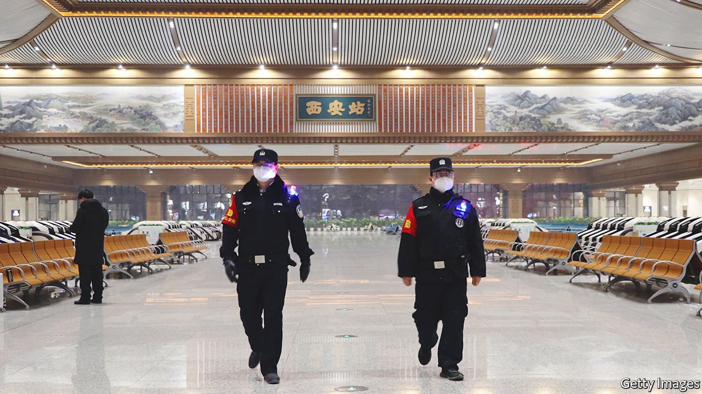

###### The price of zero

# A cluster of covid-19 cases in China prompts a citywide lockdown 

##### Measures in Xi’an are China’s toughest on such a scale since early in the pandemic 

 

> Jan 1st 2022 

FOR MUCH of the pandemic, the lives of most people in China have remained relatively normal except for hassles caused by . For the 13m residents of the western city of Xi’an, that changed on December 23rd 2021 when officials imposed one of the biggest lockdowns anywhere in the country since SARS-CoV-2 was first detected in the central city of Wuhan late in 2019. Four days later inhabitants were told to stay at home, and go out only to be tested for covid-19. No one may leave or enter Xi’an without approval.

The measures are in response to a tiny outbreak in the city involving, so far, a mere 810 people who have tested positive for the virus. But China has a : any case is leapt upon, with harsh local lockdowns to make sure there is no spread. The authorities have not reported any infections involving the  in Xi’an (they believe the outbreak began early in December with a case imported from Pakistan). Only a handful of cases of Omicron have been reported elsewhere in China. They must be nervous about it, however. The variant , which has been the main variant detected recently in China. Omicron can evade the antibodies which the immune system produces in response to vaccination and infection. Officials are anxious to avoid any covid-related disruptions to the , which are due to be held in and around Beijing in February.


Cases of any variant have been rare: America currently records more in a day than China has discovered throughout the pandemic. Extraordinary levels of testing and the mobilisation of armies of quarantine enforcers have helped. Officials are punished if cases are discovered in their areas. Twenty-six have been disciplined in Xi’an. On December 27th the city began testing its entire population for the virus, taking 6.4m samples in just one day. Other countries are trying to come to terms with the idea that SARS-CoV-2, thanks to growing immunity against it, is becoming just another respiratory virus with which . China is still trying to crush it.

Its worries are compounded by the performance of Chinese-made vaccines, which are the only ones available in the country. Earlier in December China said more than 80% of its people were fully vaccinated. But a study by Hong Kong’s medical schools, published on December 23rd, found that antibodies produced in response to Corona­Vac, one of the commonly used ones, do not prevent infection with Omicron after either a second dose or a booster. This means China’s high vaccination rate will do little to tamp Omicron’s spread. Like other vaccines, however, those used in China should offer good protection against severe disease and death.

In places like America, Britain, Denmark and South Africa, Omicron has driven growth in cases that is more rapid than any since the pandemic began. Omicron’s high transmissibility is likely to increase the rate at which China must play whack-a-mole by putting cities into lockdown to keep case numbers from growing.

Even before the cases in Xi’an, precautions surrounding the Winter Olympics were intense. The government had banned non-essential attendees, such as foreign fans, and imposed strict “closed-loop” protocols for athletes, trainers and support staff to prevent contact with other people. An outbreak seeded by someone who enters China for the games, or disruption of the event by domestically transmitted cases, would be bad news for a government that prides itself on its covid-controlling expertise. Xi’an’s travails will put the country on even higher alert.

For China, there is no clear path towards a more relaxed approach to the virus. Around 250m of its people have still not received two jabs, even though China is now vaccinating children as young as three. No matter how long China keeps its borders closed, the virus is not going to disappear from the planet. When it opens up again, whatever variant is circulating at the time will find its way in, creating what is often called an “exit wave”—an upsurge of cases caused by a relaxation of covid-related restrictions.

Two things may help China manage the transition, says Ben Cowling, an epidemiologist at the University of Hong Kong. One is its possible development of new vaccines that confer higher levels of immunity. If China could revaccinate a large number of its people with such drugs, it could reduce the impact of the exit wave. But as yet no such vaccine is on the horizon.

Nature itself may also lend a hand. If SARS-CoV-2 evolves to become , an exit wave will no longer be so worrying. Omicron shows hints of this property. It causes asymptomatic disease at a greater rate than previous variants. Four independent laboratory studies from around the world have shown that the variant replicates very poorly in lung tissue compared with older variants, but is much better at doing so in the upper airways. This suggests a virus that is more transmissible, but less dangerous.

Western hospital systems are watching their patient numbers closely, looking for signs that Omicron does indeed pose less of a danger. One promising sign is that the proportion of covid patients admitted to hospital in London who need ventilation is lower than at any other time during the pandemic. But a big wave of less severe disease could still be a disaster for China if it does not improve its own vaccines, or abandon its politically motivated opposition to importing better ones.

China has been waging what it calls a “people’s war” against the virus. In one sense this has worked. Even accounting for dodgy statistics and state control of information, China has got through the first two years of the pandemic with only a tiny proportion of the death and disease seen in other countries, and without suffering long-term economic damage. An exit wave, however big, is unlikely to bring China’s death toll up to levels seen elsewhere. But it might undermine the Communist Party’s efforts to  of controlling a terrible scourge.

Dig deeper

All our stories relating to the pandemic can be found on our . You can also find trackers showing ,  and the virus’s spread across .

