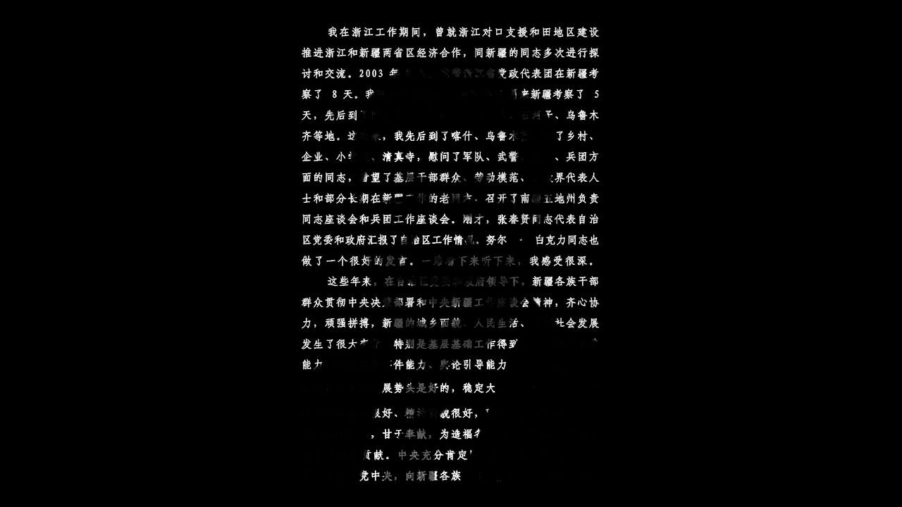
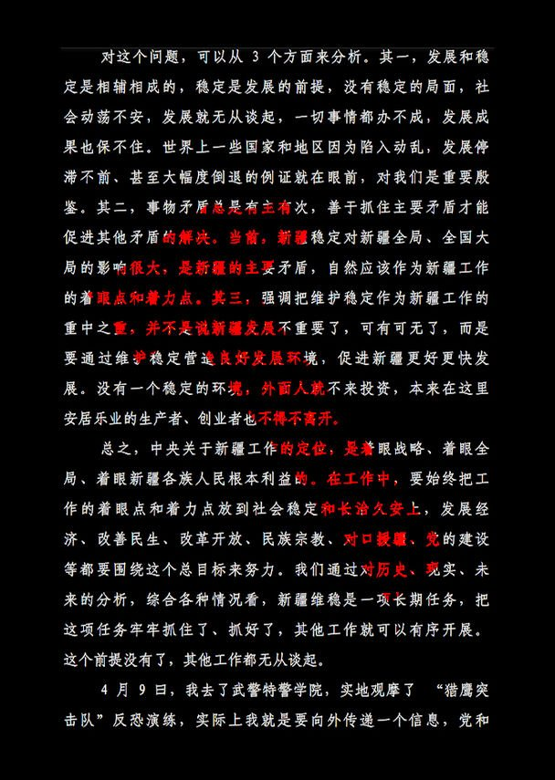

###### Xi’s secret speeches

# Even in secret, China’s leaders speak in code 

##### Chinese bureaucrats have to learn to read between the lines 

 

> Jan 1st 2022 

IN NOVEMBER 2022 Xi Jinping will have served for ten years as China’s leader. In the coming months, state media will be filled with fawning tributes to his decade in power. Yet they will give little inkling of how he makes decisions or interacts with colleagues. Even more than his predecessors, Mr Xi operates in the shadows. China has published many volumes of excerpts from his speeches. Only recently, however, has a rare leak of secret versions offered a glimpse of how Mr Xi communicates behind the scenes at a time of crisis, and how the bureaucracy responds.

The cache comprises four talks, all delivered in 2014. They relate to the party’s campaign against the “three evil forces” of terrorism, separatism and religious extremism in the far-western region of Xinjiang, where nearly half of the population of 26m people—which is about the size of Australia’s—belongs to a mostly Muslim ethnic group, the Uyghurs.


Copies were obtained in 2019 by the New York Times, along with numerous other classified documents about Xinjiang. The newspaper described it as “one of the most significant leaks of government papers from inside China’s ruling Communist Party in decades”. But it did not release the full texts. Only in recent weeks have these emerged. They were submitted by an unknown source to a group in London investigating human-rights abuses in Xinjiang, known as the Uyghur Tribunal.

There can be little doubt about their authenticity. Several Western scholars have testified to their credibility, including Adrian Zenz, a German academic. Mr Zenz has been at the forefront of research into China’s establishment in Xinjiang of a network of “vocational education training” centres in which perhaps 1m Uyghurs have been held captive, without any legal process, since 2017.

Most analysis of the four speeches, which contain a total of about 36,000 Chinese characters, has focused on what they suggest about Mr Xi’s role in the decision-making that led to the building of these camps. They provide no proof that, in 2014, he was thinking about creating a gulag into which so many people would be tossed, often for trivial signs of devotion to their faith or culture, such as praying too much. But they did call for much tougher action against the three evil forces.

On March 1st 2014 a group of eight Uyghurs armed with knives had stormed a train station in Kunming, a city in the south-west, killing 31 people. State media had compared the shock caused by this bloodshed to the September 11th attacks in America. On May 22nd five Uyghurs drove two SUVs into a market in Urumqi, the capital of Xinjiang, and detonated explosives, killing 43 people.

One of the speeches was delivered in Beijing just six days after the violence in Urumqi at a meeting of leaders to discuss policy on Xinjiang. At the time, state media published only a few quotations from it, but they clearly reflected Mr Xi’s rage. They quoted him as calling for “walls made of copper and steel” and “nets spread from the earth to the sky” to catch terrorists as if they were “rats in the street”.

The classified text of that speech as well as of the three others, which were delivered by Mr Xi during a tour of Xinjiang in April 2014, contain the outlines of a strategy for curbing the violence. But they are not an explicit blueprint. In them, Mr Xi did not directly call for the measures that have unfolded since 2017 and have prompted America to accuse China of genocide. In addition to the internments, these have included forced sterilisations and the pressing of hundreds of thousands of Uyghurs into forced labour. On December 23rd America’s president, Joe Biden, signed into law a  unless they can be proven not to have involved such coercion.

The paucity of specific prescriptions is typical of speeches by the general secretary that are circulated at lower levels of the bureaucracy. These ones were included in a classified publication called Zhongban Tongbao, or “General Office Circular”. Even in this restricted forum, speeches may be edited, leaving almost as much room for interpretation as those released publicly (official translations of Mr Xi’s speeches, for consumption by foreigners, are stripped of sensitive content with particular rigour). The ones delivered in April 2014 were reissued two-and-a-half years later for distribution to all party committees in Xinjiang at the level of county or urban district—a relatively wide circulation not used for the most secretive directives.

Officials at lower levels have to read between the lines. In the versions that are now available, Mr Xi’s speeches do not make this easy. They include sweeping, hardline calls to action (“show no mercy”). But they are surprisingly leavened with appeals for tolerance and respect for Uyghurs and their religion. Any outsider reading them in 2014, or the three that were republished in 2016 on the eve of the gulag’s opening, would not have imagined the degree and scale of repression to come.

It is likely that other orders transmitted through the bureaucracy by different means—such as directives given by propaganda officials, the security services and Xinjiang’s party boss, Chen Quanguo—would have steered officials to seize on Mr Xi’s harshest words, as he probably intended (Mr Chen was replaced on December 25th by the governor of Guangdong province, Ma Xingrui, but kept his other job as a member of the ruling Politburo).

Mr Xi’s occasional more moderate or even progressive-sounding statements—such as those condemning discrimination against Uyghurs—were downplayed. They never appeared in state-controlled media or in public reports of speeches by senior officials in Xinjiang.

Hammer them hard

Over time bureaucrats, and Mr Xi himself, have preferred and rewarded the most draconian interpretation of his vision. Such was the case following another secret speech by Mr Xi that was subsequently leaked. Delivered shortly after he took power in 2012, it was a warning against ideological laxity. The Soviet Union, he said, had collapsed because nobody had been “man enough to stand up and resist”. A fierce clampdown on dissent ensued.

When Mr Xi gave his speeches about Xinjiang, officials there would already have sensed a hardening mood. Earlier that year Ilham Tohti, a Uyghur academic who had called for greater protection of his ethnic group’s identity, had been arrested in Beijing (later in 2014 he was sentenced to life in prison for separatism). Surveillance of Uyghurs was becoming more intense, with ubiquitous police checkpoints. Tolerance was not the watchword.

 


Mr Xi’s words provided the cue. He said the three forces had deep roots and that an “extremely fierce” fight was needed to eradicate them. “Three feet of ice does not come from a day of cold,” Mr Xi said. He lamented weaknesses in China’s intelligence-gathering, calling for improvements in the use of “big data technology” as well as of “grassroots” informants. “Bin Laden was found with the help of informers,” he said. He urged officials to be forever “chasing and fighting, pressing and fighting, digging and fighting, not giving violent terrorists any chance to breathe”. And, he thundered, “Those who should be seized should be seized, those who should be sentenced should be sentenced. There must be no one above the law.”

At the time, the laws in Xinjiang provided no obvious basis for putting Uyghurs in camps to “deradicalise” them, as officials describe one of their aims. But Mr Xi told the authorities in Xinjiang to draft local regulations to fight terrorism. They duly promulgated new rules in 2017. These were revised the following year to make the point clearer, specifically calling for the establishment of “education and training centres”. Mr Xi said people in Xinjiang must develop “immunity” against the “infection” of religious extremism. As Mr Zenz notes, this metaphor was later adopted by officials when justifying the camps.

Mr Xi’s warnings against “chauvinism” by ethnic-Han Chinese towards Uyghurs made sense. “If people feel they are not included or respected, it will create a feeling of dissatisfaction or alienation. In the extreme it can lead to racial animosity,” he said in one speech. “If this happens, wouldn’t we fall into the very trap that hostile forces have deliberately set?” He cited examples in history of ethnic groups disappearing, and declared it would be “a great political mistake” to try to cause this.

But it is not clear how sincere Mr Xi was in urging tolerance. The party has a long record of declaring how enlightened it is, even as it ruthlessly crushes dissent. He urged that Han Chinese officials spend time with Uyghurs in their homes, in positive language that encouraged bonding between ethnicities. This instruction turned into a terrifying programme of billeting Han officials with Uyghur families to spy on and intimidate them. He called for the “optimisation” of the population ratio of southern Xinjiang, apparently meaning there should be a more even balance of Han Chinese and Uyghurs. His wording suggested he meant that more Han Chinese should settle in the region. What followed was a campaign involving forced sterilisations that caused a sharp reduction in the birth rate of Uyghurs.

Mr Xi presumably intended to give Uyghurs a bashing when, in 2016, he appointed Mr Chen, the official who has just been replaced, as party chief in Xinjiang. This was a recognition of Mr Chen’s past success in imposing draconian security measures as party boss in Tibet. Mr Chen was promoted to the Politburo the following year, as the camps in Xinjiang were filling. Mr Xi has said nothing in public about these facilities. But at a meeting in 2019 with an approving Donald Trump, Mr Xi attempted to justify their existence, wrote John Bolton, the American president’s national security adviser at the time, in a memoir. China’s official news agency, Xinhua, has said Mr Chen will be given another job. A promotion is possible.

Officials who may have felt tempted to play up Mr Xi’s more moderate-sounding remarks would soon have thought twice. As Xinjiang’s chief, Mr Chen purged thousands of local officials for being “two-faced”—that is, failing to fight the three forces vigorously enough.

One of them was Wang Yongzhi, the party secretary of Yarkand, a county in southern Xinjiang. Mr Wang was detained in 2017 after he had “illegally” released thousands of detainees from the camps, according to the documents obtained by the Uyghur Tribunal. He confessed that by releasing these inmates, he had planted “time bombs” threatening social stability. A secret government report said he had refused “to arrest all those who should be arrested”. As he should have remembered, Mr Xi had ordered as much. ■

