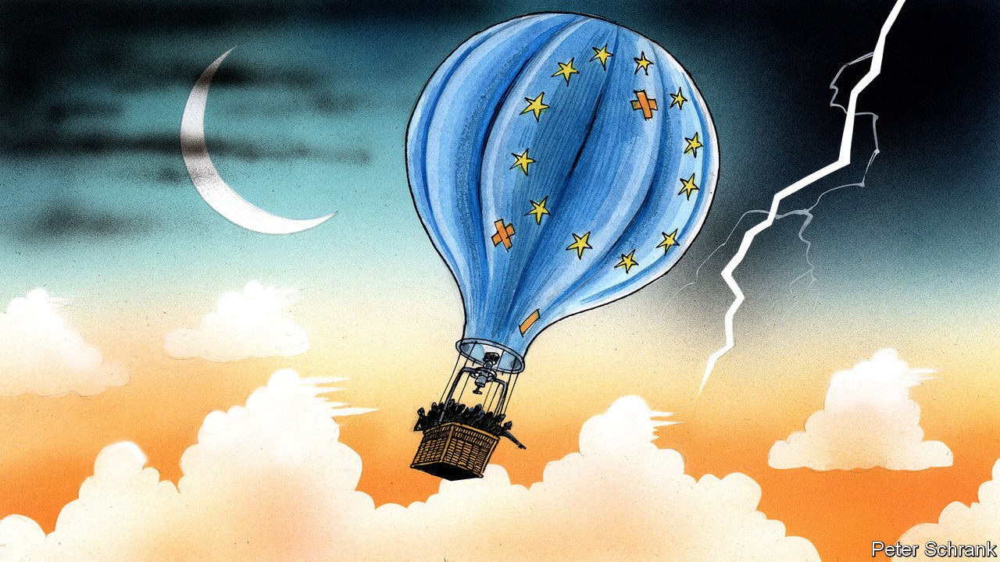

###### Charlemagne

# How Europe’s politicians started to think of themselves as European 

##### Our departing columnist offers some valedictory views 

 

> Jan 1st 2022 

GERMAN IS A thorough language. Almost every concept seems to be covered by a single compound word. There is Kummerspeck, or the weight one puts on if sad. Torschlusspanik is for the worry that your life is running out and opportunities slipping away. Most satisfyingly, there is Backpfeifengesicht for when someone has a slappable face. When it comes to the EU, a compound word pops up repeatedly: Schicksalsgemeinschaft, or a community of fate. Olaf Scholz, the new German chancellor, used the phrase when explaining why Germany must help its neighbours in the pandemic. His predecessor, Angela Merkel, was a fan too. Now, however, the concept—if not the tongue-twisting word—is spreading beyond the German-speaking world.

An acceptance among Europe’s leaders and voters that the continent’s fate is bound together has been the main shift of the two years your departing columnist has spent writing this column. Residual objections to the idea melted during the pandemic. A long-standing refusal to issue common debt was reversed. (Mrs Merkel once said common debt would not happen in her lifetime. She is, at time of writing, fighting fit.) Even the most sovereignty-obsessed governments, such as Poland’s, were happy to make the EU responsible for sorting out the continent’s vaccines in a new constitutional frontier.


That the problems facing individual countries required a continental response became obvious. An effective climate policy can be orchestrated only at a supranational level. No European country is big enough to deal with China, or even Russia, alone. Most importantly, the acceptance of Schicksalsgemeinschaft has transformed European politics. Until recently, leaders trod lightly on each other’s turf lest theirs be trampled by others. In a community of fate, however, everything is everyone else’s business.

Part of the reason for the shift is simple: money. Supervision is the price for solidarity. In the summer of 2020, leaders signed off a recovery fund of €750bn ($850bn) paid for with common debt, with half of it given as grants rather than loans to needy countries. Dutch taxpayers’ money is spent in Italy; German cash is in Polish coffers. It is only natural that they pay attention to how it is spent.

The spectre of Schicksalsgemeinschaft has been summoned before. Mrs Merkel used it during the euro-zone crisis, when explaining why loans worth hundreds of billions to stricken southern European economies were necessary. But that was different. Lending a friend money is one thing. Not expecting it back—as is the case with €390bn of the €750bn—is another. Legally, the scheme is a one-off. In principle, however, the red lines have been erased. It has been used once and it can be used again.

When money is shared, so is politics. The EU has become domestic politics by other means. During the pandemic, politicians went over the heads of their peers and started appealing directly to each other’s voters. Giuseppe Conte, then Italy’s prime minister, appeared in Dutch newspapers begging for aid. Mark Rutte, his Dutch counterpart, appeared in Italian newspapers, explaining why it would not be forthcoming (until he shifted). During the euro-zone crisis, such interventions were a novelty. Now they are the norm. If voters in other countries have a say, it makes sense to try to sway them.

Fears about the EU falling apart are no more. The club will not break apart by accident. If anything, the EU is antifragile: it emerges sturdier from every crisis (by plugging holes already filled in other polities). Nor is leaving an appetising option. Britain, the country that most firmly resisted the idea of any common European destiny, botched its departure. Even the most Eurosceptic politicians have given up on leaving. Questions are no longer existential, but political.

Being stuck together brings problems, of course. Troublesome members, such as Poland, have no intention of leaving. Britain pursued a clean Brexit, ripping up the rules that bound it to the continent; Poland is opting for a dirty remain, hanging around and ignoring strictures it does not like. Grinding out consensus is the only option. The flipside is that bad behaviour can no longer be ignored. Most leaders spent the bulk of the 2010s politely avoiding the topic of democratic backsliding in Hungary and Poland. Now the sight of, say, Dutch politicians chiding Polish ones is common.

Stuck in the middle with EU

A community of fate is not necessarily a community of peace. Rows between EU countries will become nastier as they switch from economics to deeper questions of values. The EU finds itself resolving whether banning a headscarf in a business is a defence of secular values, or an assault on religious freedom. At a summit this summer leaders gave Viktor Orban a tongue-lashing for proposing a homophobic law. It is precisely because they are stuck together that feelings run so high. A family fight is always more painful than one with colleagues.

Those outside the community have an even rougher time. Talk of “Western” values has been replaced by “European” ones. Leaders such as Emmanuel Macron play up transatlantic splits. The differences between Europe and America are so large, he suggests, that they are best thought of as separate civilisations with distinct worldviews, whether on capitalism or le wokisme. A club that was once evangelical is now defensive. An impermeable border, guarded in places by the EU’s own border agency, is a policy with universal support among members.

As the EU solidifies into something resembling a normal state, with border guards, debts, currency and, increasingly, shared politics, it will be a civilisation-state rather than a nation-state. Europe has always needed an “other”, an outsider to judge itself against. Now it has the rest of the world. Most of the continent’s politicians bridle at nationalism. But they are happy with the Europeanism that has replaced it. ■

Read more from Charlemagne, our columnist on European politics:

 (Dec 18th) (Dec 11th) (Dec 4th)

