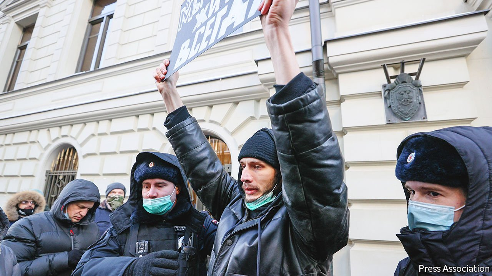

###### Memory hole

# Russia bans Memorial, a seminal human-rights group 

##### Putin intensifies his campaign to repress the memory of totalitarian crimes 

 

> Jan 1st 2022 

RUSSIAN HISTORY is rich in shameful dates, many of them marking show trials and mass executions—or liquidations, as they were then called. December 28th, 2021, should be added to the calendar. On that day Russia’s supreme court “liquidated” Memorial, the country’s most vital post-Soviet civic institution, dedicated to the memory of Stalinist repression and the defence of human rights.

Memorial emerged as a group independent of the state in the late 1980s, at the height of Mikhail Gorbachev’s policies of glasnost (openness) and perestroika (reconstruction). One of its founders was Arseny Roginsky, a historian who spent four years in a Soviet prison for publishing a samizdat almanac entitled Pamyat (“Memory”). Another was Andrei Sakharov, the nuclear scientist who created the first Soviet hydrogen bomb and later campaigned tirelessly for human rights.


The group was formally registered in 1990, a few months after Sakharov’s death. The initial goal was historical, to document the crimes under Stalin. Every year Memorial ran a mass reading of the names of some of his millions of victims, read out by thousands of participants. As post-Soviet Russia began to abuse its citizens, first in Chechnya and then throughout the country, Memorial became the country’s best human-rights organisation.

Russia’s supreme court is Kremlin-controlled, so its decision was expected. In recent years Memorial has increasingly come under attack, its offices vandalised and its staff harassed. But this did not make the court’s ruling less significant. Memorial paved the way for post-Soviet Russia, its embrace of human dignity drawing a line that separated the new state from the systemic terror of the old one. The group’s liquidation has erased that line, making it easier for Mr Putin to whitewash not only the crimes of the past but also those of the present. A day earlier, on December 27th, a Russian court extended the jail term of Yuri Dmitriev, a historian affiliated to Memorial who had uncovered mass graves in Stalin’s gulags, from 13 to 15 years. Prosecutors fabricated charges that he had sexually abused his adopted daughter.

Formally, Memorial was liquidated as a “foreign agent”, an old Soviet term for traitors. The trial resurrected language once used by Stalinist prosecutors. “Memorial creates a false image of the Soviet Union as a terrorist state…Why should we, the descendants of the victors, watch attempts to rehabilitate traitors to the motherland and Nazi collaborators? Perhaps because someone is paying them for it,” proclaimed Aleksei Zhafyarov, a state prosecutor. “It makes us repent of the Soviet past, instead of remembering its glorious history.”

The ruling fell on the centenary of Sakharov’s birth and on the 30th anniversary of the Soviet Union’s dissolution. In his farewell speech on December 25th, 1991, Mr Gorbachev proclaimed a new era when human rights would be treated as supreme: “We have paid with all our history and our tragic experiences for these democratic achievements—and they must not be abandoned, whatever the circumstances.”

Yet unlike the de-Nazification of Germany, the process of de-Stalinisation was never enshrined in law. Nor have the crimes of the Soviet state ever been prosecuted. The KGB was renamed and re-organised, not abolished. The securocrats who rule Russia today wrap themselves in nostalgia for the great empire that defeated Hitler. Meanwhile, they gloss over the way it abused its own citizens, and copy some of its methods.

“The liquidation of Memorial is...a message to the elites: ‘Yes, repressions were necessary and useful to the Soviet state in the past, and they are needed today,’” wrote Grigory Okhotin, who founded OVD-Info, a human-rights organisation. The state considers any form of independence a threat. OVD-Info, which uses social media to organise legal help for the victims of repression, has been labelled a foreign agent. Its website has been blocked.

The ruling on Memorial signals a move by the government from limited, targeted repression to something much broader. Internet freedoms are being rolled back. On December 24th a Russian court slapped a $100m fine on Google for “systematic failures to remove banned content”—the largest fine directed at the Western tech giant and the first to be calculated on the basis of its annual revenue. Hours later the court fined Meta Platforms, the parent company of Facebook and Instagram, $27m.

Repression requires an excuse. The Russian government’s favourite one is the threat of war. Its build-up of troops on the Ukrainian border in recent months is part of the propaganda offensive. The Kremlin accuses America, NATO and Ukraine of threatening Russia. It labels independent Russian politicians and civil-society groups such as Memorial as Western collaborators. The West is nervously watching for Russian military aggression beyond its borders. But the onslaught inside Russia is well under way, against its own people and their memory. ■

