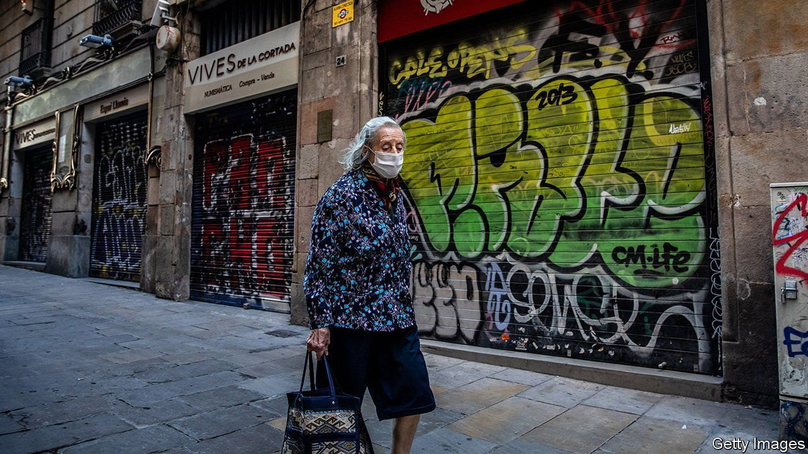

###### A bad bet

# Spain’s reforms in 2021 were only tiny steps 

##### The country’s changes to pensions and labour-market rules are too timid 

 

> Jan 1st 2022 

SPANIARDS EAGERLY tuned in on December 22nd to watch the annual Christmas lottery, nicknamed el gordo (“the fat one”). Punters were hoping for a share of €2.4bn ($2.7bn) in prizes. The European Union, meanwhile, had placed a bet of its own. It hoped Spain’s politicians might go out of their way to win a national jackpot of €70bn, the country’s share of the EU’s €750bn covid recovery fund. The grants were conditional on reforms, especially in two worrisome areas: pensions and the jobs market. The government met the EU’s deadline of December 31st. Whether its reforms merit the name is another matter.

Spain’s government, made up of the Socialists and the far-left Unidas Podemos grouping, entered office in 2019 on a misguided pledge to repeal an earlier reform from 2012. Those changes had made layoffs cheaper and let unions strike wage deals within individual firms, rather than in industry-wide negotiations. This is thought to have aided Spain’s strong recoveries from the euro crisis and the pandemic. The package the government announced on December 23rd stopped short of repeal, but took no great steps forward either.


The government’s goal was to make the labour market less unequal. Some Spaniards have good jobs and are nearly unsackable; others have temporary contracts and little security. The new proposal curbs time-limited contracts and tries to stop companies from evading the law by subcontracting. Promisingly, it would make permanent a pandemic-era measure in which the state pays temporarily furloughed workers. Both the unions and the employers’ organisation blessed the deal. But it contains no creative solutions to Spain’s high structural unemployment.

The other big missed chance was fixing pensions. Spaniards retire young (at 60.7 on average), live long (83.5 years on average) and get generous pensions (80% of pre-retirement earnings against an average of 62% in the OECD, a club mostly of rich countries). Spain has yet to feel the full strain of these promises because its baby boom came late. But the crunch will come. A reform passed earlier this year merely offered inducements to postpone retirement and increased contributions slightly (by 0.1 percentage points of salary paid by workers, and 0.5 paid by employers). That is not nearly enough.

The European Commission is now in theory to judge whether Spain’s reforms are sufficient to release the next tranche of money. No one expects a thumbs-down: the commission does not want to deliver a shock to the EU’s fourth-biggest economy in the midst of a pandemic. The money will be put to some good uses, primarily greening and digitising the economy. But the chance to use it to fund bigger reforms has been lost, at least for now. Like punters who bet on el gordo, the EU must hope future years bring more luck. ■

