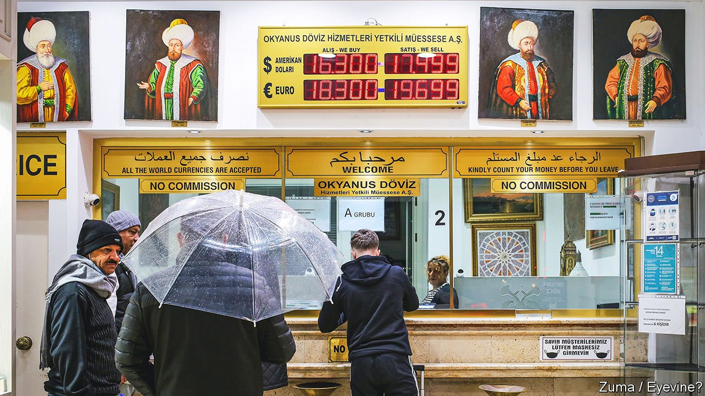
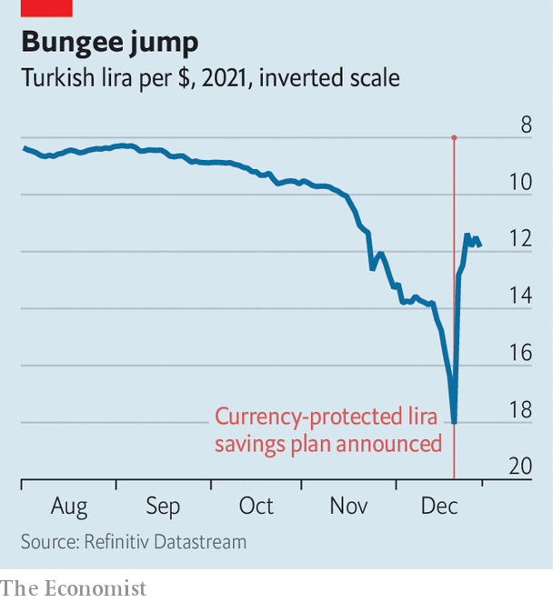

###### Smoke, mirrors and lira

# Turkey’s currency woes are likely to get worse 

##### President Erdogan’s voodoo economics have put taxpayers on the hook for billions 

 

> Jan 1st 2022 

IN TIMES OF trouble, it is good to have something to lean on. For a currency this can be a central bank capable of keeping inflation at bay, or a stable and predictable government to reassure nervous investors. Since today’s Turkey has neither, its swooning currency, the lira, has had to look elsewhere for help. On December 20th President Recep Tayyip Erdogan announced an unorthodox plan to rescue Turkey’s economy from the crisis his policies have caused. It involves the government insuring some lira deposits against swings in the exchange rate.

In the short term the scheme seemed to have worked. The day after Mr Erdogan’s announcement the lira staged a record rebound, quickly erasing a month’s worth of losses. Yet the main factor in the rally was not the deposit-insurance programme but the central bank, which spent billions of dollars from its shrinking reserves to buy lira. The currency’s recovery has bought some time for Mr Erdogan, who had been in deep political trouble. But it has only obscured, or even heightened, the risks to Turkey’s economy.


The immediate source of those risks is Mr Erdogan’s obsession with low interest rates. For years he has insisted, in defiance of basic economics, that low rates reduce inflation rather than stoke it. Starting in September, with Turkish inflation nearing 20%, Mr Erdogan goaded the central bank into cutting its base rate four times, from 19% down to 14%. That triggered a currency crash. Even after its recent rally, the lira has lost almost 40% against the dollar in 2021, more than any other major currency.

Mr Erdogan maintains that a weak lira will be good for Turkey’s economy, boosting exports and attracting investors. Few Turks agree. In a recent poll, 94% said depreciation has had a negative impact. About two in three said they could not meet basic needs without taking out loans. Even more think inflation is far higher than the officially reported rate of 21%.

Fast-rising food and energy prices hit the poor especially hard, since they spend a bigger share of their earnings on necessities. There are long queues at shops selling subsidised bread. Real wages have plummeted. Turkey’s middle class, which swelled during Mr Erdogan’s first decade in power, is shrinking. One chef at an Istanbul restaurant says he took out a cash loan in September to stock up on nappies for his infant child, fearing they would soon be unaffordable. Since then their price has more than doubled.

Mr Erdogan would never describe it as such, but his scheme to save the lira is in effect an indirect rate rise for savers. Under the plan, Turkey’s government will compensate holders of fixed-term lira deposits when the currency’s depreciation against hard currencies exceeds the interest rate offered by their banks. Were the dollar to strengthen by 30% against the lira in a year, for example, a depositor at a bank with a 14% annual rate would get an additional 16% courtesy of Turkey’s treasury. The Turkish taxpayer will end up bailing out the Turkish depositor.

 


The scheme may have helped prevent a run on the banks. Turks had been converting their savings to dollars at a record pace, contributing to the lira’s fall. More than 60% of the country’s deposits are now held in foreign currencies. Some were considering fleeing Turkey’s banks altogether. “People had begun to lose trust in the banking system,” says Ozlem Derici Sengul, founding partner at Spinn Consulting in Istanbul. “The decision stopped this.”

Yet the rally had less to do with confidence in Mr Erdogan’s plan than with interventions by Turkish lenders. Since the start of December, Turkey’s central bank has burned through at least $20bn in foreign reserves to prop up the currency, sometimes acting itself and sometimes through state-owned commercial banks. In the two days surrounding Mr Erdogan’s announcement Turkish banks bought $7bn-worth of lira.

Regardless of its effectiveness, the new scheme is a big risk for public finances. If a large portion of Turkey’s roughly $300bn-worth of private savings moves to guaranteed deposits, a sharply falling currency could put the state on the hook for hundreds of billions of lira. “The system may implode when faced with an exchange-rate or risk-premium shock,” says Hakan Kara, the central bank’s former chief economist.

Standard economics would have Turkey raise interest rates to bring down inflation and stabilise exchange rates. But that looks less likely than ever. Mr Erdogan has dug in his heels, ignoring pleas from economists and business groups and invoking an Islamic injunction against usury to justify his eccentric policy.

Loyal media outlets have proclaimed Mr Erdogan’s move a masterstroke, and the government has ways of discouraging sceptics from speaking up. On December 27th Turkey’s banking regulator filed criminal charges against Durmus Yilmaz, a former central-bank governor, and at least 25 others for criticising monetary policy and for other statements it disliked. Mr Yilmaz had accused the president of turning the country into a “laboratory” for crackpot ideas. But other critics are beyond the reach of Mr Erdogan’s enforcers. At a press conference on December 23rd, Vladimir Putin defended the Russian central bank’s recent rate increases. Without them, he said, “we could end up like Turkey.” ■

