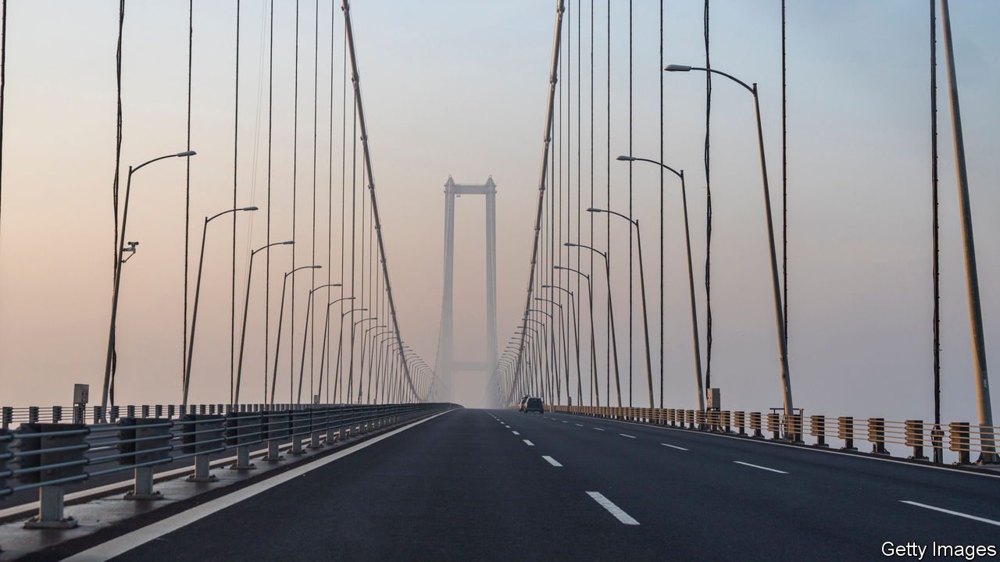

###### Privatised gains, socialised losses

# Turkey’s public-private partnerships are pricier than promised 

##### The lira’s woes raise the bill for Erdogan’s big projects 

 

> Jan 1st 2022 

THE OSMANGAZI suspension bridge, one of the world’s longest, opened in 2016, stretching nearly 2,700 metres over the Marmara Sea. Combined with a new road, it has halved the travel time between Istanbul and Izmir, Turkey’s largest and third-largest cities. But for many Turks, the country’s currency crisis has made the crossing unaffordable. A driver making the trip every day for a month would have to pay tolls amounting to twice the minimum wage. The toll will rise again at the start of 2022.

Turkey’s president, Recep Tayyip Erdogan, has decked out his country with scores of new bridges, tunnels, airports and hospitals. Most are public-private partnerships (PPPs), deals whereby companies construct and operate infrastructure in exchange for fees from consumers or payments from state coffers. The lira’s slide over the past year has dramatically raised the cost of PPPs to taxpayers. The government guarantees companies involved in such projects a minimum level of income, almost invariably in hard currency. Such guarantees amount to a total of $150bn in the coming two decades, estimates Ugur Emek, an academic at Baskent University in Ankara. At the start of 2021, that was equivalent to 1.1trn lira. By late December, it had risen to 1.7trn lira.


PPPs often make economic sense. In Turkey and elsewhere, they have a better record of avoiding delays and cost overruns than conventional public procurement. They have helped Turkish construction companies accumulate know-how and capital. Many projects, including sprawling hospitals that opened just in time before the covid-19 pandemic, have been a success.

But the same few companies regularly walk away with the biggest contracts. Some projects are white elephants. “There’s an overreliance on PPPs,” says M. Coskun Cangoz, a former official at the World Bank now with TEPAV, a think-tank in Ankara. “We’re doing things in a less transparent way.”

For Mr Erdogan, PPPs come with political benefits. He can take credit for launching big projects (a recent exhibit at his palace featured over 800 pairs of scissors and ribbons used for such occasions) and pretend that private companies shoulder the cost, since the investments do not show up as government debt. Defenders of PPPs say Turkey would not have been able to afford the new infrastructure by paying for it directly. But unless Mr Erdogan gets the economy back on track, Turks will pay dearly for his spending spree.

