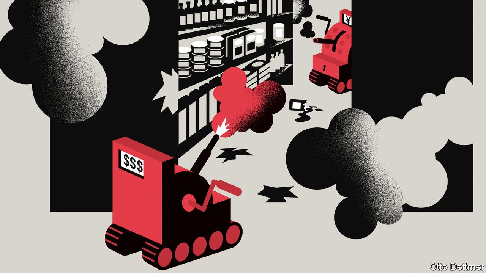

###### Free exchange

# New research counts the costs of the Sino-American trade war 

##### It has been a lose-lose ordeal 

 

> Jan 1st 2022 

THE INITIAL two-year segment of the “phase one” trade deal between America and China comes to an end on December 31st. Neither country is in a mood to mark the occasion. Mutual antagonism is as fierce as ever; a new American law banning goods made with forced labour in Xinjiang is the latest flashpoint. Still, it is a good moment to take stock of the economic outcomes of the Sino-American trade war. The verdict is unremittingly negative for both countries—with one important exception.

Start with the most glaring failure. As part of the phase-one deal, signed on January 15th 2020, China promised to import dramatically more from America, by buying an additional $200bn in goods and services in 2020 and 2021, compared with 2017 levels. Having long complained about China’s manipulation of its economy, America demanded that it manipulate trade flows. As it turns out, Chinese officials lacked either the willingness or the ability to get it done. China will reach barely a tenth of its purchase target for goods, according to data compiled by Chad Bown of the Peterson Institute for International Economics, a think-tank. Even allowing for pandemic-related disruptions, America’s strategy of browbeating China into buying more of its wares has underwhelmed.


More broadly, the trade war has hurt both the Chinese and American economies, as a growing body of research shows. The superpowers started hitting each other with tariffs in early 2018, giving economists two full pre-covid years of numbers to crunch. During that time average American tariffs on Chinese imports soared from 3% to 19%, while average Chinese tariffs on American imports went from 8% to 21%. It is hard to overstate how big a shock this was to the world’s biggest bilateral trading relationship. Pablo Fajgelbaum of Princeton University and Amit Khandelwal of Columbia University calculate that the tariffs were applied to even more trade as a share of American GDP than were the notorious Smoot-Hawley levies of 1930, which led to a spiral of international retaliation and may have worsened the Depression. Mercifully, the Sino-American trade war has precipitated no such disaster. The global economy was in much better shape to begin with. And price effects have been muffled by complex supply chains.

At the onset of the trade war, a common assumption was that both sides would bear the costs of the tariffs: Chinese suppliers would charge a little less for their goods, and American importers would pay a bit more. Yet an early study by economists including Gita Gopinath, now of the IMF, found that American importers in fact bore more than 90% of the cost of America’s tariffs. The obvious explanation was that they had little choice but to rely on Chinese suppliers, at least in the short run, and could not negotiate lower prices. In addition, prices to consumers barely budged, suggesting that retailers absorbed the costs through thinner profits.

This could not last, wrote Ms Gopinath and her colleagues: at some point American importers would pass higher costs on to customers. Chinese economists might gleefully point to America’s current surge in inflation to argue that this is now happening. At the margin they are surely right that tariffs can be inflationary, as even Janet Yellen, America’s treasury secretary, has conceded. But dislocations stemming from the pandemic—from microchip shortages to a quintupling of shipping costs—are far bigger factors in driving up prices. The trade war only adds to the headache.

One reason why America levied tariffs was to encourage manufacturers to relocate there. Yet trade friction has in fact depressed business investment in America, suggests research by Mary Amiti of the Federal Reserve Bank of New York and others. The share prices of companies trading with China fared especially badly after tariff announcements. This reflected lower returns to capital and, by extension, weaker incentives to invest. All told, the annual investment growth of listed American firms was likely to have shrunk by 1.9 percentage points by the end of 2020. Aaron Flaaen and Justin Pierce of the Federal Reserve Board estimate that exposure to higher tariffs was associated with a decline in American manufacturing employment of 1.4%. The burden of higher import costs and retaliatory levies outweighed the benefits of being sheltered from foreign competition.

So far all this might sound like a win for China. But more recent papers show that it too has taken some blows. Because of a lack of granular official Chinese data, Davin Chor of the Tuck School of Business and Li Bingjing of the University of Hong Kong studied satellite images of night-time lights to gauge economic activity. The bulk of China’s population, they found, would have been oblivious to the trade war. But for the directly affected export-intensive parts of the country, they estimated that the tariffs led to a 2.5% contraction in GDP per person. Another approach by economists including Xu Mingzhi of Peking University was to look at data from 51job.com, a Chinese job platform. Firms more exposed to American tariffs posted roughly 3% less ads in the six months following tariff increases, and reduced salary offers by 0.5% on average. Chinese officials like to talk about bilateral co-operation as “win-win”. The trade war has been lose-lose.

Eggs in more baskets

The trade war has been constructive in one respect, however. America’s imports from China are fractionally lower than before it implemented tariffs. By contrast, its imports from Vietnam have doubled, and those from Mexico have risen by 20%. Viewed narrowly, this may be a sign that trade is being diverted from more efficient producers in China to slightly less efficient ones.

But as a matter of business strategy, this looks sensible. One of the lessons of the supply-chain snarls of the past year is the danger of over-reliance on a single source. American firms can thank the trade war for getting them started on the messy business of rethinking their supply chains. The trajectory of Sino-American relations suggests they have every reason to hasten the shift. ■

Read more from Free Exchange, our column on economics: (Dec 18th 2021) (Dec 11th 2021) (Dec 4th 2021)


