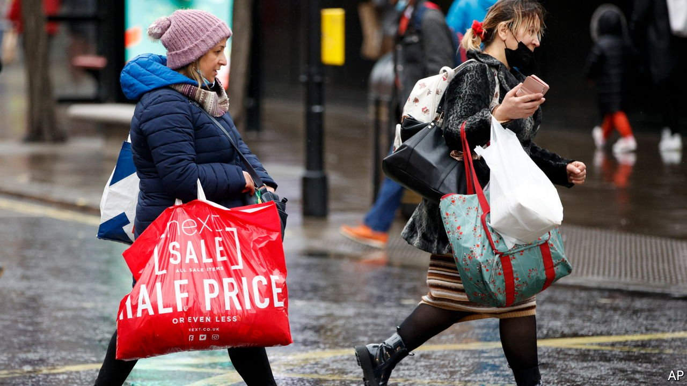
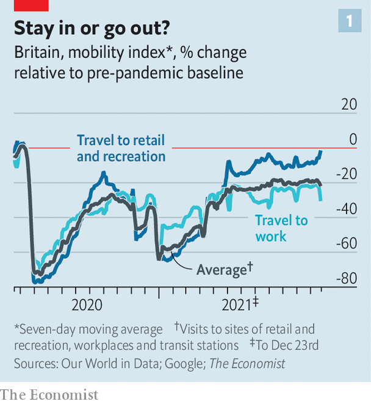
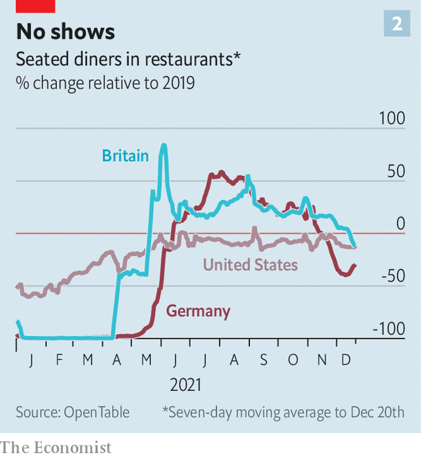

###### Omicron omens

# What real-time indicators suggest about Omicron’s economic impact 

##### People have been quicker to desert offices than shops 

 

> Jan 1st 2022 

WHAT IS THE economic impact of Omicron? The latest variant of the coronavirus has let rip at such a ferocious pace that forecasters are still catching their breath, and it will be some time before its economic effects become apparent in the official data, which are published with a lag. But a number of speedier, albeit partial, indicators can provide some insight into how consumers and workers may be adjusting their behaviour.

Consider first people’s willingness to go out and about. A mobility index using real-time data from Google and constructed by The Economist includes visits to workplaces, retail and recreation sites, and transport hubs. This measure has been reasonably stable in America, albeit at levels below pre-pandemic norms, and has fallen a little in Britain and Germany in recent days. But underlying those headline figures are bigger differences depending on the kind of activity. The return to the office seems to have stalled. In America and Germany journeys to workplaces fell to about 25% and 16% below pre-pandemic levels, respectively, in the week to December 23rd. In Britain, where the government has issued guidance to work from home, they were 30% lower (see chart 1). By contrast, retail- and recreation-related activity has continued to recover in all three countries. This suggests that people may have become more discriminating about when to leave the house, especially as the festive season began. It might also indicate that people who can easily work from home were doing so, a sign of the economy’s increased adaptability to new variants.

 


Other measures show that the hospitality industry is taking a knock. Fewer people are eating at restaurants than in 2019, according to data from OpenTable, a booking platform. In America and Britain there were 12-15% fewer diners in the week to December 20th than in the same period in 2019 (see chart 2).

 


Omicron also seems to have contributed to travel disruptions. That has been most notable in America and China, where domestic air travel had more or less returned to normal. In the week to December 26th some 3,500 domestic and international flights that started or finished in America were cancelled, according to FlightAware, a data firm—about 2.5% of the total number of flights. That compares with a cancellation rate of 0.7% in the same week in 2019. American airlines have blamed covid-related staff shortages and bad weather for the cancellations. The number of passengers passing through American airports on December 22nd and 23rd slightly exceeded that in the same period in 2019. But only 3.2m made journeys on the 24th and 25th, compared with more than 5m in 2019.

These indicators give only a limited view of the economy. But they may well capture the areas that are most likely to be affected by fresh outbreaks of covid-19. Analysts at Moody’s, a rating agency, have revised down their estimates of growth in America in early 2022 partly because of reduced spending on travel. Economists at Pantheon Macroeconomics, a consultancy, expect the pain in Britain to be concentrated in the hospitality, entertainment and travel industries, while other sectors remain unaffected. That points to a smaller overall economic impact this time round, compared with previous waves. But with infections still surging and governments pondering fresh restrictions on activity, the full effect of Omicron could be yet to come. As covid-19 enters its third year, every forecaster knows by now to brace for the unexpected. ■

For more expert analysis of the biggest stories in economics, business and markets, , our weekly newsletter.

