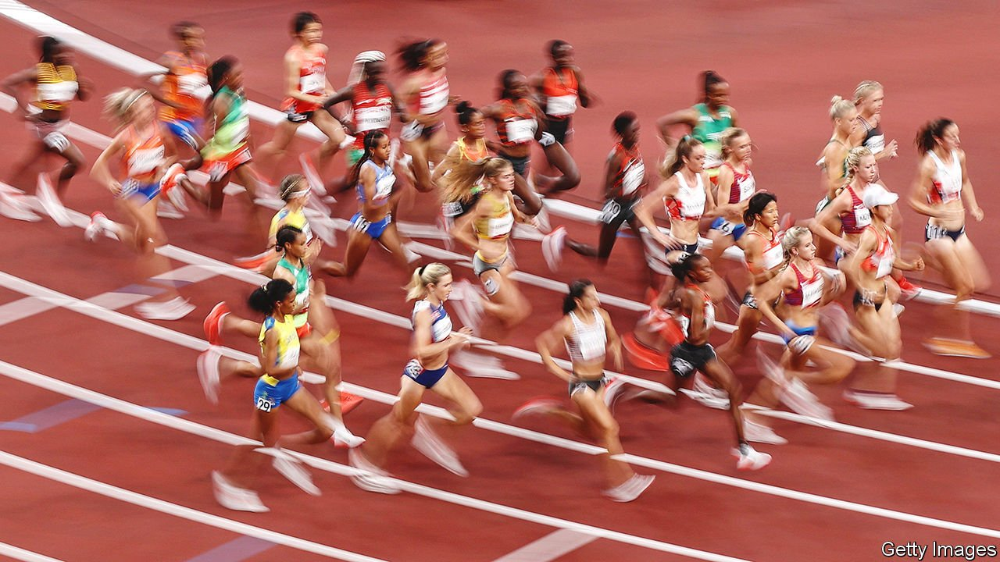
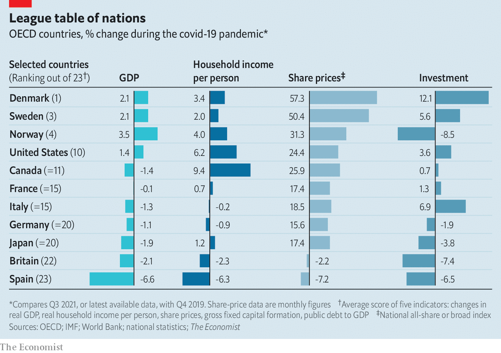

###### Winners and losers

# Which economies have done best and worst during the pandemic? 

##### We rank 23 rich countries along five measures 

 

> Jan 1st 2022 

THE SPEED of the economic bounce-back from the enormous recession of 2020 has taken many forecasters by surprise. Output across the 38 mostly rich OECD countries combined probably surpassed its pre-pandemic level a few months ago. The average unemployment rate across the club, at 5.7%, is in line with the post-war average. And aggregate household income, adjusted for inflation, is above its pre-covid level. The overall picture has been remarkably benign, even as several variants of the coronavirus have emerged. But it hides stark differences beneath. The pandemic has created winners and losers —and the dispersion between them is likely to persist in 2022.

In order to assess these differences, The Economist has gathered data on five economic and financial indicators— GDP, household incomes, stockmarket performance, capital spending and government indebtedness—for 23 rich countries. We have ranked each economy according to how well it has performed on each measure, creating an overall score (the table below shows the overall ranking, and four of our five indicators). Some countries remain in the economic pits, while others are faring better than they were before the pandemic on almost every measure. Denmark, Norway and Sweden are all near the top, and America has also performed reasonably well. Many big European countries, however, such as Britain, Germany and Italy, have fared worse. Spain has done worst of all.


The change in headline GDP since the end of 2019, our first indicator, offers a snapshot of economic health. Some countries always looked vulnerable to travel bans and a collapse in services spending—in particular those in southern Europe, which rely heavily on tourism. Other places, including Belgium and Britain, suffered high levels of covid-19 infections and deaths, which limited consumer spending.

 


Granular data help fill in the picture. The change in household income gives a sense of how well families have done, as it includes not just earnings from employment but also handouts from governments. Our measure is in real terms, which adjusts for reduced purchasing power as a result of recent surges in inflation.

In some countries, especially those where the impact of the virus was relatively slight, labour markets did not suffer too much, allowing people to continue to earn. Japan’s unemployment rate has barely budged since the pandemic began. By contrast, Spain’s rate rose by three percentage points between February and August 2020.

Some governments more than made up for people’s lost labour income by sending them vast amounts of money. That was America’s strategy: although unemployment soared as the economy locked down, households received more than $2trn in government transfers in 2020 and 2021, in the form of topped-up unemployment benefits and stimulus cheques. Canada did something similar. Other countries, however, such as the Baltics, focused their fiscal firepower on protecting firms’ cashflow or expanding health-care capacity. Austria and Spain seemed neither to preserve jobs nor compensate the losers: in both countries real household income is still around 6% below its pre-pandemic level.

What about companies? Stockmarket performance hints at their health, as well as a country’s attractiveness to foreign investors. Share prices in Britain are slightly lower today than on the eve of the pandemic—a reflection, perhaps, of Brexit-induced uncertainty. Britain also hosts fewer companies in the higher-growth sectors that have benefited from pandemic-induced technology adoption and lower interest rates. America, which has more such firms, has seen its stockmarket jump. But it has nothing on the bourses of northern Europe, where prices have soared. Three of the ten biggest firms by market capitalisation on the Danish market are in health care, decent stocks to hold in a pandemic.

Capital spending, our fourth measure, provides a gauge of businesses’ optimism about the future. Some countries are in the middle of a capex boom: in America, for instance, entrepreneurs are spotting opportunities created by the pandemic, and companies are spending big on technologies that make working from home more efficient. In October Goldman Sachs, a bank, forecast that S&amp;P 500 companies would spend 18% more on capex and research and development in 2022 than they did in 2019. Investment in some other places, by contrast, is more sedate. Norway has seen cuts to oil-and-gas capex.

Our last indicator is public indebtedness. All else equal, a big rise in government debt is worse than a small one, since it could indicate potentially larger tax rises and spending cuts in the future. Not every country has amassed enormous debts during the pandemic, even if America, Britain, Canada and others certainly have. Swedish public debt has risen by just six percentage points as a share of GDP. This is a reflection, perhaps, of the fact that the country largely avoided strict lockdowns, necessitating less fiscal support.

The spread of the  is likely to . But the economic recovery is still likely to continue over the year, and the overall picture will probably mask variation again. The OECD expects some of the worst performers to start catching up: Italy is forecast to grow by 4.6% in 2022, above the average pace for the club of 3.9%.

But the laggards have a long way to go. By the end of next year, the OECD expects the combined GDP of our three highest-ranked countries to be 5% higher than its pre-pandemic level. Output for the three worst performers, meanwhile, is expected to be just 1% higher than it was before covid-19. The uneven effects of the pandemic, in other words, will endure. ■

For more expert analysis of the biggest stories in economics, business and markets, , our weekly newsletter.

