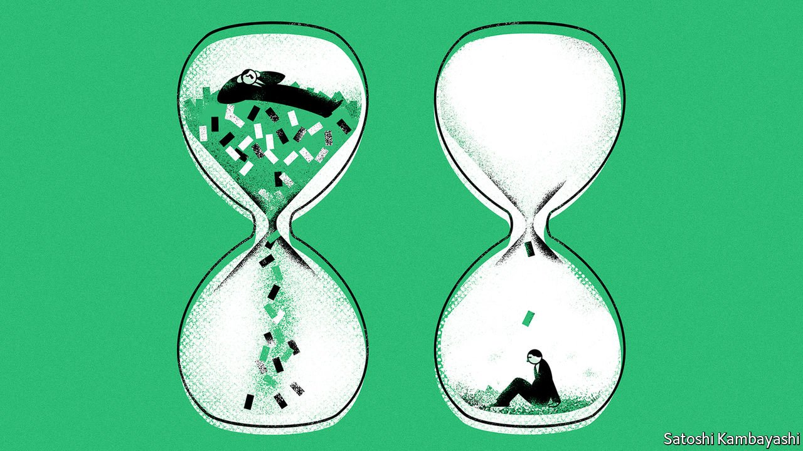

###### Buttonwood

# Why capital will become scarcer in the 2020s 

##### Populism, climate change and supply-chain fixes will raise the long-term cost of capital 

 

> Jan 1st 2022 

THE TROUBLE with the 12-month outlook, an obligation at this time of year, is that the forecasts will be wrong. Of course they will. In financial markets there are so many ways to err—on direction, timing or speed of change. A year is both too long and too short. Too long, because the blistering pace of the current financial-business cycle means even a well-identified idea plays out in a matter of weeks. Too short, because deep trends may take years to become fully apparent.

So let us shelve the immediate outlook and ask instead how things might change over the next decade or so. Today capital is abundant. A middle-aged global workforce has lots of savings to put to work. Low long-term interest rates and expensive assets point to a scarcity of worthwhile ways to deploy those savings. New businesses are often ideas-based and do not need a lot of capital. It can be hard to imagine this state of affairs ending. But over time capital is bound to become less abundant. Greater demand for it will come from three sources in particular: economic populism; shorter supply-chains; and the energy transition.


Start with economic populism. Thirty years ago two academic economists, Sebastian Edwards and Rudiger Dornbusch, sketched out its key elements. Above all, it is an approach that sees no constraints—such as borrowing limits or inflation—on economic growth. The Latin American populists studied by the scholars printed money to pay for public-spending binges. This ended badly. But economic populism lives on. It is in its purest form in .  seems hell-bent on embracing a version of it. Argentina never quite threw it off.

A diluted form of economic populism is becoming more evident in rich countries, too. One sign is a revival of discretionary fiscal policy. The $1.9trn package signed in March by President Joe Biden is the . The EU’s €750bn ($900bn) recovery fund is more modest but still significant. Fiscal stimulus is back in favour because of a realisation that policy constraints, such as budget deficits, bind less when interest rates are low. But over time  will start to absorb excess savings. There has also been a shift in monetary policy. You see this in a change in targets and in personnel. The old-style central banker—aloof from politics, paranoid about inflation—is all but extinct in the rich world. A new breed frets about inequality and finds reasons to be sanguine about inflation risks. Marko Papic of Clocktower Group, an investment firm, calls the shift towards stimulus the “Buenos Aires Consensus”, in contrast with the Washington Consensus, which counsels prudence.

A second factor is rising investment in business continuity. Global value chains are likely to shorten somewhat. In part this is to avoid the  that weighed on output in 2021. Even modest  will require more capital. A general increase in working capital seems likely. Companies lost sales during the pandemic for want of stock. The interest cost of carrying inventory is now far lower than it was when business practice shifted towards lean stock levels and just-in-time supply. A national-security imperative also favours greater redundancy in supply chains, as Mr Papic points out. Rivalry between America and China is leading each country to duplicate capacity in certain key industries, such as . Such duplication will soak up capital.

A third reason to expect capital scarcity is climate change. The transition to greener energy is essentially a capital-spending problem, argue Eric Lonergan and Corinne Sawers in a forthcoming book. Any serious attempt to arrest the climb in the global temperature requires junking the assets underpinning the carbon economy—oil rigs, coal-fired power stations, petrol forecourts—and building a new infrastructure based on electric vehicles, wind and solar power and battery storage. A lot of capital has to be deployed to create these assets.

None of these three trends is the kind that plays out fully over a calendar year. Indeed, such are the ironies of forecasting that 2022 may furnish evidence against the capital-scarcity thesis. If the Federal Reserve , it will do so quite early in the business cycle, belying the idea of a populist policy tilt. Mr Biden’s “Build Back Better” spending bill may . As bottlenecks ease, security of supply may slip down companies’ lists of priorities. But today’s capital abundance cannot last for ever. Wait long enough and some forecasts are almost bound to be right.

For more expert analysis of the biggest stories in economics, business and markets, , our weekly newsletter.

Read more from Buttonwood, our columnist on financial markets:

 (Dec 11th 2021) (Dec 4th 2021)


