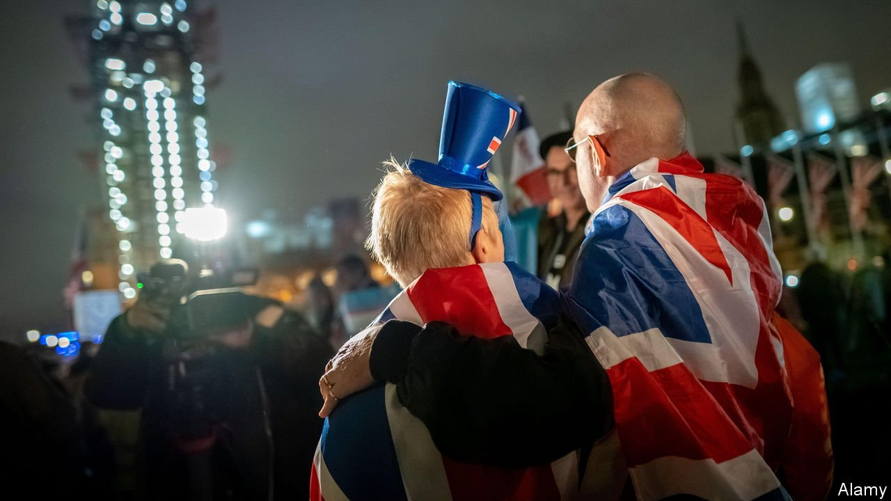
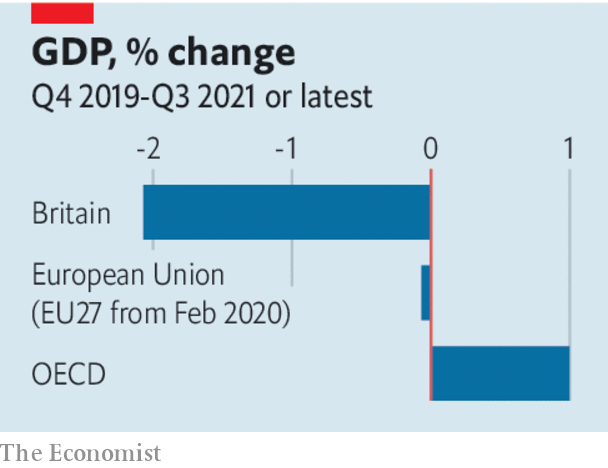

###### Time to choose

# Brexit’s many contradictions are coming to a head 

##### It is time for Boris Johnson to abandon “cakeism” 

 

> Jan 1st 2022 

A YEAR AGO, as Boris Johnson prepared to take Britain out of the European Union’s trading arrangements after an 11-month transition, he was on top of the world. The trade and co-operation agreement he had signed with the EU was, he crowed, “cakeist”—his term for deals that combine the having and eating of cake, in this case decent access to the single market and freedom to diverge from its rules. But as 2021 ended, little cake was to be had. A backbench rebellion, a stunning by-election loss and public anger at revelations that the prime minister and his colleagues partied during lockdowns in 2020 have hit his poll ratings. The year’s final blow came on December 18th, when David Frost, his chief EU negotiator, resigned, citing his frustration at the government’s failure to make progress on an ambitious post-Brexit agenda.

Some of Mr Johnson’s difficulties are tied to his personal flaws: arrogance, sloppiness and a belief that rules are for little people. But Lord Frost, for all that his bellicose approach to the EU made progress harder, was right about his central charge. On , which the Conservatives promised would kick-start a national renewal, the government is adrift. Growth has been sluggish and ejection from the single market has, as expected, harmed the country’s prospects: government forecasters put the long- run hit to productivity at around 4%. So far the government has failed to identify policies that could come close to making up for that. To regain momentum it must make tough choices and face up to their consequences.


The problem is less the type of Brexit that Britain opted for than a refusal to accept what flows from it. That is clearest in Northern Ireland. Britain chose to maximise sovereignty and national control, at the cost of leaving the EU’s trading system. The EU, mindful of Northern Ireland’s fragile peace, offered a special deal whereby the province remained, in effect, in the single market and customs union so as to avoid a destabilising hard border with the Republic of Ireland. That meant customs checks in the Irish Sea—an outcome spelt out in the treaty that Britain chose to sign, but which Lord Frost subsequently declared unacceptable and tried, fruitlessly, to unpick.

 


A similar failure to make a choice and stick to it is evident in Britain’s vacillations between the two options of either escaping the EU’s regulatory pull or staying in tight orbit around the single market and its rules. The reason is partly electoral. Brexit’s most ardent salesmen dreamed of lighter taxes and looser regulations—of Britain becoming Singapore-on-Thames. But many voters rather like the EU’s social-democratic model. Indeed, since leaving the EU, Britain has in some ways become more European. It has raised the minimum wage sharply and increased taxes to pay for social care. If Mr Johnson’s promise to “level up” Britain means anything, it is European-style industrial policy and grand public works.

A dose of realism is needed. On Northern Ireland, that means accepting that for the province to be both inside and outside the EU’s trading arrangements is impossible, and moving on. Britain and the EU can then work to minimise the downsides, such as onerous customs checks—and to maximise the upsides by helping businesses in one of the United Kingdom’s poorest regions profit from their privileged access to the EU’s giant market.

On when to diverge from Europe, Britain needs to assess the costs and benefits, and then move decisively. Often, that will mean concluding that bespoke national regulations, no matter how objectively better than EU ones, are impractical, pointless or impossible to sell to voters. EU regulations on data protection are de facto global standards. In the chemicals industry so much of British trade is with the EU that many British firms have to follow its rules to the letter. When it comes to food safety and animal welfare, Britons like the EU’s high standards and will oppose any relaxation great enough to boost productivity.

In other cases Britain can diverge from the EU in a way that packs a punch. It would not be hard to craft something better than the EU’s wasteful and environmentally damaging common agricultural policy. Competition policy and state-aid rules can also offer opportunities. Nimbler regulation, tax policies and visa rules can help London thrive as a global financial hub.

Taking the cake

Some of the biggest boosts to growth, however, would come from policies that were possible within the EU, such as market-driven reforms to the health service and looser planning rules. These will be hard to sell in the prosperous Tory shires and working-class northern constituencies that voted Conservative in 2019 to “get Brexit done”. Mr Johnson’s cake-based campaign made no mention of tough choices. But unless his government starts making some, Brexit’s future will hold little but crumbs. ■

