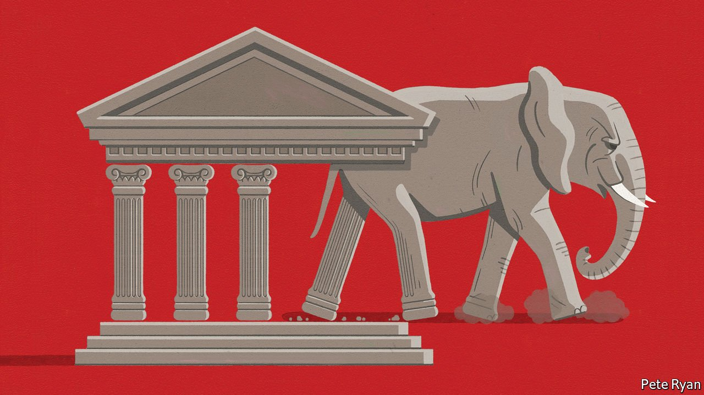

###### Walking away

# How to think about the threat to American democracy 

##### The Republican Party’s continued Trump infatuation is alarming. It should not lead to fatalism 

 

> Jan 1st 2022 

AMERICANS ARE anxious about the stability of their democracy. Roughly 40% of the politically active say that members of the other tribe are evil; 60% believe they are a threat to the country. More than 80% think the system needs “major changes” or “complete reform”. Jeremiads from pundits about the decay of political life no longer seem to match the gravity of the threat. Some scholars have gone so far as to warn of the risk of civil war.

All this became dangerously real in the attack by Trump supporters on the Capitol a year ago, which injured 140 police officers, in an attempt to prevent the certification of their champion’s defeat. After a fleeting moment of clarity, the majority of Republican lawmakers reverted to making excuses for Donald Trump because his lies had rapidly taken hold. Today, fully 70% of Republican voters still believe that the last presidential election was stolen. In head-to-head polling the former president is one point behind President Joe Biden, well within the margin of error and, thanks to the electoral college, possibly ahead in a theoretical match-up.


Extreme partisanship and the Republican refusal to accept the results of the election are indeed a dangerous combination. Yet easily lost in the daily diet of outrage is a fundamental truth about two-party politics: Democrats and Republicans need each other for the system to function. Renewal therefore must flow through the Republican Party. That will be hard—but not as hard as the catastrophists say.

The threats to the system are real. The greatest is that in several key states the administration of voting has been dragged into the partisan arena. In Arizona some of the candidates running to replace the Republican incumbent, Doug Ducey, this year will argue that he ought to have somehow engineered a victory there for Mr Trump. In Georgia Republicans have weakened the office of secretary of state, after Brad Raffensperger refused to change the results of the elections in 2020 to suit Mr Trump. In Michigan and Pennsylvania Republican candidates who claim that the last presidential election was stolen are running for positions administering and certifying the next one.

The  and the general election of 2024 will take place under this shadow. Republicans are poised to win control of one or both chambers of Congress. Mr Trump could legitimately retake the White House in 2024. The results of any of these races could be disputed by either side, especially in the next presidential election, which is likely to be close. If Democrats win, Republicans could well exploit the election machinery now infected by partisanship to try to block them from taking office. If Republicans win, Democrats could believe that disputed races have been stolen. Many would conclude that voter suppression had tipped the balance, and also note how often victors in the popular vote fail to win office. The loser’s concession, central to the transfer of power, might be withheld for a second time. Contempt for electoral legitimacy would become a bipartisan, and disastrous, conviction.

The best response would be to protect democracy today by shoring up the voting system before it is too late. However, although Americans say they want voting reform, different sides mean different things by it. Given that Democrats would like to make it easier for people to vote and Republicans are concerned with fraud and how results are verified, a compromise guaranteeing both ought to be possible. An election-security law of this type should be at the top of the agenda for 2022. And yet the passing of legislation assumes the very bipartisanship whose absence is at the root of America’s democratic decay.

This is where the future of the Republican Party comes in. Catastrophists reckon that democracy’s defenders are unequal to its assailants partly because one of the country’s two great parties is turning into something that is more like Fidesz, the ruling party in Hungary, than the Republican Party of old. Consider how far-fetched it would have been to suppose that the administrations of the Bushes or Ronald Reagan would act as the vehicle of one man lying about a stolen election.

It is true that the party is dominated by America-First Republicans who set out to deter immigration, limit foreign trade and end entanglements abroad. Their ascendancy helps explain why those Republicans who voted to impeach Mr Trump for betraying his oath of office are now being ejected from the party.

However, even the Trump-addled incarnation of the Republican Party is made up of competing factions. Country-club Republicans like Glenn Youngkin, who won the governorship of Virginia in November, want to pay less tax and not be bossed around by Democrats. Just now they see Trumpism as the only available vehicle to further their interests.

That calculation may well prove to be mistaken. Anyone who thinks they can steer Mr Trump seems to end up discarded and disdained by him. However, people who object to the attempt to undermine the election result, including Mitch McConnell and Mr Raffensperger, are still in office. Although they refrain from condemning Mr Trump in public, only in the crucible of a crisis will you find out how they would choose between having their side in power and the survival of their democracy.

Such people matter. Republican renewal, if it comes, will not be in the form of some Reaganite renaissance. Voters picking candidates for 2022 will be as many years distant from the Reagan revolution as Reagan was from FDR. And renewal is less likely from a conservative who stood up to Mr Trump than from someone who has enabled him by cowering in his slipstream, but who shares neither his reality-distorting powers nor his belief that the only legitimate result is the one where he wins.

Crucially, this person will be in charge of a party that still contains a large number of decent, patriotic voters who have been manipulated by a cynical group of leaders and propagandists into believing that, in saying the election was stolen, they are defending democracy. To presume that these people can be permanently treated as dupes would be a mistake.

Renewal is impossible for as long as Mr Trump remains the Republican Party’s leader. However, that is another way of saying that the direction of the party is tied up with the fate of one man. And that means it can change. ■

For exclusive insight and reading recommendations from our correspondents in America, , our weekly newsletter.

