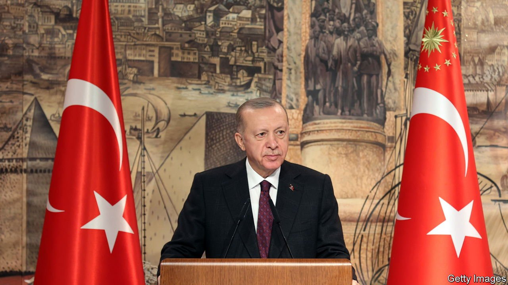
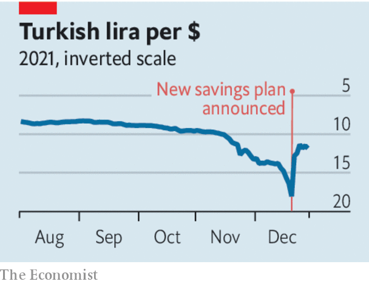

###### Erdogan v economics

# Turkey’s president cannot defy reality for long 

##### Recep Tayyip Erdogan’s scheme to save Turkey’s currency only heightens the risks 

 

> Jan 1st 2022 

MEN TEND to grow stubborn with age, and Recep Tayyip Erdogan was hardly pliable to start with. During 19 years in power in Turkey, first as prime minister and then as president, he has  thousands of dissidents and critics: secular military officers, protesters, Kurdish activists, members of the Gulen religious movement. He has silenced or purged civil-society groups, the independent media and the judiciary. With every challenge that he survives—the Gezi Park protests of 2013, an attempted coup in 2016—his ego has grown. Sensible advisers have quit, leaving him surrounded by relatives and yes-men.

A leader as powerful as Mr Erdogan can silence voices he does not wish to hear. But he cannot wish away the reality they describe. Since September, he has been trying to defy the laws of economics, over which he has no veto. As some emerging economies raised interest rates to fight inflation, Turkey . Despite inflation topping 21% in November, its president pressed the central bank to cut interest rates by five percentage points, to 14%, in keeping with his  rather than fight it. In response, Turks switched more deposits out of lira into dollars and euros. That fuelled a : the lira fell from eight to the dollar in August to 18 in late December.


In the past that might have scared Mr Erdogan straight; not now. On December 20th he announced a  back. If Turks tie up their money in lira deposits for at least three months, the treasury will compensate them (in lira) for any losses from further currency drops. After this, the  and Mr Erdogan declared victory. But it was not long before it started to fall again.

 


Officials say Turks have shifted about $3bn into currency-protected lira deposits since the announcement. But that is too little to account for the rally. The main factor was intervention by Turkey’s central and state-owned banks, which bought about $7bn-worth of lira over two days. That pace of buying is unsustainable. When it stops, the scheme will have to stand on its own two feet. Turks may decide to go along with Mr Erdogan’s ploy. More likely, they will not.

Even if the scheme succeeds in stabilising the lira, it will . The inflationary momentum from past depreciation, cheap credit and rises in the minimum wage will continue to lift Turkish prices. If the currency remains stable, the rising cost of Turkish goods would not be offset by a cheaper lira. That would erode Turkey’s competitiveness, undermine its trade balance and leave it dangerously reliant on foreign borrowing to bridge the gap between its imports and exports.

Should it fail, the consequences could be still worse. Turkey’s taxpayers will be on the hook for bailing out its depositors. That could require painful cuts elsewhere—an exercise in austerity for the benefit of the relatively prosperous Turks who have savings. Alternatively, if the government cannot tolerate that choice, it will have to print more money. If so, a scheme to compensate people for currency debasement would end up only debasing it further.

Mr Erdogan dismisses anyone who explains such things as part of an “interest-rate lobby” controlled by foreign powers. Like all populists, he ascribes setbacks to plots by his enemies. He is right that the obstacles to his economic fantasies are people: his own people, and their efforts to cope with his misguided policies. But perhaps the president is not aware of that. At the peak of his power in 2014, Mr Erdogan moved into a new 1,100-room presidential palace. His constituents’ cries of desperation must be hard to hear from inside its $600m walls. ■

