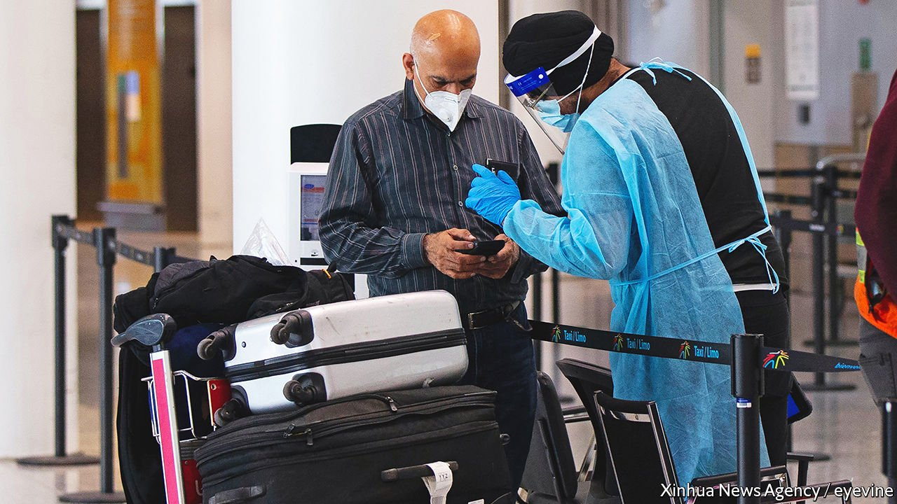

###### The virus is already here

# Why travel bans are usually the wrong way to curb Omicron 

##### Most such restrictions are disruptive and ineffectual 

 

> Jan 1st 2022 

ON DECEMBER 31ST 2019 the World Health Organisation was told about a cluster of what appeared to be pneumonia cases in a Chinese city called Wuhan. Over the next few weeks and months first cities, then countries and finally the entire planet shut down. Humanity has learned a lot about the coronavirus in the past two years. Masks, social distancing and, most of all, vaccines have proved effective in curbing its spread. Yet one lesson has not sunk in: long-lasting travel restrictions are mostly futile.

In November, when South Africa announced the discovery of a fast-spreading new variant, Omicron, many countries’ first response was to slap entry bans or onerous hotel-quarantine requirements on travellers from southern Africa. Some, such as Japan and Israel, closed their borders to all foreigners. Others that were in the process of reopening, such as Singapore, South Korea and Thailand, quickly changed their minds. Obstacles to travel were re-erected even within Europe’s supposedly borderless Schengen area.


Rapidly imposed travel restrictions make sense in the early stages of an outbreak, when infections of a variant are few and test-and-trace systems are still able to follow the paths of contagion. When imported cases account for more than 10% of infections, bans can have a big impact on the growth of the epidemic. They can thus buy time to find out about a new variant, prepare hospitals or roll out vaccinations.

But travel bans have a habit of sticking around even though, once a virus or variant is circulating freely in a country, they are largely pointless. By the time France banned non-essential travel from Britain on December 16th, hoping to keep out Omicron, it was already recording a daily average of over 50,000 infections, 10% higher than its peak during the Delta wave earlier in the year. Any imported infections would, by that point, have made little difference to the burden of disease—certainly not enough to justify the economic and social disruption caused by the travel ban.

One reason travel restrictions tend not to have lasting benefits is that most of them are leaky. With very few exceptions, countries let citizens, residents, their families, essential workers, diplomats, important businesspeople or some combination of those cross borders. The countries that impose successful long-term travel bans, as Australia and New Zealand did, must do so at enormous cost not just to their global links but also to their own citizens. For much of 2021 Australians struggled to get back into their own country and had to pay exorbitant amounts for flights and quarantine-hotels to do so. To keep covid-19 out, such measures must be reinforced by draconian curbs at home, too. Australians have not been allowed to cross state borders for most of the past two years; the city of Melbourne was locked down for 262 days in 2021.

Such policies can save lives, and they are less leaky on islands. But few democracies are willing to tolerate them for very long. Indeed, the only country still pursuing a strict zero-covid policy is China, which is taking increasingly desperate measures to contain recent outbreaks of the virus. In Xi’an, a city of about 13m where daily infections have risen from zero to over 100 in December, authorities have imposed a ferocious lockdown, are repeatedly mass-testing the population and have shoved some 30,000 people into hotel quarantine. Such methods are popular in China, where people credit their stern rulers for keeping them safe. But it is far from clear whether  is sustainable, given the high transmissibility of Omicron, nor how China will eventually move beyond it to live with the disease.

For the rest of the world, the best approach is for governments to promote the most cost-effective policies, especially vaccines and boosters, while resisting the urge to ban things just to create the illusion of decisiveness. Britain and America have displayed admirable common sense of late. Both countries removed travel restrictions on southern African countries once it was clear that the variant was circulating at home. America shortened the window during which a negative covid test must be obtained before travelling. Britain asked incoming travellers to take a test within two days of arrival and to self-isolate until they receive a negative result. Even then, such measures should aim to be proportionate and minimally disruptive. ■

Dig deeper

All our stories relating to the pandemic can be found on our . You can also find trackers showing ,  and the virus’s spread across .

