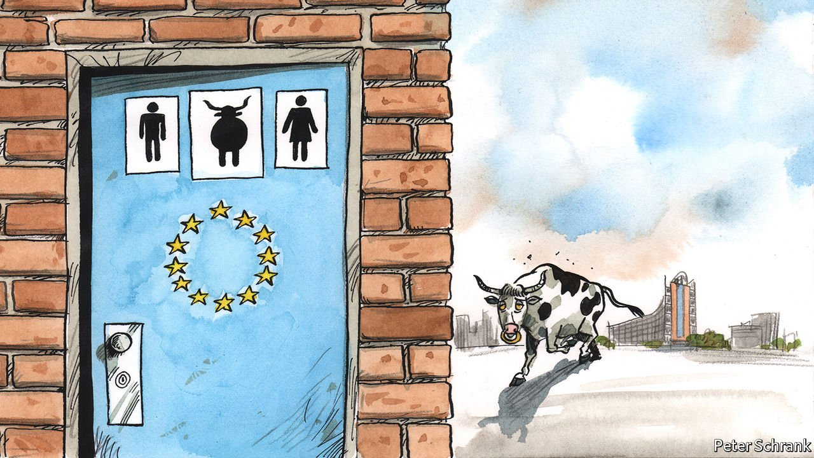

###### On antitrust, Chinese birds, confidence tricks, Singapore, the EU, Latin America, random numbers

# Letters to the editor 

##### A selection of correspondence 

 

> Jan 1st 2022 


Antitrust in perspective

“” (November 27th) spoke of Joe Biden’s “reinvigoration of antitrust” and quoted Barry Lynn saying that the president “grew up under anti-monopoly enforcement regimes that were extremely aggressive”. Antitrust policy in the United States never fitted Mr Lynn’s description. Advocates of reform assume the decades immediately following the second world war constituted antitrust’s golden era. However, Richard Hofstadter was already describing antitrust in a well-known essay from 1964 as a “faded passion”.


In 1966 Art Buchwald, a newspaper humourist, forecast that in 1978 America’s two remaining corporations would merge, and that if the resulting corporation sought to buy the United States the Justice Department would “naturally study this merger to see if it violates our strong antitrust laws”. So, if Mr Biden really does “go big on big tech” in the manner you describe, his actions would be more novel than you suggest.

BRIAN CHEFFINS

Professor of corporate law

University of Cambridge

 


The potential of European tech startups is huge, especially if they play to Europe’s strengths and demonstrate to sceptics that they can be category leaders (“”, November 27th). This is especially true in disruptive technologies, like smart mobility, smart manufacturing, digital health and especially energy transition.

That said, the weight of the success of Europe’s entrepreneurial renaissance shouldn’t rest solely on the shoulders of the startups themselves. Governments, regulators and companies need to play their part in creating the right environment to nurture and invest in innovation. If not, the fizzy potential of the current startup market will quickly fall flat.

JEAN-MARC OLLAGNIER

Chief executive

Europe, Accenture

Paris

 


Flocking to Beijing

There is growing public interest in birds and biodiversity in Beijing (“”, November 27th). The Chinese capital is situated on the East Asian-Australasian Flyway, a superhighway for migratory birds flying from breeding grounds in Siberia to non-breeding grounds in China, South-East Asia, Australasia and Africa. Beijing is a service station on this highway and thus has a responsibility to provide a variety of habitats to support this epic twice-yearly migration.

Most smaller species migrate at night, unseen as the city’s residents sleep. The project to record nocturnal bird calls from the roof of the Asian Infrastructure Investment Bank is designed to gain an insight into the volume, species diversity and timing of this invisible migration, providing useful data for the management of Beijing’s green spaces. Manicured parks may appeal to a traditional aesthetic, but they are of little value to birds and other wildlife.

To ensure Beijing plays its role in ensuring safe passage for migratory birds, more varied flora is needed, including a variety of native or near-native habitats. This means not only forest but also grassland and scrub. With enlightened land management policies Beijing could become a capital of biodiversity.

HUA FANGYUAN

Assistant professor of conservation ecology

Peking University

TERRY TOWNSHEND

Wildlife conservationist

Beijing

 


Dodgy dealers

My only quibble with Bartleby’s excellent musings on the lessons from Theranos () is whether the syndrome of the charismatic leader that sells empty promises is a phenomenon of the Silicon Valley community. Albert Dunlap, Bernard Ebbers and Jeffrey Skilling are all relatively recent examples of charismatic charlatans who bamboozled the investment community. To paraphrase Mike in David Mamet’s “House of Games”, a confidence trick is a fair exchange: you give me your money, and I give you my confidence.

JONATHAN CATHERWOOD

Middleburg, Virginia

Singapore's democracy

In a round-up of the state of democracy in South-East Asia, Banyan included Singapore among the region’s “Leninist dictatorships”, though allegedly “tongue in cheek” (). If this were true, one wonders why dozens of foreign journalists–and media platforms like the BBC and Bloomberg–find it congenial to base themselves in Singapore. Indeed, we have just received a visa application from another of your regional correspondents to be based in Singapore.

For more than six decades, Singapore has never failed to hold regular general elections: almost alone among its neighbours. The most recent, in 2020, was vigorously contested with the opposition winning more seats than in any election since 1963. Nor has Singapore experienced emergency rule or seen its constitution suspended.

Surely these inconvenient facts should have been reported in a column bemoaning the retreat of democracy in Asia.

T.K. LIM

High Commissioner for Singapore

London

 


Brussels does good

Charlemagne’s column “” (December 4th) was a snide and distorted caricature of Brussels. Yes, there is a lot of bureaucracy, although the establishment serving nearly 450m people is about as large as the local authority serving Birmingham. Yes, it often does take many hours to reach consensus among 27 independent member states, although agreement is no doubt a bit easier now that those traditional troublemakers, the British, have left.

It is easy to laugh at the Global Gateway initiative without analysis. So what if some of it relates to existing commitments? And what is wrong with a “Team Europe approach”? There was no mention of the billions of euros poured each year by the European Investment Bank into infrastructure and a wide range of other projects both within the EU and, to a lesser extent, in developing countries. No mention either of the remarkable solidity and coherence throughout the EU in the protracted Brexit negotiations with Britain. No mention of the massive €750m ($850m) grant-and-loan recovery programme to counter the effects of the pandemic. This, also, was agreed to only after hours and hours of tedious negotiation, but it commanded the crucial assent of Germany to a significant element of mutualised debt, a concession which there is a good prospect of the new German government maintaining.

No mention of the fact that although the commission was slow off the blocks in establishing an EU-wide vaccination scheme that was fair to all member states, the EU has now largely caught up with Britain. And finally, no mention that, even in the case of Poland and Hungary, no member state shows any sign of wishing to follow Britain and exit the EU.

SIR BRIAN UNWIN

President of the European Investment Bank, 1993-2000

Dorking, Surrey

 


Historical revisionism

I thank Bello () for raising the issue of the mestizo (mixed race) culture in the Spanish-speaking world. Mestizaje (mixing) has probably been the most important factor in nation-building for Latin American countries and the notion that binds us all together. Yet the woke battlefields have reached our region, with the usual tactics of manipulation and denial. As a recent example, the government of Mexico City has decided to remove a statue of Columbus from the main avenue, replacing it with one of an indigenous woman. Children’s history books present the pre-Columbian civilisations as noble savages who lived peacefully until the arrival of the Conquistadors.

It is undeniable that racism and classism prevail in Latin America, but the woke left's sectarian vision only adds fuel to a fire that needs to be controlled with a conciliatory yet critical vision of our past.

AURELIO ORTIZ CAMACHO

La Paz, Mexico

 


Some random humour

Regarding the article on randomness (““, December 4th), it should be noted that according to Robert Coveyou, the generation of random numbers is too important to be left to chance.

BILL STONE

Santa Rosa, California

