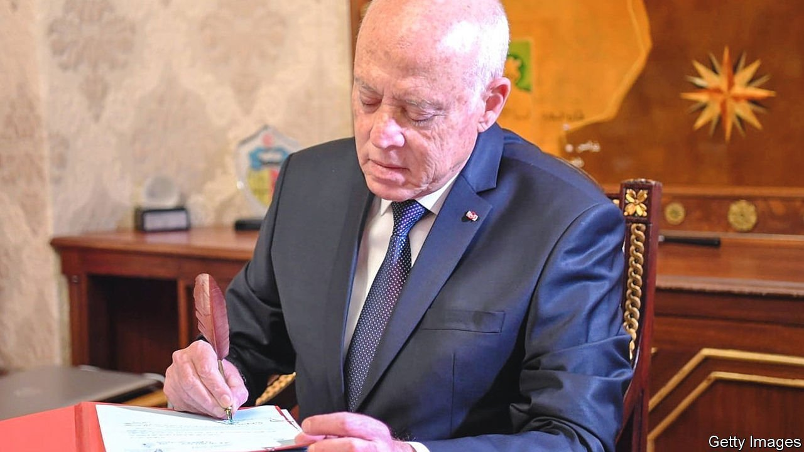

###### Charter fights

# Arab autocrats love writing, and ignoring, constitutions 

##### Like rigged elections, they serve a purpose 

 

> Jan 1st 2022 

KAIS SAIED’S birthday is not until February, but his speech on December 13th contained an early gift to himself. Tunisia has been in crisis since July, when Mr Saied, the president, suspended parliament and much of the constitution. He told his constituents that Tunisia’s democracy was broken (many of them agreed) and portrayed himself as a sort of Carthaginian Cincinnatus, called on to save the state in its hour of need.

Mr Saied (pictured) promised two votes in 2022: a constitutional referendum in July and a parliamentary election in December. First, though, he will oversee changes to the national charter. A constitutional-law professor before he was president, Mr Saied has long dreamed of remaking Tunisia as an indirect democracy. Now he has arrogated to himself the power to do so.


Thomas Jefferson once wrote that a country should remake its constitution every 19 years; to sustain it longer would be “an act of force”. In the Arab world, 19 years now seems an eternity. Egypt is on its third constitution in a decade. Tunisia will soon join it. Syria and Libya are both meant to be writing new charters.

Some of these were sincere exercises, as newly democratic countries rewrote authoritarian charters. Lately, though, it is authoritarian-minded rulers doing the writing. Far from being inviolable statements of national principles, constitutions have become a cynical tool.

Mr Saied’s obsession at least seems rooted in sincere belief. For most Tunisians, though, a new constitution ranks low on their list of priorities. Voters are more concerned about a sluggish economy and an 18% unemployment rate. A growing pile of debt (now 88% of GDP) threatens to push the country into insolvency. Tunisia can ill afford a year of inaction—yet the president, like the elected parliament he suspended, seems to have few ideas for fixing the economy.

Elsewhere, motives are more cynical. Like Tunisia, Egypt decided to write a new constitution after its revolution in 2011. A 100-member committee began drafting it the following year. Though it promised transparency, much of its work was done in secret. Still, enough leaked out to make for a fascinating exercise. There were heated debates over the role of sharia (Islamic law) and the rights of women.

Debate over the constitution would last longer than the constitution itself. Abdel-Fattah al-Sisi, an army general, seized power in 2013, barely six months after the constitution was adopted. The armed forces oversaw the writing of a new one.

During his second term as president, though, Mr Sisi ran into a problem: the constitution forbade him from seeking re-election. His regime found a creative solution. Mr Sisi’s four-year term was retroactively extended to six. The two-term limit was preserved—but since his first lasted for only four years, it was discounted, allowing him to seek a third. The amendments were a mockery of constitutional law. But they served their purpose. Nearly 90% of voters approved them in a referendum (it helped that no one was allowed to campaign against the changes). Mr Sisi can claim a popular mandate to rule until 2030.

More cynical yet is Bashar al-Assad, the Syrian dictator. Since 2019 the UN has overseen a committee meant to draft a new constitution for his war-hobbled country. Its 150 members were chosen equally by the regime, the opposition and the UN. The effort has gone as expected. It took two years of bickering for members to agree that they should start writing.

If a document does emerge from this process, no one expects Mr Assad to follow it. The current constitution, after all, begins by declaring Syria a “democratic state with full sovereignty”. In fact he runs a bloodthirsty dictatorship in which he allows his foreign backers to run amok. Later articles guarantee freedom of expression, which may come as a surprise to thousands of protesters languishing in squalid dungeons. For Mr Assad, the committee is a way to pretend he is serious about political reform; for his opponents, it is a way to pretend they are still relevant.

Where they enshrine the rights of citizens, constitutions are routinely ignored. Egypt’s also guarantees freedom of speech, which has not stopped judges from jailing countless critics of the regime. On December 20th a court sentenced two bloggers and a lawyer to five years in prison on nonsensical charges of “spreading false news”.

The political elite seem to think constitutions are there to protect them. Take Lebanon, where citizens are meant to vote for a new parliament in May. The election comes amid a punishing economic crisis that has seen much of the population pushed into poverty. There is widespread fury at the political class. Campaigners have urged the sprawling diaspora to register, hoping expats will feel less loyalty to traditional parties. Almost 245,000 Lebanese abroad signed up, compared with 93,000 in the previous election.

Michel Aoun, the president, worries this may hurt the Free Patriotic Movement (FPM), the Christian party he founded. Under the current electoral law, expats vote like any other Lebanese, in their home districts. The FPM sought instead to carve out six seats for the diaspora, limiting their votes to a small corner of the 128-member parliament. When lawmakers rejected the proposal, Mr Aoun turned to the constitutional council, arguing that the system deprived the diaspora of its right to representation. (His appeal failed.) He has shown rather less concern for other constitutional rights, like freedom of expression. Over the summer he endorsed criminal penalties for people who insult politicians.

Then there is Libya, which spent much of 2021 debating whether to write a new constitution or elect a new president first. It decided on the latter, with the vote scheduled for December 24th. After months of uncertainty, the election was delayed at the last minute—in part because it is hard to have a proper electoral law without a constitution. Having too many charters is bad, but perhaps having none at all is worse. ■

