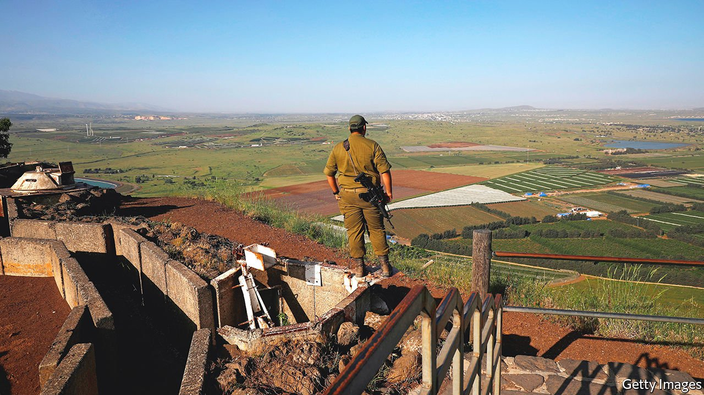
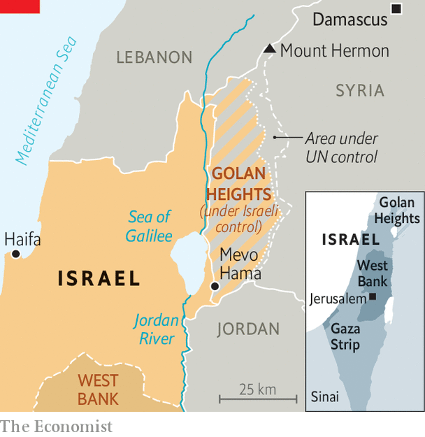

###### There to stay

# Israel tightens its grip on the Golan Heights 

##### A quiet annexation is encountering little resistance 

 

> Jan 1st 2022 

MEVO HAMA has magnificent views of three countries. On its western side is a sheer cliff dropping down to the Sea of Galilee and northern Israel. To the south is another steep drop, into Jordan. And across the mountain plateau to the east is Syria (see map). The kibbutz was established shortly after Israel seized most of the Golan Heights from Syria during the Six-Day War in 1967.

On December 26th the Israeli cabinet posed in front of the stunning views after a special meeting in Mevo Hama. The government, led by Naftali Bennet, the nationalist prime minister, had just approved a plan to spend 1bn shekels ($317m) on thousands of new homes and infrastructure in the Golan, with the aim of doubling its population (currently 52,000) by the end of the decade.


The Golan is one of four territories grabbed by Israel during the six-day war. It handed the Sinai peninsula back to Egypt after agreeing to a peace deal in 1978. It withdrew from the Gaza Strip in 2005 (though it occasionally returns in force). And the final status of the West Bank has not yet been determined.

 


But Israel has long justified its position in the Golan by claiming self-defence. Syria had sometimes used the high ground to shell Israeli farms in the Galilee below. After Israel took over, it expelled some Syrians, established Jewish settlements and built army and intelligence posts. In 1981 it formally annexed 1,800 square kilometres of the strategically valuable territory. Nevertheless, there were negotiations to return it to Syria, as part of a broader peace deal, in the 1990s. They went nowhere.

Most of the world believes that Israel’s annexation of the Golan is illegal. Yet only the Syrian regime of Bashar al-Assad and Israeli environmental groups, concerned about the region’s flora and fauna, loudly objected to the new development plan. Few countries want to see the Golan returned to the murderous Mr Assad, even if they are uncomfortable with the precedent being set. Ministers from Labour and Meretz, left-wing parties that in the past supported a deal with Syria, voted in favour of the building plans.

About half of the Golan’s population are Druze Arabs, who receive Israeli services and can request citizenship. Still, most have retained their Syrian identity, often as an insurance policy in case Israeli rule does end. Ordinary Israelis tend to view the Golan as a holiday destination. It is home to the country’s only ski resort. And whereas many Israelis fear going to the occupied West Bank, terror attacks in the Golan are rare. Attempts by Iran and its proxies to enlist the Druze in their fight against Israel have had little success.

Mr Bennett said the development plan was prompted, in part, by America. In 2019 it became the first big country to recognise Israeli sovereignty in the Golan. Donald Trump, the president at the time, justified the decision using Israel’s logic of self-defence—though it also seemed timed to benefit Binyamin Netanyahu, then Israel’s prime minister, who was in a tough race for re-election. In gratitude, Israel named a settlement in the Golan after Mr Trump.

Messrs Trump and Netanyahu have since been voted out of office, and most of the golden letters on the sign for “Trump Heights” have been torn off, probably by vandals. But the Biden administration shows no signs of reversing Mr Trump’s decision. Whether Mr Bennett plans to spend a few of those billion shekels on new lettering is less clear. ■

