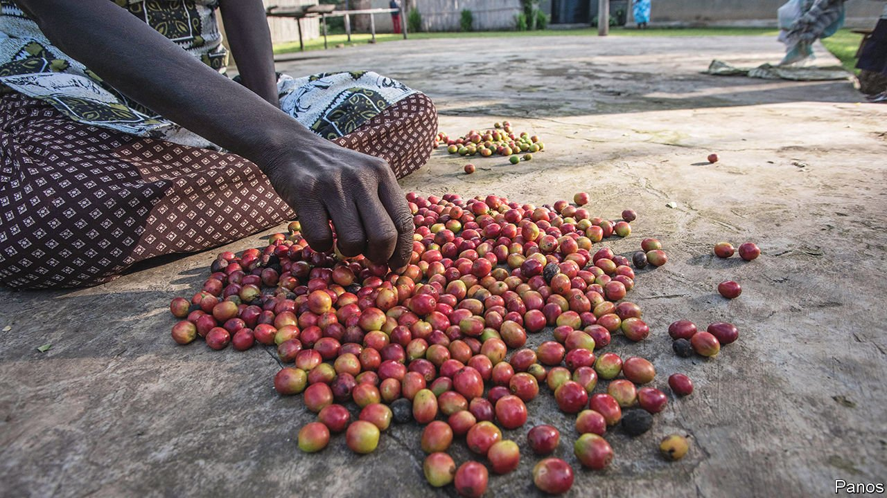

###### Bean counters

# Middlemen are the invisible links in African agriculture 

##### In Uganda they are traders, tricksters, moneylenders and marketmakers 

 

> Jan 1st 2022 

AS A CHILD Sowedi Lwanga used to collect and sell the loose coffee that had fallen outside the hulling factory where he lived in Mityana, central Uganda. He started a trading business when he was still in secondary school. Coffee is a “common man’s charter”, he says. “You jump out from your bed, you [pick up] your weighing scales and money, and you go.” He has come a long way: last year he bought and processed 27 tonnes of coffee, which he sold to an exporter.

Middlemen like Mr Lwanga are the human infrastructure of African economies. Big cash crops, such as coffee, cocoa and cashew nuts, are grown on small, scattered farms, often far from any tarmac. Somehow they must reach the warehouses of a few giant companies, before being shipped abroad. By solving this conundrum, middlemen help turn the harvest of a million gardens into cappuccinos and chocolate bars enjoyed thousands of miles away.


In the colonial era, and for a long time afterwards, the state dominated. In many African countries export monopolies for cash crops were granted to state marketing boards, which bought from farmer co-operatives. That system acted like a heavy tax on farmers, who were paid poorly for their produce and were often barred from selling to anyone else. It was also prone to corruption. In the 1980s, as a condition for loans, the World Bank and IMF pushed African governments to stop acting as overmighty agricultural middlemen.

Few countries embraced the new orthodoxy as enthusiastically as Uganda. The coffee marketing board was stripped of its export monopoly, co-operatives collapsed and multinational firms rushed in. The share of the coffee export price that went to farmers rose from just 20% in 1989 to around 75% today, though they were no longer insulated from wild swings in the price itself. The reforms also restructured rural life. The reign of the bureaucrat was over; the rise of the middleman had begun.

The Ugandan coffee trade is now a free-for-all, built on trust and treachery. More than a million farmers keep coffee trees, typically grown alongside other crops in plots smaller than a football field. They usually sell to middlemen on motorcycles, who sell to larger traders with trucks, in a chain that stretches to the foreign-owned firms which dominate exports.

Stories of fraud abound. Middlemen often mix well-dried coffee with moister beans, which are less desirable. Another trick is to cheat the exporters by bulking out sacks with waste husks, then bribing testers to look the other way. Mr Lwanga says that he used to prise open his weighing scales and slip a coin into the mechanism, so that he could take more coffee from farmers than he paid them for. These days he has forsaken such deceit. “In business you have to be trustworthy,” he says.

Reputation matters because middlemen seal deals with little more than a handshake. In the absence of strong agricultural banks, they often double as moneylenders, paying cash in advance. Sometimes a middleman will pre-buy an entire field at a knockdown price when the trees have only just flowered. That reflects fierce competition for coffee. But the relationships thus established may also keep clients loyal. Joseph Kisitu, a farmer, says that he usually goes to the same trader, even if others offer a better price, because the man has always been there with instant cash when he needs to sell in a hurry.

And farmers do need money quickly, for emergencies like hospital bills. That weakens their bargaining power. By contrast, big traders can obtain credit from exporters, which cascades down the chain to the smallest of middlemen. This flow of capital only partly “fills the gap” in rural finance, says Michael Mugisha, a researcher who previously worked at a coffee exporter. It also traps farmers in a “pervasive process of indebtedness”, leaving them with little surplus at the end of the season to invest in improving productivity.

Middlemen are driven by volumes, not quality. Some buy coffee before it is ready, says Apollo Kamugisha, an official at the coffee regulator, which is trying to impose stricter sanctions on traders who deal in unripe cherries. A similar challenge arises in many countries, notes Paul Stewart of TechnoServe, a non-profit that works across Africa. Farmers need incentives to deliver good coffee, “and often the only way to do that is to shorten the chain”.

One solution is to organise farmers into groups. The Uganda Coffee Farmers Alliance, a producer body, is trying to revive co-operatives. But the leaders of a group in Mityana district complain that traders slightly outbid them for their members’ coffee, and thus reap the rewards of the fertiliser and training the co-operative has provided. It takes co-operatives a fortnight or more to pay for the coffee they receive. Some are poorly managed.

An alternative model is for big exporters to buy directly from farmers. They increasingly source Arabica coffee this way, because the premium for certified, single-origin beans more than covers the transaction costs. But for cheaper Robusta varieties, which make up 78% of Ugandan coffee, cutting out the middleman is usually more trouble than it’s worth. “You can’t be everywhere,” says an executive at one foreign-owned exporter.

Traders themselves feel they deserve recognition as the lifeblood of a system which, if nothing else, is unusually efficient. More than 3,000 of them are now members of an association which aims to raise standards and eliminate sharp practice. “We are not here to spoil the game,” argues Amos Kasigi, its chairman. “It is the middleman who has been supporting the farmers to keep the industry running.” ■

