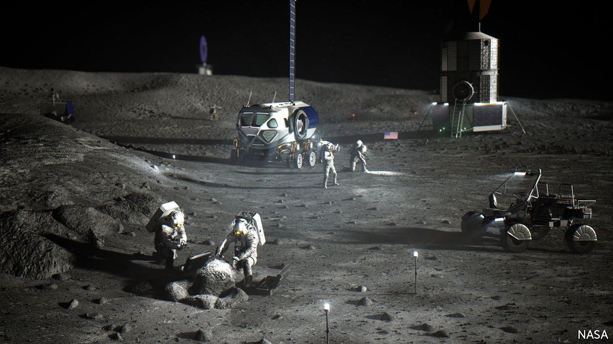
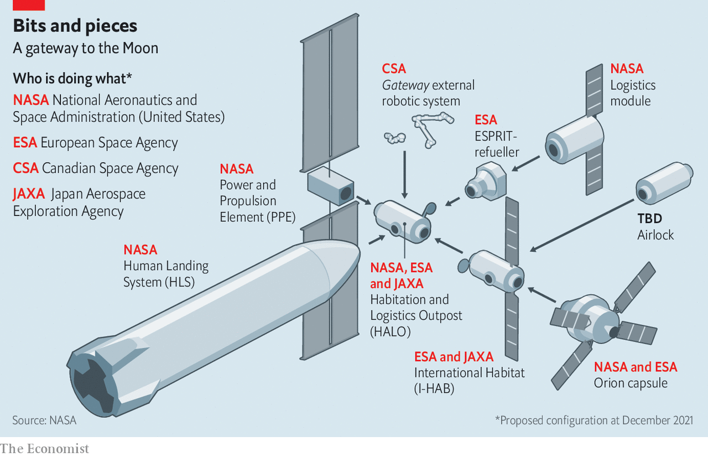
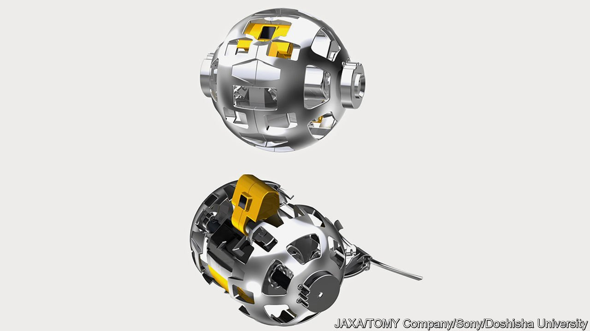

###### Everyone’s going to the Moon

# In 2022 a Moonrush will begin in earnest 

##### Countries are racing to explore Earth's closest neighbour 

 

> Jan 1st 2022 

DURING THE cold-war space race between the Soviet Union and America, the latter’s Apollo Moon missions were mostly about making a political and technological point. Having made it, they duly ceased. Now, approaching half a century after astronauts last walked on the Moon, a new age of lunar exploration is dawning. This time the goal is not just to get people and machines on or near to Earth’s satellite, but also to sustain operations there.

More people are in on the action, too. South Korea’s first lunar spacecraft, an orbiter, is to be launched this summer. The United Arab Emirates (UAE) hopes to become, in the autumn, the first Arab country to operate a craft on the Moon. Though this project involves other countries, Rashid, the rover in question, is being built by the UAE Space Agency in Dubai. It will carry a device called a Langmuir probe to study, in another first, the plasma of charged particles caused by the arrival at the Moon’s surface of the solar wind. And Israel may also soon be represented, by Space IL, a philanthropically sponsored organisation that intends, in a couple of years’ time, to land a probe on the far side of the Moon—a feat accomplished so far only by China.


The UAE’s rover will be delivered by HAKUTO-R, a landing craft built by ispace, a Japanese firm, that is launched on a rocket from SpaceX, an American one. HAKUTO-R will also carry a baseball-sized rover (pictured on a subsequent page) from Japan’s space agency, JAXA. This will trundle, Star Wars-droid style, over the lunar surface. India likewise plans to put a spacecraft on the Moon in this coming year—its first attempt having (as did a previous try by Space IL) crashed into the lunar surface in 2019. Russia is another hopeful. It last landed a vehicle, Luna-24, on the Moon in 1976, when it was part of the Soviet Union. Luna-25 is to blast off in the coming year, too.

The most ambitious Moon efforts, though, are America’s. Its space agency, NASA, aims to return people there by the middle of the decade. Instead of flying direct from Earth, as Apollo did, the plan this time is to build a lunar-orbiting space station, known as Gateway. This will host a shuttle called the Human Landing System (HLS) into which astronauts will transfer for descent to the surface—where, eventually, an outpost will be established. After years of delay this project, dubbed Artemis, after the Moon goddess who was the twin of the Sun god Apollo, is beginning to move. The coming year should see at least 18 NASA-sponsored lunar missions, some of which will deliver equipment and supplies for later use. Gateway itself is scheduled for 2024.

Heaven can’t wait

The protective outer shell of the Habitation and Logistics Outpost (HALO), as Gateway’s living space is called, is being built in Turin by Thales Alenia Space, a Franco-Italian firm, as a contribution from ESA, the European Space Agency. It will be shipped to America in October. After this casing has been fitted to the rest of HALO, and HALO in turn connected to a Power and Propulsion Element (PPE), the whole caboodle will be lifted into Earth orbit. The PPE will then draw energy from huge solar arrays to power ion thrusters that will push it slowly away from Earth, until, 11 months later, it arrives in orbit around the Moon.

ESA is also chipping in ESPRIT, a module that will allow Gateway to be refuelled once it is in lunar orbit. Canada is making the station’s “external robotic system”, a mechanical arm. And Thales Alenia Space is at work on a second habitable module, I-HAB—a joint project by JAXA and ESA that will likewise be attached after the station core is safely in place.

Others are expected to join in, too. For, besides kudos, participation earns access to HALO for a country’s astronauts. Dave Oberg, who manages HALO operations at Northrop Grumman, NASA’s prime contractor for the unit, thus describes HALO as “the first Space BnB” for lunar orbit.

To start with, the station will be inhabited for just a month a year. Automated and remotely controlled systems will run it at other times. But before long, Mr Fuller says, it should be possible to increase that period to two months. Some might reckon this brief. The International Space Station (ISS) has been continuously inhabited for more than 21 years. But the ISS orbits a mere 400km or so above Earth. Distant lunar operations will be far harder to sustain, not least because Gateway and any putative surface base will be outside the radiation-deflecting embrace of Earth’s magnetic field, and will thus need heavy shielding.

Ignition sequence start

Artemis I, the project’s first big launch, is supposed to lift off from Cape Canaveral in a few months’ time. Its scientific payload is modest: 13 small “cubesats” to gather data about things like the abundance of lunar water. But its real purpose is to evaluate NASA’s massive Space Launch System (SLS) rocket and an associated crew capsule, called Orion, that is being built by Lockheed Martin. On this mission an Orion capsule will fly, uncrewed, 64,000km beyond the Moon, before returning to Earth and splashing down in the Pacific Ocean.

The follow-up to that, Artemis II, is scheduled for 2024. An SLS will launch an Orion capsule with a service module built by ESA attached to it. This will carry four astronauts, one of them Canadian, into orbit around Earth. After circling twice, to gain speed, and thus altitude, the spacecraft will shed its last stage. The crew will then conduct manoeuvres near this jettisoned stage to give them a feel for how the capsule actually handles, as well as a bit of practice for “rendezvous and proximity” operations like docking. On this mission, it will carry astronauts some 7,400km beyond the Moon, farther from Earth than people have ever previously ventured.

Artemis II’s flight will probably last ten days, though it might be extended to as much as three weeks. And if everything goes well the door will thereby open for Artemis III, a Moon landing, in 2025—probably near the lunar south pole with a crew of four who will stay for six days.

NASA says Artemis III will help it establish a permanent “first foothold on the lunar frontier”. Artemis Base Camp, as this will be named, should one day boast an unpressurised rover (for short drives with spacesuits on), a pressurised “habitable mobility platform” (for longer trips), and living quarters that are not part of a lunar lander. Eventually, it should be able sustain four people for a month or two.

That, at least, is the plan. However, the SLS—already years late and shockingly over budget—may be beaten to its maiden flight by SpaceX’s Starship system. The reuseable booster of this is more powerful and much cheaper than the SLS. And a version of the crewed Starship itself has been worked into the Artemis programme as the first HLS. Contingency plans are also being laid for the crew transfer from the Orion capsule to the Starship HLS to be made directly, rather than via Gateway, in case the station is not ready in time.

Starship’s existence raises questions about the whole Artemis project. One is whether the SLS is the right launcher. Another is the value of circumlunar infrastructure like Gateway. Cynics see both as being as much conduits for piping money to influential aerospace firms and politically important constituencies as they are means for returning to the Moon—a suspicion enhanced by the fact they are, in large measure, continuations of previous, cancelled, human-capable programmes, and have cost billions of dollars. If Starship proves itself in 2022 the contrast will be stark, and an alternative approach using it or some rival private-enterprise system, and cutting out Gateway altogether, may look quite attractive.

 


Whichever way things turn out, however, America is not alone in its desire to operate outposts on and in orbit around the Moon. In a remarkable development, China and Russia announced in June 2021 their intention to build a joint Moonbase and space station in lunar orbit—though, according to officials, the International Lunar Research Station, as these orbital and surface outposts are collectively to be known, will not end up with people on board until at least 2036.

Luna-25 and two follow-on missions are now part of this effort. So are China’s increasingly complex Chang’e missions, named, like Artemis, after a Moon goddess. The Chang’e programme’s accomplishments go well beyond its operations on the Moon’s far side. China has used radar to probe beneath the lunar surface. In 2020 Chang’e 5 brought some samples home. In 2024 Chang’e 6 is to begin establishing a robotic research station on the Moon.

A notable obstacle to doing all this is radiation, for it is not just people who are harmed by it. Equipment is, too. As a consequence, components developed for use in satellites operating near Earth, and thus shielded by the planet’s magnetic field, are likely to fail rapidly when exposed to the rigours of deeper space. To illustrate the point, Timothy Cichan, Lockheed Martin’s top designer for space exploration, observes that, despite heavy shielding, an Orion’s electronics need to include so much fail-safe redundancy that the capsule’s computers are actually quite slow.

A higher rivalry

At one level, all of this is impressive. But both the American and the joint Chinese-Russian efforts will create little more than lunar toeholds. For something substantial and durable, local resources will be needed. Two, in particular, might be useful.

The first is water. Its presence, in the form of ice, was confirmed in 2008 by spectroscopic analysis of a plume of material ejected from the lunar surface by an Indian “impact probe”. The Moon’s ice is concentrated at its poles, which are home to the largest number of places enjoying the permanent shadow required to stop ice evaporating. But an analysis published in 2020 suggests such refuges are also scattered across the entire lunar surface.

Water is good for more than drinking. It is scientifically interesting, because working out the dates of its arrival on the Moon, courtesy of incoming comets, will help illuminate the history of the solar system. And its molecules can be split into oxygen and hydrogen. The former is, literally, vital. The latter might be employed as rocket fuel. And bringing water from Earth would be expensive. At the moment, the cost of getting a kilogram of material from there to the Moon’s surface is about $1.6m.

That cost is also pertinent to the second resource, the Moon’s surface itself. This crushed rock, called regolith, crushed further still and perhaps mixed with appropriate liquids, might be turned into “ink” suitable for the 3D printing of buildings.

 


Chang’e 8, scheduled for 2027, will test that idea. One problem is that, in the vacuum of space, liquids rapidly boil. To overcome this, ESA has run tests on Earth. These have found that sticking a printer’s nozzle beneath a layer of untreated regolith, which can then be brushed away after the ink has set, seems to protect the squirted ink long enough for it to consolidate.

An alternative approach is to do away with the liquids altogether. Some 3D printing techniques involve sintering dry powders using lasers or microwaves rather than solidifying slurrified inks. ICON, a company in Austin, Texas, is being paid by NASA to test this approach using a terrestrial knock-off of lunar regolith.

Such efforts raise a question. Can lunar resources be owned? The Outer Space Treaty, which dates back to 1967 and has been ratified by 111 countries, including America, bans claims of sovereignty over heavenly bodies. But sovereignty and ownership are not the same thing. So America and several other countries argue that useful lunar materials are there for the taking.

There is a catch, though. The treaty stipulates space exploration be “for the benefit and in the interests of all countries”. Some see this to mean merely that exploration must be peaceable. Others push for a broader interpretation—that benefits from off-world resources must be divvied up to include non-spacefaring countries as well.

A talking shop called the Hague Space Resources Governance Working Group has discussed the matter regularly since 2016. Rather than wait for its conclusions, though, some have opted for action. Over the years, the governments of America, the UAE and Luxembourg (a country that plays host to many companies involved in space businesses, despite its small size) have passed legislation granting firms the right to extract extraterrestrial resources. In June 2021 Japan’s parliament followed suit.

And America, at least, is turning words into action. NASA has signed a contract with Lunar Outpost, a robotics company in Colorado, to provide communications and hardware such as rovers on the Moon. If all goes well, in late 2022 a Lunar Outpost rover carrying 4G communications gear for Artemis will land near the Moon’s south pole. In a side deal, it will also scoop up a shovelful of regolith, take a picture of this, and transmit that image back to NASA. This act, it is claimed, will transfer ownership of the Moon dust to the agency—for which Lunar Outpost will be paid the princely sum of 80 cents. Julian Cyrus, the firm’s head of operations, says the transaction will be the first sale of resources in space. Not to mention a marketing coup.

America wants to get the private sector excited about an emerging “cislunar” economy. So far, this hinges mostly on government spending. But that could change. Just as the past decade has seen an expansion of commercial opportunities in orbit around Earth, so some people hope something similar will happen on the Moon. Not long ago, developing a robotic mission to the Moon took about seven years. Now three or four years is common, says Erick Dupuis, head of space-exploration development at the Canadian Space Agency. He is in charge of a kitty of C$150m ($117m) intended to help Canadian aerospace firms dip their bread in the lunar gravy.

Celestial spheres of influence

The Moonrush, then, brings opportunity. But it also brings geopolitical jostling. Among Europe’s spacefarers, scientific goals still carry weight. Elsewhere, missions are more about power-flaunting of a sub-Apollo kind. Xavier Pasco, head of the Foundation for Strategic Research, a Parisian think-tank, reckons India, in particular, shapes its space exploration to gain an edge over its neighbours and rivals, Pakistan and China. China’s desire to erode America’s technological lead in space is no secret. As for Russia, Pavel Luzin, an expert on space policy and security in St Petersburg, says his country sees space prowess as a pillar of national power overtopped only by its nuclear weapons and UN Security Council veto.

Some observers see the spacefaring world dividing into two increasingly opposed camps. One consists of America and (at the moment) 13 other countries that have joined its Moon programme. These have signed up to the so-called Artemis Accords, a set of motherhood-and-apple-pie principles about the peaceful use of space, data sharing, mutual aid and so on. The other, less formal, camp is led by China, with Russia a junior partner. Marco Aliberti of the European Space Policy Institute, an international quango, says that countries being wooed to join this group include Iran, Pakistan and Saudi Arabia.

There are also military risks. The Outer Space Treaty bans nuclear or other weapons of mass destruction in space. Respect for that, and also for a more general taboo against the placing in space of other types of weaponry, could be challenged by the emerging polarisation of spacefaring countries, says Sa’id Mosteshar of the London Institute of Space Policy and Law.

For its part, DARPA, an American military-research agency, has called cislunar space the “new high ground”. That makes it something no power would willingly concede to an opponent. The potential for diplomatic incidents in space, albeit not cislunar on this occasion, was illustrated by a Chinese complaint in December to the UN’s Office for Outer Space Affairs about two alleged close encounters between its space station, Tiangong, and satellites belonging to SpaceX’s Starlink network.

America’s Air Force Research Laboratory is thus developing a “Cislunar Highway Patrol System” to assist America’s Space Force, the newest branch of its military establishment. Officials are cagey about the details. But this and similar programmes for deeper “space domain awareness” will, says Jaime Stearns, the laboratory’s head for space vehicles, help ensure safe passage of hardware to and from the Moon.

NASA seems keen on such ideas. In 2020 it signed an agreement with the Space Force for, among other things, greater protection for lunar spacecraft. Until recently, the force’s commanders assumed their responsibilities ended 36,000km from Earth, the altitude of so-called geostationary satellites, which appear to hover in the sky because they have an orbital period of 24 hours. Those days are now over. As the agreement with NASA noted, the push to the Moon multiplies the volume of space the Defence Department must keep an eye on more than a thousandfold. If it ever existed, then, the age of innocence is past. Tentatively, but deliberately, the Final Frontier is now being pushed out. ■

To enjoy more of our mind-expanding science coverage, , our weekly newsletter.

