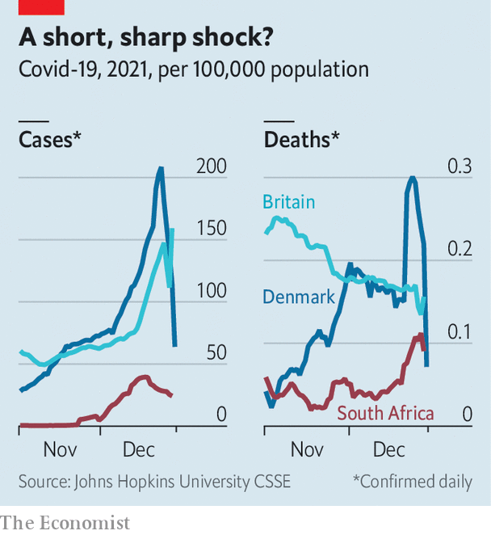

###### The new covid variant

# Omicron causes a less severe illness than earlier variants 

##### But it is spreading fast, and options for treating it are more limited 

 

> Jan 1st 2022 

WITH ITS ability to escape immunity induced by past infections and vaccines, the  of SARS-CoV-2, first detected in South Africa on November 9th, has been tearing around the world, causing record numbers of cases of covid-19 as it does so. Australia, Britain, Denmark, France, Italy and South Africa are at the forefront of this rising wave of infections. But Omicron has reached at least 113 other countries, too.

Yet despite its ominous-looking clutch of mutations, particularly in the “spike” protein it uses to attach itself to cells when infecting them, the past week has given grounds for hope that the symptoms Omicron causes are less severe than those induced by its predecessors, and that people who do get infected are thus less likely to end up in hospital, or dead. This good news is tempered by the fact that it is far more contagious than those predecessors. It will thus spread widely in coming weeks. And a higher infection rate, even of a less serious illness, could still overwhelm hospitals and cause many deaths.


Hope springs eternal

Omicron’s lower severity is probably a result of changes in the virus itself, combined with high levels of immunity (from vaccination or prior infection) that have built up in human populations. A study released on December 21st by the National Institute for Communicable Diseases, in Johannesburg, for example, found, after adjustment for age, illnesses and other factors (including vaccination status and prior infection) which determine the chances of developing severe disease, that Omicron cases are 80% less likely than previous variants to require admission to hospital.

On December 22nd, work published in Britain pointed in a similar direction. Researchers from Imperial College, in London, showed that people in England who had been infected with Omicron were 40-45% less likely than those with its immediate predecessor, Delta, to be admitted to hospital for a day or more. They also had shorter stays.

When the researchers dug more deeply they also found that, broadly speaking, people who had had at least two doses of any of the three vaccines (AstraZeneca, Moderna and Pfizer) used in Britain were “substantially protected” against hospital admission, even if protection against actual infection by Omicron had been lost. The next day, Britain’s Health Security Agency concluded that those in the country catching Omicron are 55-69% less likely than people infected by Delta to need hospital care, and 31-45% less likely to go to accident and emergency units.

The findings about vaccination put a new complexion on previous concerns that antibodies raised in people jabbed against the original Wuhan strain, or who have been previously infected, will not effectively neutralise Omicron. Clive Dix, a former chairman of Britain’s Vaccine Taskforce, said, “we have seen a progressive loss of antibody neutralisation as we moved through Alpha, Beta, Gamma and Delta…but to date the vaccines all protect against severe disease and death.” Booster doses of vaccine, given in many countries, will add to protection against both infection and disease. And the Imperial team says that, as more data accumulate, it is possible the risk of the most serious outcomes of Omicron might turn out to be even lower than currently suspected—adding that remaining immune protection against more severe outcomes of infection is expected to be much higher than those against milder disease.

This good news is tempered by caveats. It is based on early data, and therefore only small numbers of hospital admissions. As of December 20th, for example, 132 British patients with Omicron had been recorded as passing through hospital emergency departments. Of these 14 had died with covid within 28 days of diagnosis, though the precise cause of death is not always clear. The victims ranged in age from 52 to 96. Yet in Britain Omicron infections are currently concentrated in 20- to 29-year-olds. If the virus spreads to older cohorts its impact may thus worsen.

Moreover, once someone is so sick as to require hospital treatment, doctors may have fewer options available for Omicron than for its antecedents. Previous strains could often be treated with drugs called monoclonal antibodies. Omicron seems oblivious to most of these, and supplies of those that do affect it, newly developed versions made by GlaxoSmithKline and Vir Biotechnology, are limited.

The infectiousness of Omicron and the consequent speed of its spread mean that hospitals around the world are wary of an onslaught of admissions happening at a time when many staff are unavailable because they, too, have been infected. All this could have an effect on care. Scientists advising the British government have warned that covid-related admissions to hospital this winter may match or exceed previous peaks. But there is also hope that these fears may not come true.

 


In Denmark, for instance, although hospital-admission rates have risen, there are signs this increase is at the low end of the range of projections. And Chris Hopson, boss of NHS Providers, which represents organisations in England’s National Health Service, tweeted on December 27th that though the number of patients with covid was rising, it was not doing so “precipitately”. Across the country it has gone up by around 30% in a week. But many of these are people who were admitted for other reasons and are actually asymptomatic for covid, their infection having been spotted instead by a routine test. For this reason, Mr Hopson urges caution in over-interpreting admissions data.

Waving Omicron goodbye?

The Omicron wave could also recede quickly. In South Africa there is a feeling that the country may have passed its peak of cases (see chart). At a pre-Christmas meeting Sir Patrick Vallance, Britain’s chief scientific adviser, said there was “an apparent slowing of growth rates” of covid. Britain, and also Denmark, are both well vaccinated countries and will be watched closely in the days and weeks to come.

Omicron may do more damage in places that are poorly vaccinated—especially those where “zero-covid” strategies intended to stop infections happening at all mean there is little natural immunity around either. But ultimately, there may be a silver lining. By infecting so many people and thus potentially providing widespread immunity to the next variant of concern, Omicron may accelerate covid’s transition from being a dangerous epidemic to something that is an endemic nuisance which people can learn to put up with. ■

Dig deeper

All our stories relating to the pandemic can be found on our . You can also find trackers showing ,  and the virus’s spread across .

