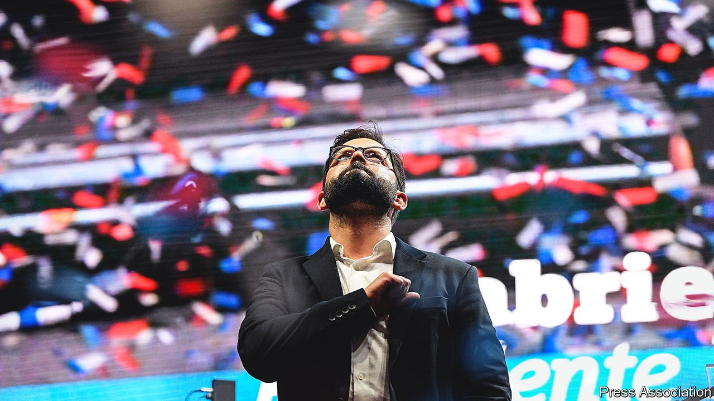
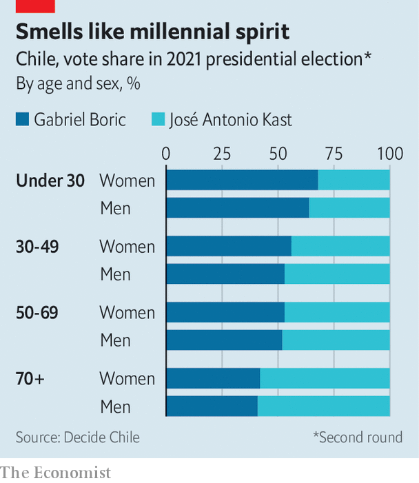

###### Boric acid or placid?

# How radical will Gabriel Boric, Chile’s new president, turn out to be? 

##### The former student leader has promised to end “neoliberalism” 

 

> Jan 1st 2022 

LEFTISTS CHEERED and investors trembled when Gabriel Boric, a former student protester whose political coalition includes the Communist Party, won Chile’s presidential election on December 19th. Contrary to expectations, he beat José Antonio Kast, a hard-right candidate, by a hefty 11 percentage points.

When Mr Boric is inaugurated in March, he will be, at 36, Chile’s youngest president in two centuries. Preliminary analysis suggests that much of his vote came from younger people, particularly women, who feel fed up with establishment politics (see chart). But how radical will he be when in office?


Despite his grand plans to change Chile, for much of his first year Mr Boric will be constrained by three forces. He will govern alongside an assembly that is rewriting the country’s constitution, a process that started in response to violent riots against inequality in 2019. He will be limited by Chile’s Congress, which is fragmented among 22 parties. And he will pay a price if he spooks markets too much. The relationship between the presidency, the constitution-writers and legislators will determine how far the country lurches to the left.

 


When he started out in politics, Mr Boric made a name for himself railing against the centrist parties that have governed the country since the end of Augusto Pinochet’s military dictatorship in 1990. He called the former centre-left president Ricardo Lagos a “producer of discontent” and claimed the Christian Democratic party had done little but “torpedo transformations”, ignoring the fact that such centrist parties oversaw years of impressive growth and a big reduction in poverty. The country grew at an average of 5% per year between 1990 and 2018, and poverty fell from 36% in 2000 to 9% in 2018. (Poverty now stands at 11%.)

Since becoming a national deputy in 2014 Mr Boric has ruffled Congress by showing up with a mohawk, tattoos and—most shocking to some—without wearing a tie. More worryingly, in 2018 he visited a former Communist paramilitary exiled in France who is charged with assassinating Jaime Guzmán, the author of the country’s dictatorship-era constitution (he later apologised for the visit). His initial presidential manifesto included proposals to revise free-trade agreements and require companies to give half their board seats to workers. On the campaign trail he promised that “If Chile was the cradle of neoliberalism, it will also be its grave.”

But after losing the first round to Mr Kast, Mr Boric tempered his tone. He began to work with the centre-left parties and tweaked his manifesto after consulting a group of centrist economists. He promised to be tough on crime and recruited Izkia Siches, the popular head of the doctors’ union, to lead his campaign. He smartened up with a suit and new haircut. Having won, he vowed to be the president “of all Chileans” and to implement reforms “with fiscal responsibility”.

Many are unconvinced. His platform remains radical. He vows to raise taxes by 8% of GDP over two four-year terms and abolish private pension funds. He makes grand promises, such as free public transport for all and universal health care funded by a 7% levy on all workers, but shows less enthusiasm for fostering the economic activity that might help pay for such things. His original manifesto, which declared itself to be a feminist document, mentions “gender” 90 times but “economic growth” only ten.

On December 20th he promised to cancel a big mining project on environmental grounds. He also supported a policy that would have let Chileans withdraw 10% of their pension savings for the fourth time in a year. This would have caused long-term damage to pension pots and increased inflation—which, at 6.7%, is already more than double the central bank’s target.

Growing pains

Much depends on the two political bodies that could limit Mr Boric’s plans. The constitutional convention already skews to the left, although it will choose new leaders on January 4th that could temper its radicalism. The institution that is most likely to constrain him is Congress. A general election in November left the Senate split evenly between parties of the left and right; Mr Boric’s coalition commands only five seats. The lower house is also almost tied, and Mr Boric’s coalition has only 37 of 155 seats. This should force him to seek broad support for his proposals.

Mr Boric claims he is different from old-guard leftists in the region. He calls himself a social democrat and has criticised leftist dictatorships in Cuba, Venezuela and Nicaragua. Some hope that his government will be similar to that of Brazil’s Luiz Inácio da Silva, or Lula, who moved from the left to the centre when president from 2003 to 2010. Moderates are holding their breath. ■

