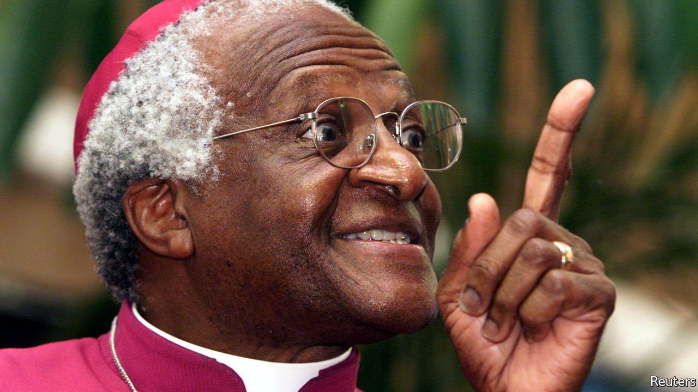

###### 

# The world this week 

#####  

 

> Jan 1st 2022 

Archbishop Desmond Tutu, a giant of the anti-apartheid struggle, died, aged 90. Archbishop Tutu’s moral leadership and his opposition to violence earned him the Nobel peace prize in 1984. He later presided over the Truth and Reconciliation Commission, a groundbreaking exercise in restorative justice, and condemned the corruption of South Africa’s post-apartheid governments, especially President Jacob Zuma’s.


Somalia’s president, Mohamed Abdullahi Moham ed, suspended the powers of the prime minister, Hussein Roble, for alleged graft. Mr Roble said he would remain in office and accused the president of trying to stage a coup.

A presidential election in Libya scheduled for December 24th was postponed, raising doubts about a UN-backed peace process. Rival factions could not agree on a legal framework for the vote or who should be eligible to run. The electoral commission proposed a new date of January 24th, but some politicians want a longer delay.

With covid-19 cases rising, a government panel in Israel recommended a fourth dose of vaccine for people aged 60 and over, health-care workers and those with weaker immunity. Also in Israel, the government approved a $317m development plan that aims to double the population in the occupied Golan Heights, which it captured from Syria in 1967.

Typhoon Rai tore through the  Philippines on December 16th, killing nearly 400 people, leaving half a million displaced and causing $400m in damage. Torrential downpours in Malaysia led to flooding that displaced 70,000 people and left many without food or clean water.

India declined to renew a licence for the Missionaries of Charity, a Catholic organisation founded by Mother Teresa, that allows it to receive foreign funding. Based in Kolkata, the charity cares for orphans, lepers and the poor. Extremist Hindu groups have accused it of trying to convert Hindus. The decision comes amid a rise in attacks on Christian groups in India.

Xi'an, a city of 13m people in western China, was tightly locked down in response to a small outbreak of covid-19. Residents were told to stay at home. Movement in and out of the city without permission was banned.

China’s central bank cut one of its main interest rates for the first time since the start of the pandemic. The cut was small, but suggests a move towards a loosening of monetary policy, just as other countries embark on a course of tightening.

The Communist Party chief of the Chinese region of Xin jiang, Chen Quanguo, was replaced. He had overseen the creation of a network of “vocational education centres” where about 1m Uyghurs have been detained for “deradicalisation”. Mr Chen remains a member of the Politburo. Meanwhile, Joe Biden signed a law that bans imports from Xinjiang, unless the manufacturer can prove they were made without forced labour.

Gabriel Boric, a former student leader, won Chile’s presidential election on December 19th. Mr Boric will be 36 when he becomes president in March, the youngest for two centuries. Although he moderated his hard-left manifesto ahead of the vote, uncertainty remains about how radical Mr Boric will be when he is sworn into office.

The  Turkish lira resumed its long slide after a sharp recovery. A new scheme announced by Turkey’s president, Recep Tayyip Erdogan, insures some lira deposits against currency depreciation, at a potentially vast cost to taxpayers. Markets are nervous because of very high inflation and Mr Erdogan’s unconventional passion for low interest rates.

Russia’s supreme court banned Memorial, the country’s oldest human-rights organisation. The group, launched in the 1980s, documents the history of Soviet atrocities and protests against abuses by today’s Russian government. The government said it had created a “false image” of the Soviet Union’s “glorious history”.

Democrats in the United States Senate vowed to press ahead with Joe Biden’s $1.7trn social-spending bill despite losing the support of Joe Manchin, a centrist Democrat whose vote is crucial in the evenly split chamber. The Senate parliamentarian is also raking over the legislation, creating another hurdle for it.

Harry Reid died, aged 82. Mr Reid was the Democratic leader of the Senate for most of Barack Obama’s presidency. He was best known for steering Obamacare, an attempt to make health insurance universal, through the chamber. He also midwifed big bills on bank regulation and stimulus packages in the wake of the financial crash.

America’s Supreme Court is to hold a special hearing on January 7th that will decide the fate of Mr Biden’s vaccine mandates on large companies and health-care workers.

“Spider-Man: No Way Home” became the biggest box-office hit of 2021. Released in mid-December, the film has already taken more than $1bn in ticket sales, overtaking “The Battle at Lake Changjin” and “Hi, Mom” (both Chinese productions) and “No Time To Die”.

