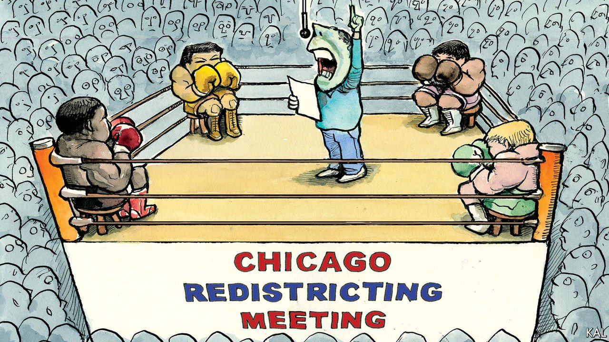

###### Lexington

# What Chicago’s ward map fight says about racial politics in America 

##### Ethnic-minority caucuses serve their communities less and less well 

 

> Jan 1st 2022 

TOM STOPPARD, a British playwright, once quipped that it was not the voting that makes democracies, but the counting. He was right in more ways than one. In March 2020, even as the then novel, now overly familiar coronavirus was spreading out among Americans, so too were census workers, collecting information on every human being within the country’s borders. Over the past six months or so the results of the census have gradually been released. They have enormous political consequences.

One of the biggest stories of the census has been how the big cities of the north-east and Midwest have been losing African-American voters even as they have become far more diverse otherwise. The city of Chicago lost 85,000 black residents in the decade to 2020, or about 10% of the total. That was more than any other city except Detroit. And yet the city also gained 40,500 Hispanic residents and 45,000 Asian ones, as well as 34,500 people of two races and 9,000 whites. The loss of black people, driven by deindustrialisation and opportunity elsewhere, actually slowed compared with the previous decade. But the “exodus” of black residents, as Lori Lightfoot, Chicago’s mayor, calls it, is nonetheless obsessing Chicago’s black political class. The city provides a lesson in how racialised politics increasingly hinders the Democratic Party.


Race and politics have always been linked in Chicago. From the emergence of the enormous stockyards in the late 19th century, where millions of heads of cattle were herded from across the Midwest to slaughter each year, the city drew black migrants from the South. Facing brutal discrimination which forced them into overcrowded and underserved ghettoes in the south and west of the city, they quickly found a political voice. Real politics happened (and still happens) outside of elections, with power brokers such as church leaders and union leaders picking candidates. This machine has helped elevate black politicians. Decades before Chicago gave America its first black president, it gave Congress its first black committee leader, William Dawson, in the 1950s. In 1983, the election of Harold Washington, a black radical, shook up the Irish-American mafia that controlled the city for most of the 20th century. It inspired a young Columbia University graduate, Barack Obama, to become a community organiser in the city.

Today, the black political power machine in Chicago is looking shakier. The census results require the redrawing of the council ward map. The Hispanic caucus, a relatively new bloc in the city’s racial politics, wants two more seats in the 50 seat council, to account for Hispanic population growth. Mostly white members from the north of the city lobbied for the creation of the city’s first Asian-American ward, something that almost everyone seemingly agrees on. The black caucus stands to lose two of its 18 black-majority seats, which its members see as an affront. The leader of the Hispanic caucus and members of the black caucus spent November and December trading increasingly personal barbs.

The result is likely to be a referendum. That will drag the argument out for months, and cost millions. And many Chicagoans might reasonably ask, what is it really all about? When you look at the voting record of council members (known as aldermen), Chicago’s ethnic caucuses matter less than they used to, says Dick Simpson, a former alderman and academic expert on Chicago’s politics. Chicago now has five members of the Democratic Socialists of America, and its Democratic progressive caucus has 18 members. Nowadays blocs like those matter as much as racial ones. Indeed, the rise of these groups offers hope that one day Chicago’s rather imperial mayors may face more public scrutiny and accountability than they used to. Ms Lightfoot has already found it trickier to get her measures through than past mayors.

So why is race, not ideology, at the core of the ward map debate? The problem, suggests Ms Lightfoot, is that while the machine matters less to actual policy, it matters as much as ever in the election of members. Despite some improvement, Chicago remains hyper-segregated, which enables racial gerrymandering. Ms Lightfoot recounts how in the council wars of the 1980s, aldermen had to wait over a dot-matrix printer for hours to try to estimate the electoral results of different maps. Now they can create projections for any hypothetical ward almost instantly. Members worry about any dilution of “their” racial bloc vote, and with it, the chance of their losing an election. “The basic blood sport of redistricting hasn’t changed but the stakes are higher,” she says. When it comes down to it, aldermen will put their cushy positions ahead of a more principled politics. Otherwise, they lose.

An idea whose time has passed

It would be better if Chicago, and America, could do away with this racialised politics. Most Hispanic and black voters, and indeed a lot of white people, share the same interests: lower crime, better jobs, better services and greater investment in their neighbourhoods. Ethnic voting blocs are better suited to portioning out a pot of city jobs and money to cronies than to improving things for all voters. The black and Hispanic caucuses did not create this machine, and segregation meant they needed to win a seat at the table. But that does not make it good. “I don’t think in my lifetime we’ll get beyond the influence of race in politics,” says Ms Lightfoot, who is 59. Nevertheless, she says it has to be worth trying.

In Washington the Black Congressional Caucus has become less keen on racial gerrymandering in recent years. After decades of accepting a Devil’s pact, in which black Democrats got safer seats and Republicans got more seats, a few of its members are now pushing for their seats to be split up, diluting the black vote but improving Democrat chances. America’s inequality, its violence and its urban blight may affect black people disproportionately. But it affects voters of all colours. In the long run, counting up voters and packing them into districts by the pigment of their skin is not a good way to fix it. ■

Read more from Lexington, our columnist on American politics:

 (Dec 18th) (Dec 11th) (Dec 4th)

For exclusive insight and reading recommendations from our correspondents in America, , our weekly newsletter.

