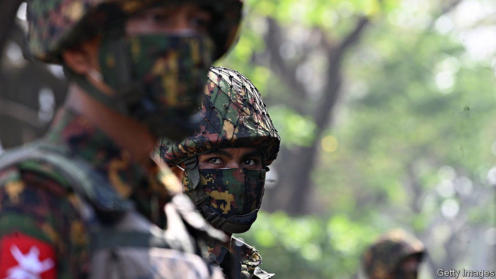

###### Goodbye to all that

# A growing number of soldiers are deserting the Burmese army 

##### The shadow government hopes helping them escape will weaken the Tatmadaw 

 

> Jan 8th 2022 

ANGE LAY tried to contain his anxiety one morning last July as he, his wife and their daughter drove off the military base where they lived. A sergeant in the Burmese army, Mr Ange Lay had received permission from his superiors to visit a relative. Instead, he and his family wended their way to territory controlled by a rebel group, changing cars several times en route to shake off any followers.

Mr Ange Lay had been dissatisfied with life in the army, or the Tatmadaw as it is known, for years. Officers treated low-ranking soldiers like their servants. Anyone who complained got a punch in the head or time in a cell. We “lived in fear”, he says. And after toiling in the notoriously corrupt army for 15 years, Mr Ange Lay had little to show for it. “The army is taking the country down with it,” he recalls telling a fellow soldier when he learnt that the Tatmadaw had seized power in a coup. Eventually he decided to defect.


There are many others like Mr Ange Lay. Since the coup, some 2,000 soldiers and 6,000 police officers have fled to territory controlled by rebel forces, according to the National Unity Government (NUG), a shadow government made up of deposed parliamentarians which helps organise resistance to the junta. It is likely that other soldiers have gone into hiding or fled the country. Many of those who have crossed over to the resistance have been helped by People’s Embrace and People’s Soldiers, organisations started by former soldiers who help troops flee. Both co-ordinate their activities with the NUG and some of the sympathetic ethnic-minority rebel groups in the country’s borderlands.

Soldiers who contact them, through an encrypted messaging app, have either already decided to defect or are considering it. Volunteers, many of whom are former soldiers themselves, urge fence-straddlers to consider how future generations of Burmese will think of them if they remain in the army. They provide would-be defectors with instructions on how to locate “liberated” territory and help them get there. Once they have arrived they are provided with food, housing, a stipend and medical attention, funded by the NUG and donations from the public.

“[The] defection programme is vital,” says Yee Mon, the NUG’s defence minister, arguing that it may help bring about the downfall of the junta and in a way that minimises violence. Yet he admits that only a tiny proportion of servicemen have actually deserted so far. The Tatmadaw is thought to number some 300,000 soldiers and the police around 80,000. Nyi Thu Ta, a former army captain and a founder of People’s Soldiers, says that at least 10,000 soldiers would need to defect for “a crack in the military to become obvious”.

Many soldiers in the Tatmadaw would like to flee but cannot for various reasons, according to the NUG. The Tatmadaw closely monitors the rank and file. Contact with the world outside the barracks is heavily restricted. There are internet blackouts in some camps. Most soldiers are no longer allowed to leave the barracks without permission. Before the coup, deserters would get five years in prison. Now they would most likely be shot.

But the NUG remains upbeat. Tatmadaw troop numbers are misleading, says Kim Jolliffe, an analyst. “A huge number” of soldiers “are just guys with guns with very limited training”. Morale is flagging, too. The force faces more opposition than it has encountered in a generation, and is fighting members of its own ethnic group, the Bamar majority. It is struggling to recruit.

For every soldier who defects to the resistance, there are likely to be far more who desert. According to Ye Myo Hein of the Wilson Centre, an American think-tank, between 5,000 and 7,000 soldiers abandoned the army every year before the coup. The figure in 2021 was probably much higher. No matter why they run, fleeing soldiers will recognise how Mr Ange Lay felt when he drove out of the barracks. “I felt I was so free...It was like dropping something, a burden I had been shouldering for so many years.” ■

