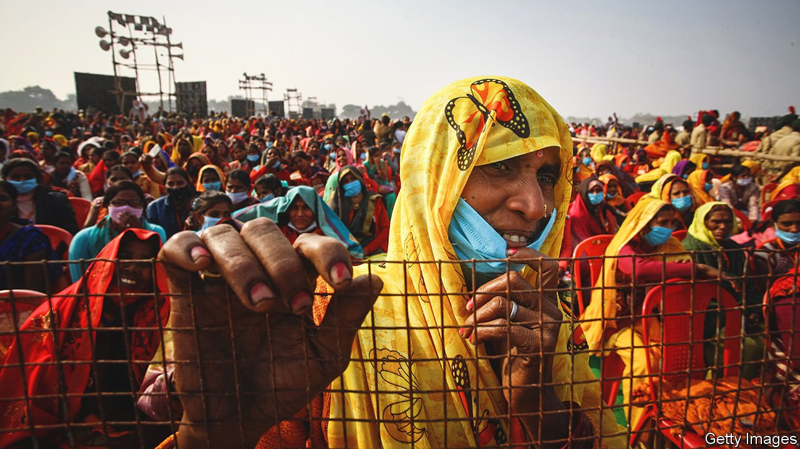
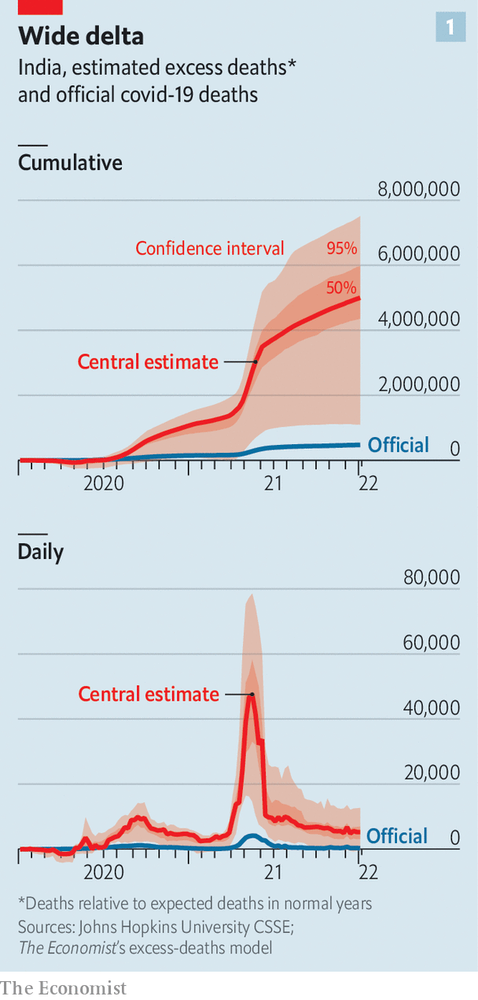
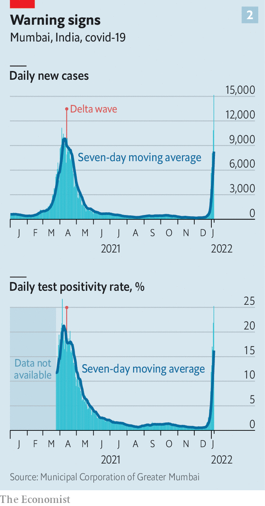

###### Elections and infections

# Is India prepared for Omicron? 

##### Some lessons have been learnt from the devastating Delta wave of 2021, but not all 

 

> Jan 8th 2022 

MANY INDIANS would have loved to slam the door on 2021 with a loud bang of good riddance. Instead, celebrations for this new year proved muted. As the highly contagious Omicron variant of covid-19 started spreading in late December police in Mumbai, the country’s commercial hub, banned public gatherings. Several states, along with Delhi, the national capital, ordered night curfews.

 


But it was not just government-imposed social distancing that dampened revelry. Barely seven months have passed since a ferocious wave of the Delta variant racked the country. Covid has left some 5m Indians dead, according to The Economist’s excess-deaths tracker (see chart 1), the world’s highest toll. Memories of loved ones gasping for breath, of overwhelmed hospitals turning away the dying and of the stench of mass cremations remain all too sharp. It was fear of a reprise of such terrors, more than of police lathis, that kept fireworks dry.


There is no doubt that India is in for another massive wave. Paul Kattuman of Cambridge University, one of the creators of an India covid tracker that correctly predicted last year’s peak, describes the current growth trend as “super-exponential”. The reproduction rate of the virus, or R, which has mostly remained below the replacement level of 1.0 since June, has from mid-December ticked inexorably upward, reaching 2.69 nationwide on January 5th, and a frightening 5.0 in the rural state of Jharkhand. In the same period the national tally of fresh daily cases rose more than 15 times, to nearly 91,000.

 


That is still a far cry from the 400,000 new cases a day recorded when the second wave crested last May. But it is only a matter of time before India scales this height again, and it is likely to be far below the true number. Systemic undercounting of cases and a pattern of spread from big cities mean that a better measure may be the proportion of PCR tests returning positive results. During last year’s peak this briefly exceeded 25% across India, but by December 27th it had fallen to a low of 0.5%. By January 5th positivity rates in Mumbai, which is often ahead of the rest of the country, were again exceeding 25% (see chart 2). In both Mumbai and Delhi (where positivity is also surging), Omicron is already the dominant strain.

However ominous the new wave, India is now much better prepared. Last April the country’s vaccination campaign had scarcely begun; now, with around 1.45bn doses delivered, 44% of the population has been double-jabbed. Millions more have gained some resistance because of previous infection. A national sero-survey conducted in June and July found that 68% of Indians already carried covid antibodies. More recent antibody surveys revealed even higher levels of exposure: 87% in Mumbai in August and 97% in October in Delhi. Such studies cannot tell whether the antibodies came through vaccination or previous infection. But 80% of children in the Delhi study were found to be carrying antibodies. Since under-18s became eligible for vaccination only on January 3rd, this suggests that exposure to the virus has been extremely widespread.

In other words, despite a failure to provide booster shots—the government belatedly declared it would start supplying what it quaintly calls “precautionary doses” for vulnerable groups only on January 10th—Indians may enjoy a level of “hybrid immunity” comparable to countries with higher vaccination rates. This profile is similar to that of South Africa, where Omicron was first detected and where the wave is now receding. Epidemiologists are hoping that in India, too, the variant may prove to be less deadly than was at first feared.

There are other reasons for cautious optimism. India’s medical system is relatively well prepared. Last year’s nightmare provided valuable lessons. Doctors say their teams are now more efficient as well as better equipped. Disgraced by catastrophic shortfalls in medical oxygen, the government has massively increased supply and streamlined distribution. Dozens of hospitals now have their own production units, and the country’s overall capacity is said to have grown by 50%. The network of private relief groups that sprang into action last year, providing everything from free meals to ambulance services to oxygen concentrators, is also ready for redeployment.

The same old story

But even as evidence grows that Omicron is indeed less likely to cause severe disease or death than other covid variants, doctors also warn of dangers. The sheer size of India’s population, combined with crowded living conditions and the prevalence of factors such as high rates of malnutrition, diabetes and tuberculosis, could still place millions at high risk. As yet unprotected by booster shots, front-line workers are particularly exposed. At the best of times India has too few doctors, and too many concentrated in big cities. Even with milder symptoms and quicker recoveries, a flood of infections among medical staff could cripple the health care system.

By January 5th hospitals across the country had started recording growing staff shortages, prompting the government to cancel holidays and shorten quarantine rules for infected medics. The Supreme Court also speeded up hearings about quota rules for poor or low-caste medical students, which have stalled the induction of tens of thousands of badly needed hospital interns. “Getting reports of more and more health-care workers testing positive,” tweeted a frustrated doctor from one rapidly filling covid unit. “We needed boosters much before this wave started…Nobody listens or understands.”

This doctor is not the only medical professional concerned about inadequate or misguided government policy. Last year’s wave left bureaucrats and politicians red-faced. They boasted about Indian-made vaccines while failing to supply enough to Indians, and dawdled over crucial needs such as oxygen or the release of data about the virus. Most egregiously Narendra Modi, the prime minister, and other top members of his party encouraged huge religious gatherings and campaigned vigorously in state elections, holding giant public rallies in spite of the obviously spreading virus.

This year’s rising wave again coincides with heated election battles in several Indian states. Even as politicians ordered schools shut and gatherings banned, their own rallies have gone ahead. In Uttar Pradesh, India’s most populous state and a crucial one for Mr Modi to hold in advance of the next national elections in 2024, barely 30% of adults are fully vaccinated. Campaigning has nevertheless proceeded uninterrupted, with the prime minister himself repeatedly appearing in crowds without a mask; on January 2nd it was to inaugurate a “sports university”, and on January 9th he is scheduled to address a “mega rally” in the state capital, Lucknow.

Not that opposition politicians are setting a better example. The central government complains that states have touched only a fraction of the $3bn it earmarked for them to spend on preparations for a third wave. Only a day after marching unmasked through throngs at a rally in another poll-bound state, Punjab, Arvind Kejriwal, whose Aam Aadmi Party is challenging Mr Modi, tested positive for covid. The Congress party, meanwhile, only cancelled a series of girls’ marathons in Uttar Pradesh, where its campaign is targeting women voters, after a crush at one event. Pandemic be damned, it seems: India’s political show must go on. ■

Dig deeper

All our stories relating to the pandemic can be found on our . You can also find trackers showing ,  and the virus’s spread across .

