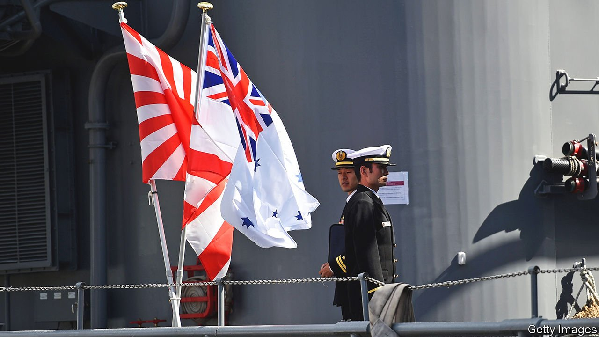

###### RAAring to go

# Japan and Australia are cosying up to each other 

##### Wariness of China, and concern about American reliability, is bringing them closer 

 

> Jan 8th 2022 

WHEN ABE SHINZO visited Australia in 2014, he became the first Japanese leader to address its parliament. Relations between the two countries have since blossomed. In 2018 Malcolm Turnbull, Australia’s then-prime minister, posted a celebratory selfie of himself with Mr Abe and their wives after salvaging the Trans-Pacific Partnership (TPP), a big trade deal that America had ditched. Before the pandemic, Aussie tourists flocked to Japanese ski resorts. Japan was the first country that Scott Morrison, the current Australian leader, visited after the pandemic started. On January 6th Mr Morrison and Japan’s new prime minister, Kishida Fumio, held a virtual summit to sign a long-awaited treaty to improve security co-operation.

China has done much to push the two together. When territorial disputes between Japan and China flared up in 2005, Australia saw it as “a bilateral problem, and we didn’t want to be drawn into that problem”, says Bruce Miller, a former Australian ambassador to Japan. And when Otsuka Taku, a Japanese lawmaker from the ruling Liberal Democratic Party, made his first official visit to Australia in 2013, he recalls being “shocked” at the extent of Chinese influence among his Australian peers. Since then, the situation has “drastically changed”, says Mr Otsuka. These days, Australia shares many of Japan’s insecurities about Chinese expansionism. It has also experienced China’s economic coercion in the wake of its call for an independent inquiry into the origins of the pandemic.


Yet it is not only China’s aggression that has brought Japan and Australia closer, but also concern about American reliability, says Shiro Armstrong of Australian National University in Canberra. Even as America demurs, Japan and Australia have continued to champion free trade: along with the CPTPP, as the revived TPP is known, they collaborated on the Regional Comprehensive Economic Partnership, another big Asian trade deal, which came into effect on January 1st. They are enhancing security ties with other partners too, both as a means of supplementing American power and of keeping America engaged by contributing more. Co-operation with India has grown, in part through the Quad, a grouping that also includes America. British warships visited Japan in 2021; Australia inked AUKUS, a new security treaty with America and Britain.

Japan and Australia have in recent years also ramped up bilateral contacts between their armed forces. The Reciprocal Access Agreement (RAA), the pact signed this week, cements the ever closer security relationship. The RAA creates a legal framework for the two militaries to operate in and around each others’ territories, a process that used to require reams of paperwork and long periods of planning. That will spur more frequent and more realistic joint training, says Mr Otsuka, who chairs the security committee in Japan’s lower house. It is the first such arrangement Japan has with any partner other than America. For Australia, the agreement will have more immediate practical significance than AUKUS, reckons Nick Bisley of La Trobe University in Melbourne.

A long and fruitful commercial relationship underlies the closer strategic ties. Japan has long bought loads of Australia’s raw materials, including iron ore and coal, and spent heavily on the infrastructure, such as mines, to secure them: it is Australia’s second-largest source of foreign investment and its third-largest trading partner. Australia, in turn, is Japan’s largest energy supplier. Coal and gas are the core, but both countries have high hopes for Australian hydrogen playing a similar role as they eye decarbonisation.

Yet much must still be done to build on the newfound closeness. While the RAA elevates Japan and Australia’s security partnership, it is far from a formal alliance. Both governments will also need to do more to reorient the energy trade towards greener sources. The risk, says Melanie Brock, a Tokyo-based Australian business consultant, is “that we assume that because we’re close that we don’t have to work at it.” Realising the relationship’s potential will require more than ski trips and high-profile summitry. ■

