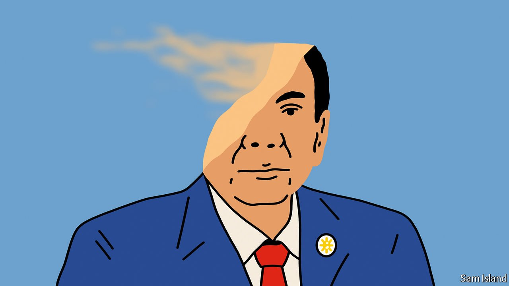

###### Banyan

# What is Rodrigo Duterte’s legacy? 

##### The Philippine strongman’s list of achievements is negligible 

 

> Jan 8th 2022 

NO PRESIDENT OF the Philippines since Ferdinand Marcos, the late dictator, has held such a grip on power as the authoritarian Rodrigo Duterte. Nor has any appeared so unconcerned at accomplishing so little. His promises of constitutional change, devolving power from the centre in Manila, came to nothing. His kowtowing to President Xi Jin ping of China brought little investment and much resentment. By his own admission, his war on drugs has failed—though at a human cost, according to the UN’S human-rights body, of at least 8,000 dead in vigilante-style killings. His administration has mishandled covid-19, with less than half of Filipinos fully vaccinated and the economy nearly 6% smaller than before the pandemic.

The gulf between his putative power and what he has done with it is a central feature of Mr Duterte’s six-year rule, which comes to an end after elections in May (the constitution mandates a single presidential term). Yet the president’s Teflon approval rating presents a conundrum: though it has lately dipped a bit, it remains impressive at 72%, according to Pulse Asia Research, a pollster. Most other democratically elected presidents in the Philippines started off popular, too, but then quickly crashed.


Perhaps the conundrum is in reality a chimera. Ronald Mendoza of Ateneo de Manila University suggests that herd behaviour plays a powerful part in surveys of popular opinion among Filipinos. Probably more than in most places, individual voting preferences and personal political expressions are influenced by what the neighbours think. That is unsurprising in a political system with powerful actors. Conformism is not just acceptable; bucking it carries risks with an authoritarian in charge. But the herd may already be moving on, notwithstanding the poll ratings. After Mr Duterte declared in November that he would run for vice-president—a constitutionally dubious move—so disapproving was the popular reaction that he quickly withdrew.

To the political classes he is already a has-been. They are abandoning him in droves, starting with his own daughter, Sara Duterte. Mayor, like her father before her, of the southern city of Davao, she was the most popular presidential possible and the natural choice for the ruling party’s candidate. But Ms Duterte’s relations with her father have long been strained (she blames him for her parents’ divorce). She detests his henchmen and has no desire to favour them.

Choosing to run for vice-president rather than president, she has thrown her lot behind the presidential bid of Ferdinand Marcos’s 64-year-old son, who goes by “Bongbong”. As senator, Mr Marcos and Mr Duterte had been allies in authoritarianism: the president even had the late kleptocrat reburied, with full military honours, in the national Cemetery of the Heroes. These days Mr Duterte snipes at Mr Marcos, accusing him, variously, of being weak, pro-communist and a coke snorter (Mr Marcos denies the claims).

Two other political dynasts and former presidents, Joseph Estrada and, especially, Gloria Macapagal Arroyo, back the Marcos-Sara Duterte ticket. Meanwhile, Mr Duterte’s own party is disintegrating. His favoured nominee and chief henchman, Senator Bong Go, has withdrawn from the presidential race. The ruling party now has nobody contesting the election. Only one candidate, Isko Moreno, the mayor of Manila, seems hungry for Mr Duterte’s endorsement. But that is in order to win over his followers, mainly among the poorer classes, not to inherit his legacy. Unlike the president, Mr Moreno, who grew up in the capital’s slums, holds moderate political views and evinces competence.

The final months of Mr Duterte’s presidency look likely to be taken up with a growing scandal concerning a pharmaceutical company with close ties to the administration that was given outsize government contracts. Corruption, in other words, colours this presidency just as it did previous ones, despite his promises to stamp it out.

Mr Duterte, who rose to power by presenting himself as an outsider, a foul-mouthed defender of ordinary folk, is not the mould-breaker he claimed to be. True, he is the first president from Mindanao in the far south. But for all his current strains with his daughter, he is in many ways typical of the political families that have long dominated the Philippines, acting like royalty and responsible, as Mr Mendoza puts it, for bad governance, stagnation and a sense of impunity. Like many of his predecessors, Mr Duterte will leave little behind.

Read more from Banyan, our columnist on Asia:

 (Jan 1st) (Dec 18th) (Dec 11th)

