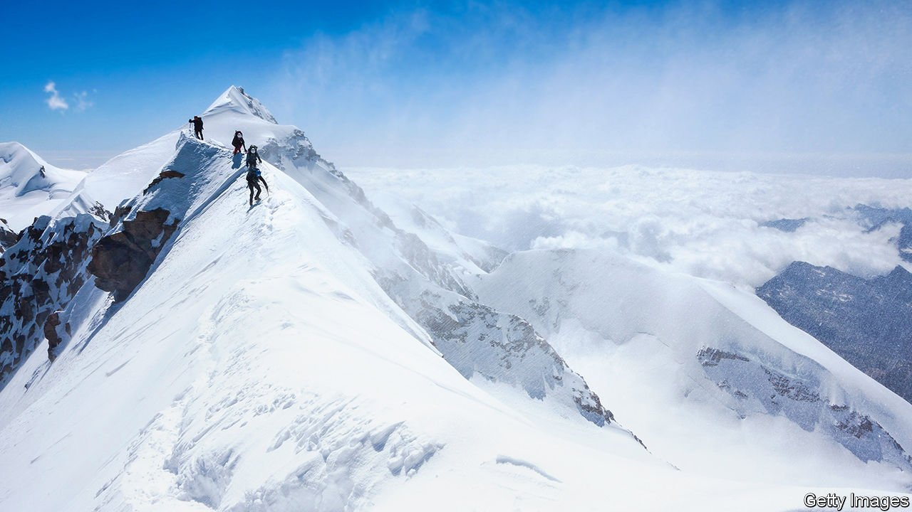

###### Tell it from the mountain

# A climber’s story evokes classic mountaineering literature 

##### Like many of the genre’s finest books, Anna Fleming’s voyages within as well as up 

 

> Jan 8th 2022 

Time on Rock. By Anna Fleming. Canongate Books; 272 pages; £16.99

LESS ICONIC than the victories of Jesse Owens at the Berlin Olympics of 1936—but no less galling to the games’ Nazi hosts—were those of Günter and Hettie Dyrhenfurth, a Swiss couple who won the gold medal for alpinism. The Dyhrenfurths, who had Jewish heritage, were born in Germany and took Swiss citizenship only in 1932. They had made two expeditions to the Himalayas, in 1930 and 1934, enjoying success that contrasted markedly with the Nazis’ own disastrous attempt on Nanga Parbat. Hettie, a mother of three, was 42 when she climbed all four peaks of Sia Kangri, capturing the women’s altitude record, which she would continue to hold for more than 20 years. Günter pointedly refused to give the Nazi salute when accepting the medals on their behalf.


This was the last Olympic contest in alpinism; these were also the penultimate games at which another Olympic prize was awarded—for literature. Among the competitors for the award, which recognised works “inspired by the idea of sports” or dealing “directly with athletic topics”, was Günter Dyrhenfurth, whose “Demon of the Himalayas” was submitted in the “epic” category. He didn’t win—the prize went to a Finn, Urho Karhumaki, for a long poem about open-water swimming—but his participation in both events highlights the close and enduring relationship between climbing and writing.

“Time on Rock”, a new book by Anna Fleming, is the latest to embody this close affinity. It is the story of a young woman’s climbing life, from nervy teenage apprentice to lead climber in her 30s. It is also a “journey into the rock”, as Ms Fleming, an academic and journalist, comes to know and love the varied terrain of the British Isles (and, in one chapter, Greece). It is about the fear and joy of climbing, and how a hobby can expand to become the centrepiece of a life. Echoing and honouring some of the classics of climbing literature, the book is a fine introduction to the genre.

Though most celebrated mountaineers have been men, many of the best books about climbing are by women. Ms Fleming pays tribute to perhaps the greatest of all mountain writers, Nan Shepherd, the Scottish author of “The Living Mountain” (written in the 1940s but not published until 1977). Part memoir, part Buddhism-inflected meditation, Shepherd’s work influences both Ms Fleming’s prose and her approach to mountain life. “The thing to be known grows with the knowing,” Shepherd thought, a conviction reflected in Ms Fleming’s attitude to the mountains she scales. “We shape the rock,” she says, and “the rock shapes us”.

Traces of other mountaineer-authors are visible too. One is the poet Helen Mort, whose physical, sinuous verse, full of granite and rhyolite, slabs and ledges, seems to have informed Ms Fleming’s tactile engagement with the mountain world. “I think through my hands,” Ms Fleming writes, grappling with the “textures and densities of rock which erode in their own characteristic style”. (Ms Mort’s own forthcoming memoir, “A Line Above the Sky”, is an intimate take on motherhood and self-dissolution, and the way mountains can come to fill the voids of a life.)

Partly a story about being a woman climber in a world still largely dominated by men, “Time on Rock” is also a kind of phenomenological engagement with different rocks, a close looking and feeling which reveals the dazzling variety of stones that might appear from a distance to be much alike. The more time Ms Fleming spends on the faces of mountains, the more she seems to recognise that the joy of climbing is not the brief elation of the summit, but rather the “journeys across the stones”. In a poised and poetic epilogue, in which she climbs Creag an Dubh Loch in the Grampians, she writes of how the “self is poured into the stone and the rock flows through the body”.

Out of the void

Some traditional climbing narratives are structured around triumphs or tragedies. The best of these—such as Joe Simpson’s “Touching the Void”, Ed Caesar’s “The Moth and the Mountain” and Jon Krakauer’s “Into Thin Air”—are animated by a sense of looming disaster, by the horror of the empty space below. “Time on Rock” eschews these vertiginous thrills. The nearest Ms Fleming comes to real danger is an “epic” climb up the Cuillin ridge on Skye, where she is forced to retreat, defeated, by the fall of night. Instead she uses the act of climbing, and the way that “intense vulnerability sharpens the senses”, to contemplate the beauty of nature in its loftiest reaches.

In this, she looks back not only to Shepherd but to Gwen Moffat’s luminous “Space Below My Feet”, a hymn to the high places of Britain, as well as Robert Macfarlane’s “Mountains of the Mind” and Dan Richards’s “Climbing Days” (about Dorothy Pilley, a pioneering climber and wife of literary critic and fellow mountaineer I.A. Richards). All these books tread a line between nature writing and climbing literature; they both celebrate places and extremities, and show how time in the elements reveals the elemental self.

In a similar way, “Time on Rock” calls to mind Al Alvarez’s “Feeding the Rat”. Alvarez, who died in 2019, was best known as a poet and friend of Sylvia Plath, but he was also a committed climber. His book is a record of his friendship with the mountaineer Mo Anthoine, but it is also about the way climbing divulges hidden truths about the climber. Pretence is unsustainable on the mountainside, and the “rat” of the title—the climber’s primal, essential nature—takes over. As Ms Fleming puts it, “the animal within stirs”. On the rock face, “the veneer is stripped away and you can see the heart and mettle of a person”.

Climbing’s exposure of character helps make it a fertile subject for literature. Ms Fleming’s book, like many of the genre’s best, is devoid of braggadocio. Instead it goes deep into the mountain landscape—and the minds of those who choose to spend their lives on rock. ■

