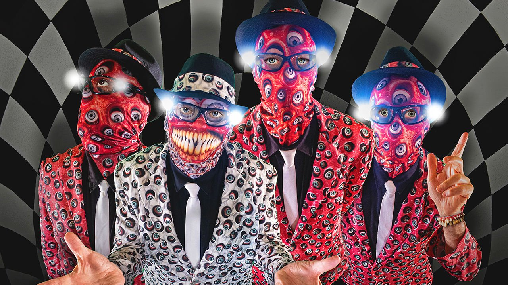

###### The eyeballs have it

# After 50 years, the Residents are still on the road 

##### Anonymity is key to the cult art-pop group’s success. But so is innovation 

 

> Jan 8th 2022 

IN MAY 2020, shortly after the coronavirus struck, America’s weirdest rock band reissued one of its hits. The new video for “Die! Die! Die!”, a shrieking, nihilistic number re-recorded with the front man from the Pixies, featured tumbling viruses and a blond effigy of Donald Trump mouthing “I want you to die, die like a stranger…like a rat.” The caustic chanting and surreal graphics were a biting reminder that the cult phenomenon known as the Residents remains as subversive and strange as ever, half a century after the group was founded.

At a gig in Los Angeles that kicked off the 50th-anniversary tour, diehard fans bedecked in Residents merchandise howled their approval. The performers were swathed in fabric imprinted with hundreds of eyeballs, their signature image. Their anonymity, guarded by eyeball-themed masks, has been key to their success. Of the four young men from Louisiana in the original line-up, two dropped out in the 1980s, whereupon the group became a revolving collective with two main leads, the “Singing Resident” and the “Musical Resident”. Hardy Fox, one of the last original members and the main composer, outed himself before he died in 2018. The current four carry on behind their disguises, as fans go along with a wink.


But the band’s improbable longevity is also “a triumph of perseverance over talent, which they never believed in anyway”, says Homer Flynn, the group’s spokesman and co-owner of its marketing arm, the Cryptic Corporation. “It’s not like the Residents were ever very good musicians.” Unlike most bands from the heyday of rock, they don’t just trot out golden oldies, but incessantly create new material and repurpose old songs. The ongoing 50th-anniversary concerts reprise the character of Dyin’ Dog, a Southern blues singer possibly of their own invention.

The masks safeguard their creative freedom as well as their identities. From the moment the original quartet mounted their first guerrilla raid on a folk-music club in San Francisco in October 1971, they understood that performing anonymously “gave them a lot more space underneath to be whoever they wanted, or do whatever they wanted”, says Mr Flynn. An early attempt at a record deal failed when their demo tape was sent back by a Warner Brothers scout, addressed to “Residents”. It was the perfect moniker for a group based on what they call “the theory of obscurity”.

Their lyrics are wilfully impenetrable, the music a barrage of sound. To admirers, part of the appeal is “trying to figure out what they’re saying”, allows one 30-something concertgoer in LA. Covid-19 aside, their dyspeptic commentaries are rarely overtly political. Their entertaining half-century of narrative games include an elaborate tale of underground mole people, gruesome takes on fairy tales and Bible stories, and discordant covers of songs by artists from James Brown to the Beatles and the Rolling Stones.

The fanbase is impressively wide: more than 100,000 people follow their Facebook page. Long before he created “The Simpsons”, Matt Groening extolled the group as “the most significant pop-music ensemble of the 20th century”. And for a west-coast underground sensation, their tentacles reach surprisingly far—many male baby-boomers in America, Europe and Australia own a Residents disc. Much to their gratification, fans emerge in each new generation. “There will always be people who aren’t really interested in what the mass market is trying to shove down their throats,” says Mr Flynn.

Naturally, the internet has helped. But it is the Residents’ own grasp of evolving technology that has made them the innovators they are. Experimenting with the first multichannel recorders, advanced synthesisers and sampling technologies allowed them to create an overdubbed sound that they could take on the road. Four-track, 8-track, CDs, DVDs, Midi—the group has surfed each successive wave. The latest is retro: Cherry Red Records in London is issuing vinyl sets of newly remastered tapes and unreleased material.

Mr Flynn formed a graphic-design firm to help the Residents with film-making, often using elaborate sets. By the 1980s, he says, they were pioneers of music video and a fixture on the new cable channel MTV. “Technology evolves faster than culture,” he observes. “So there’s a gap, a place where they could experiment.” The “Commercial Album” of 1980 was made up of 40 one-minute songs, some later turned into 60-second films: TikTok before TikTok. One such film, “The Act of Being Polite”, is now the group’s first NFT (non-fungible token), minted last autumn and auctioned in a fund-raiser for the Burning Man festival.

This faceless art collective masquerading as a rock band, with its mad theatrical performances, attracts oddballs and outsiders across the globe. After over 60 albums, innumerable videos and an “Ultimate Box Set” housed in a refrigerator at the Museum of Modern Art in New York, the cast is glad to be earning a living. Whatever comes next, they are sure to stay ahead of the curve—and in disguise.

On the “Wonder of Weird” tour of 2013, the “Singing Resident” rasped these lines:


