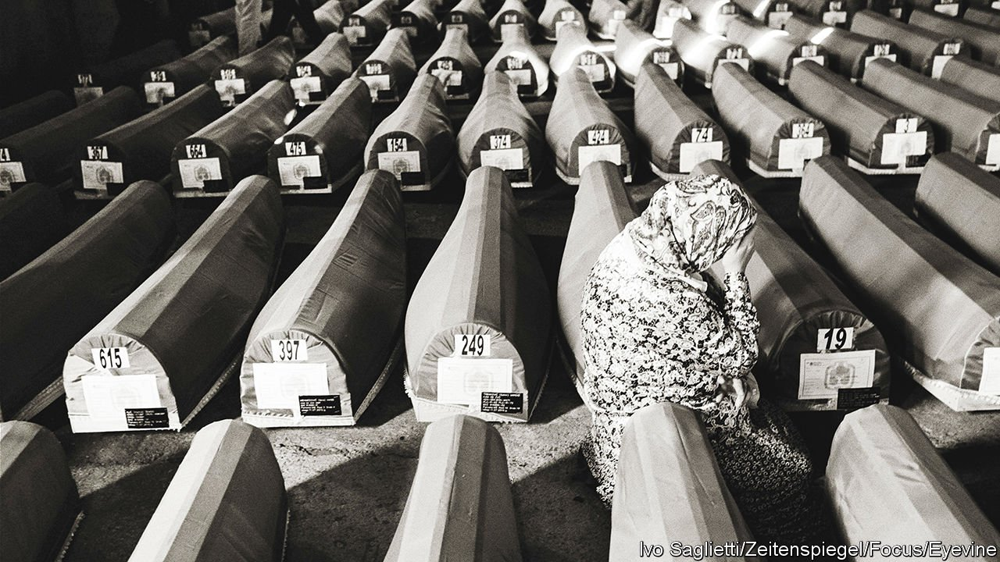

###### How things fall apart

# An expert on civil war issues a warning about America 

##### But Barbara Walter exaggerates 

 

> Jan 8th 2022 

How Civil Wars Start. By Barbara Walter. Crown; 320 pages; $27. Viking; £18.99

IT IS HARD to overstate the danger Donald Trump poses to America and the world, but Barbara Walter manages it. Mr Trump scorns democratic norms, stirs up racial division, propagates the big lie that he won re-election in 2020, encouraged a coup attempt on January 6th 2021—and might win the presidency again in 2024. Ms Walter, a political scientist at the University of California, San Diego, rightly decries these sins. But she goes further. Thanks partly to Mr Trump, and partly to the underlying trends he has exploited, she claims America is at risk of civil war.


This far-fetched conclusion spoils an otherwise interesting book. Or rather, “How Civil Wars Start” is really two books: a well-argued one about what caused past civil conflicts around the world, and a tendentious one maintaining that the same factors may soon result in war in the United States.

The well-argued part goes something like this. Countries are most vulnerable to civil war when they are somewhere between dictatorship and liberal democracy. In a functional democracy, people have no cause to take up arms. In a full-blown dictatorship, they are likely to be locked up or killed the moment they do so. The danger zone opens up when a dictatorship gives way to a looser form of government, but the new regime has not yet found its feet. “Given a choice between democracy and dictatorship, most will gladly take democracy,” Ms Walter writes. “But the road to democracy is a dangerous one.”

A second risk factor is factionalism. Since the end of the cold war, perhaps 75% of civil wars have been fought between ethnic and religious groups, rather than political ones. Here what matters is not how diverse a country is, but whether politics revolves around identity.

Political leaders who stir up fear of another group to win support from their own are often especially dangerous. Consider (as Ms Walter does) the former Yugoslavia. As the cold war ended, it cast off communism and began to move towards democracy. It promptly fell apart, goaded by “ethnic entrepreneurs” such as Slobodan Milosevic.

He was not a true believer. A former communist, he switched to Serbian nationalism because it was the easiest way to win support. In speeches, he duly celebrated Serbia’s historical greatness and “reminded listeners of past atrocities perpetrated against Serbs”. His path was smoothed by his enemy, Franjo Tudjman, a Croatian bigot. The more Tudjman picked on Serbs, the more they turned to Milosevic for protection, and vice versa.

Home truths

The most effective grievance-mongers are creative liars. Serbian television, for instance, once claimed that Serb children were being fed to lions in Sarajevo Zoo. They also recognise no statute of limitations. “For five centuries they violated our mothers and sisters,” said one Croat nationalist of Bosnian Muslims.

Complacent cosmopolitans did not see war coming. They lived in cities where Serbs, Croats, Muslims and others freely intermingled and intermarried. They did not imagine those groups would start killing each other. Even when they knew that Serb militias were forming in the hills, they dismissed them as yokels. One local writer recalls city folk joking about rustic Serbs “hating us because we knew about soap and water…and wearing clean socks”.

Another risk factor arises when a large group fears it is losing status. Ms Walter lists several that rebelled for this reason. Sunni Arabs, who dominated Iraq under Saddam Hussein, were shut out of power after he was toppled; some went on to create Islamic State. After the revolution in Kyiv in 2014, some in Ukraine who considered themselves ethnically Russian revolted against the new government (with assistance from Vladimir Putin).

The most disgruntled members of an aggrieved group may take up arms. At first they are typically too small in number to pose a serious threat—but social media can accelerate the descent into bloodshed. Ms Walter describes how the voices of Buddhist extremists were amplified after Facebook reached Myanmar in 2015. Suddenly, their warnings of the threat posed by Muslim Rohingyas found a much wider audience. The more alarming the posts, the quicker they went viral. “Just feed them to the pigs,” said one. The Rohingyas suffered genocide, and Myanmar is now embroiled in a complex civil war.

All this is persuasive, and a useful guide to what is happening today in, say, Ethiopia, or might happen in Lebanon. But America? Yes, there are some parallels. The country is polarised, and cynical race-baiting politicians have made matters worse. The most egregious culprits are on the right, but some on the left have exacerbated the split by alienating white Americans: urging minorities to think of themselves first and foremost as members of a racial group, as some activists do, ultimately encourages the majority to do likewise. Many working-class whites feel a loss of status, and their grievances have been stoked on social media. There is a rural-urban divide: some educated city-dwellers disdain their rustic compatriots, who keenly resent it.

And yes, America has small but well-armed militia groups who talk of violent revolution and occasionally kill people. If Mr Trump were to return to office, moreover, he would surely degrade American democracy further. Arguably the most important thing President Joe Biden and the Democrats can do for their country is to keep hold of the White House. Amazingly, given the quality of their likely opponent, the polls say they might lose it.

These are all grave problems. But they do not portend civil conflict. Ms Walter mentions only fleetingly some of the reasons why today’s America is not like the former Yugoslavia or other imploding states. No country as sophisticated, modern, liberal and democratic as contemporary America has ever descended into civil war. It has exceptionally strong, professional and apolitical armed forces. Its police, though far from perfect, uphold the law, as do its courts.

A series of politically inspired terrorist attacks is sadly plausible. So is a better-organised revolt than the one staged a year ago. But it would have no chance of success—and, on past form, the terrorists would be caught and punished. The American state cannot be overthrown by seizing a building in Washington. ■

