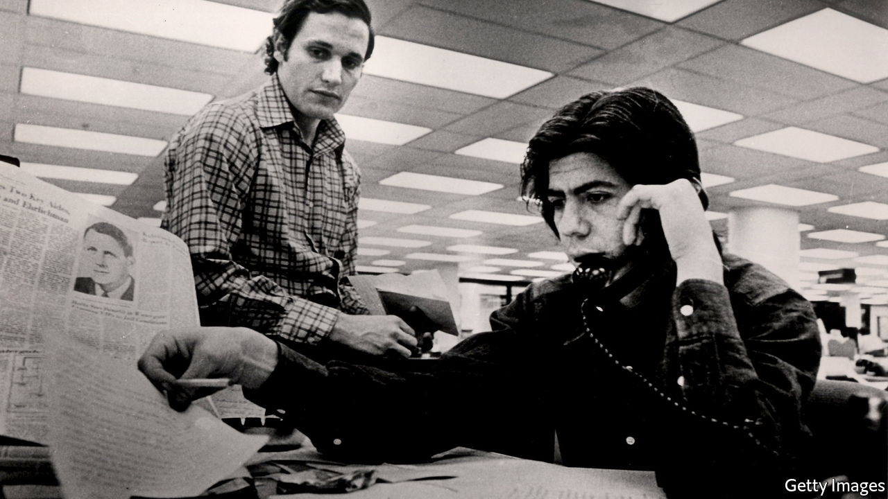

###### A journalist’s apprenticeship

# Carl Bernstein’s memoir traces his path to Watergate 

##### His book is a vivid and elegiac portrait of a bygone newspaper world 

 

> Jan 8th 2022 

Chasing History: A Kid in the Newsroom. By Carl Bernstein. Henry Holt; 352 pages; $29.99

THIS ENGAGING memoir recounts how Carl Bernstein earned his chops as a young newspaperman in the years before, with Bob Woodward, he became one of the world’s most renowned investigative journalists after exposing the Watergate scandal. It begins in 1960 when the 16-year-old, a far from diligent student, wangles a part-time job as a copy boy at the Washington Star, the capital’s evening newspaper. Mr Bernstein’s father, a public-sector union leader, pulls strings to get the lad an interview. Skills learned at an all-girls’ typing class, and his own persistence, secure him the role. Glimpsing the organised mayhem of the newsroom, he realises that this is the industry for him.


His picture of life on the Star is both vivid and elegiac. He captures the frantic rhythms of a big newspaper and its multiple editions—the first published at 11am, the last after Wall Street’s close—and the craft of the men and (still relatively few) women who made it all happen. When a police radio discloses that two people have been electrocuted in a swimming pool, it takes just 75 minutes for a front-page story—based on phoned-in copy from a team choreographed by Sidney Epstein, the coolly brilliant city editor—to reach the composing room to be set into type.

Epstein, who dresses like a model from Esquire, is one in a gallery of tremendous characters from whom the youngster learns his trade. At the opposite end of the spectrum is the paper’s well-connected police reporter, Ted Crown, who looks and sounds like a warthog and is no more capable of writing a coherent newspaper article than of penning a sonnet. A crass bigot, Crown nevertheless has a kind of integrity and an “allegiance to the facts and to getting the story right”, demonstrated when he suspects a police chief of framing an innocent black man.

As Mr Bernstein rises to the dizzying heights of a “dictationist”, he gets opportunities to be the leg-man for senior colleagues, phoning in reports on live events such as civil-rights marches and John F. Kennedy’s inauguration, which find their way into front-page stories. As well as taking copious notes on every aspect of a newsman’s trade, he begins building up his list of potential sources. The feckless schoolboy is becoming a young man of determined ambition.

The cause that most animates him is the struggle for civil rights. Peaceful protests in Washington were met with police and National Guard violence; neighbouring Virginia was still governed by Jim Crow laws. Relatively conservative compared with the liberal Washington Post, the Star employed only one black journalist, but its staff were able to report on the brutalities of systematic discrimination. The most important lesson the paper taught Mr Bernstein was to spare no effort in getting the facts and then, as accurately as possible, to put them in a context that the reader could understand.

Despite his devotion to the Star, in the end his problematic relationship with academia catches up with him. Although now a respected general-assignment reporter, he is still nominally a student at the University of Maryland, from which he must graduate or face demotion back to the dictationist’s booth. Rating his chances of graduation as zero, he departs with a colleague, who has been made editor of the much smaller Elizabeth Daily Journal in New Jersey. He wins three statewide journalism prizes in a year, including one for investigative reporting. That is his ticket back to a big-time newspaper—the Post, where Ben Bradlee is about to become the campaigning editor. Six years later, Bradlee would let Mr Bernstein and Mr Woodward follow wherever the facts of the Watergate break-in led them.

Bad commercial decisions and declining circulation—caused in part by competition from local television news and an exodus of readers to the suburbs—led to the Star’s demise in 1981. Many other newspapers have succumbed since, undone by the digital-media revolution and unsustainable business models. There are still great reporters in the Bernstein mould, but fewer than there were. Opinion is cheaper, news agendas are more partisan and many readers like it that way. For powerful malefactors, meanwhile, “fake news” has become a jeering, all-purpose retort. ■

