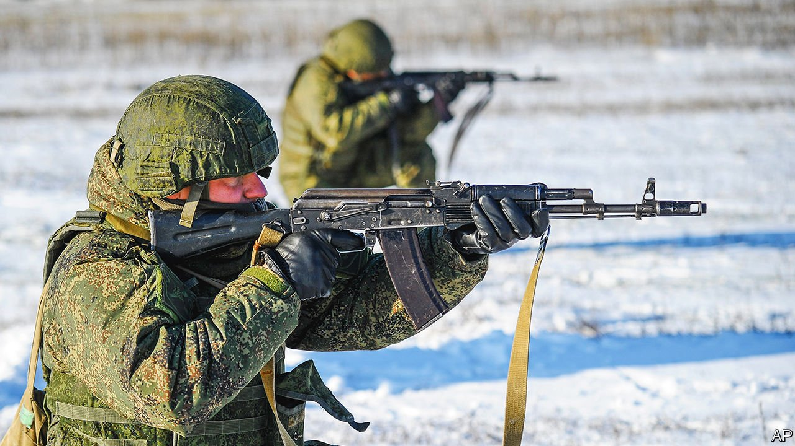
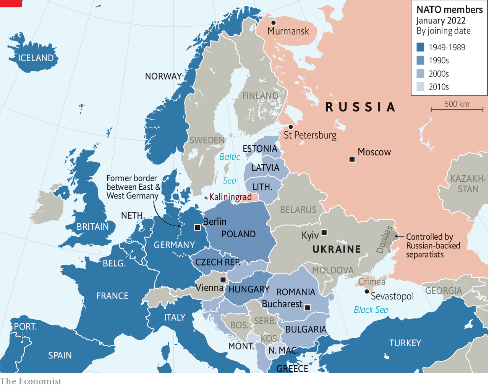
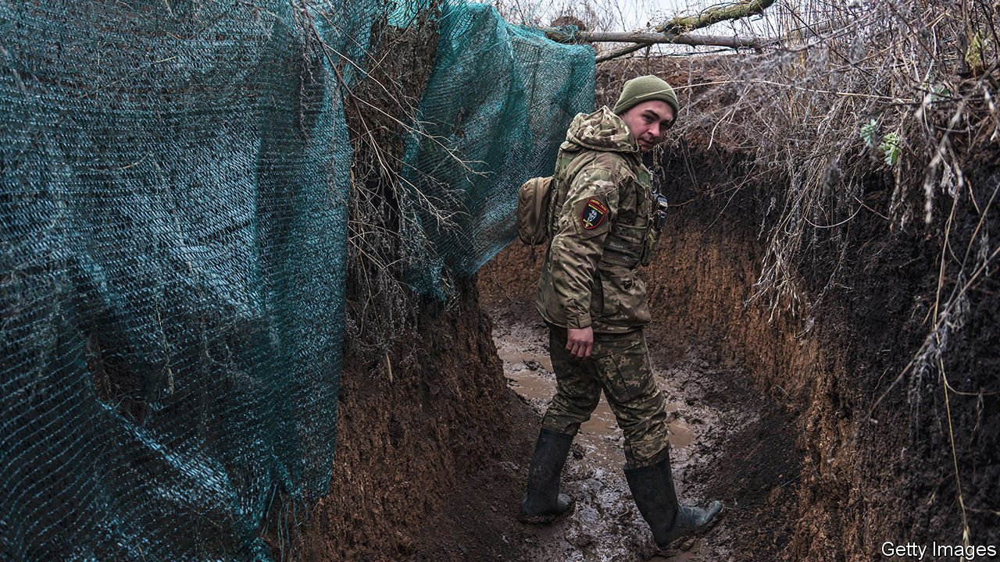

###### Putin’s brinkmanship

# Russia’s menacing of Ukraine is unlikely to induce NATO to retreat 

##### It may have the opposite effect 

 

> Jan 8th 2022 

AS THE COLD war reached its denouement three decades ago, the West was careful to temper its elation with magnanimity. “I have not jumped up and down on the Berlin Wall,” President George H.W. Bush pointed out to Mikhail Gorbachev, the last Soviet leader, at a summit in Malta in 1989. Months later James Baker, America’s secretary of state, delivered an assurance to Mr Gorbachev in Moscow: “If we maintain a presence in a Germany that is a part of NATO…there would be no extension of NATO’s jurisdiction…one inch to the east.” Even as the Soviet Union crumbled in 1991, John Major, Britain’s prime minister, repeated the pledge. “We are not talking about strengthening of NATO,” he said.

Yet strengthened NATO was. In 30 years the alliance has expanded more than 1,000km to the east of the former front line dividing Germany. A bloc that once shared only a slender border with Russia, in Norway’s northern fringes, now encompasses the Baltic states, former Soviet territories within 200km of St Petersburg and 600km of Moscow. Seven of the eight former members of the Warsaw Pact—the Soviet Union’s answer to NATO—have become part of NATO (see map). At a summit in Bucharest in 2008, America persuaded the rest of NATO to declare that Ukraine and Georgia “will become” members—a promise reiterated last month.

 


For Vladimir Putin, Russia’s president, this was both an indignity and an encroachment. “What the US is doing in Ukraine is at our doorstep,” he thundered at a meeting with military officers on December 21st. “They should understand that we have nowhere further to retreat. Do they think we’ll just watch idly?”


The question was rhetorical. Mr Putin has spent much of the past year  near the border with Ukraine. The force of perhaps 100,000 troops may be the largest military build-up in Europe since the cold war. With that stick in hand, he issued demands on December 17th for “legal guarantees” of Russia’s security, in the form of draft treaties with America and NATO. In practice, Mr Putin was calling both for a massive retreat on NATO’s part and the creation of a semi-formal Russian sphere of influence in eastern Europe, the Caucasus and Central Asia.

Consider a few of the treaties’ provisions. The pact with NATO would require the alliance not only to rule out further expansion, but also to forgo military co-operation of any kind with Ukraine and other non-members in the former Soviet realm. Russia would not be bound by any reciprocal measures. Nor would NATO be allowed to place troops or weapons on the soil of its own members in eastern Europe, a condition that would involve dismantling the small NATO forces deployed in Poland and the Baltic states after Russia’s invasion of Ukraine and annexation of Crimea in 2014. The agreement with America would entail the withdrawal of American nuclear weapons from Europe, without any constraint on Russia’s considerable arsenal of comparable tactical nuclear weapons.

Even many Russian observers were stunned by the audacity of these demands. “Dear Father Christmas,” quipped Elena Chernenko, a journalist at Kommersant, a leading Russian newspaper, “Please give me a live unicorn for the new year.” That the proposals were published openly, rather than presented with the discretion typical of sensitive negotiations, suggested that Russia knew they were unlikely to fly, notes Dmitri Trenin, a former army officer who is director of the Carnegie Moscow Centre, a think-tank. Veteran Russia-watchers are struck by the unexplained sense of urgency, but it hardly suggests an appetite for patient diplomacy. “If there is no constructive response within a reasonable time,” warned Sergei Lavrov, Russia’s foreign minister, on December 31st, “then Russia will be forced to take all necessary measures to…eliminate unacceptable threats to our security.”

One interpretation is that Mr Putin is counting on the West to dismiss his maximalist demands, furnishing him with a pretext to invade Ukraine. In recent weeks Mr Putin and his ministers have made lurid and ridiculous allegations, ranging from the suggestion that Ukraine is perpetrating genocide on ethnic Russians to the idea that American mercenaries are preparing a chemical-weapons attack in the Donbas region of eastern Ukraine, which is controlled by Russian proxies.

Use before thaw

Though European and American officials say Russia has not yet made a final decision to invade Ukraine, it will probably have to decide whether to launch an operation by the end of winter, says Michael Kofman of CNA, a think-tank. Troops cannot be kept on an invasion footing indefinitely, some of them thousands of kilometres from their normal bases, without their morale plummeting and their vehicles requiring maintenance. Ukraine’s frozen ground will begin to thaw in March, making it harder for tanks to advance. In April Russia’s conscripts will also be replaced with a new, inexperienced cohort.

Nonetheless, perhaps to avoid giving Mr Putin the opportunity to claim that he has run out of diplomatic road, America has agreed to talk. A phone call between Joe Biden, America’s president, and Mr Putin on December 30th was “frank, meaningful and…quite constructive”, noted Yury Ushakov, an aide to Mr Putin. “It is important that the American side has demonstrated its willingness to understand the logic and essence of Russian concerns,” he added. Diplomats from both countries are due to meet in Geneva on January 10th. Two days later the NATO-Russia Council will meet in Brussels for the first time in years, and on January 13th the Organisation for Security and Co-operation in Europe (OSCE), a group that includes Russia and all NATO countries, is to gather in Vienna.

The flurry of diplomacy satisfies Mr Putin’s desire for a seat at the top table and for a chance to air his grievances. Yet talking alone may not quench Mr Putin’s thirst for vindication. On December 27th Mr Lavrov warned against “endless discussions, which is something the West knows how to do and is notorious for”. Mr Putin will want something he can present as a diplomatic victory. What that might be is less clear, but Mr Putin and Mr Biden “are signalling a readiness to go around the conventional roadblocks to diplomacy on European security”, suggests Matthew Rojansky of the Kennan Institute in Washington. He sees two areas of potential co-operation: missiles and conventional arms control.

Missiles may not seem a propitious place to start. In 2019 America abandoned the Intermediate-range Nuclear Forces (INF) treaty, which barred land-based missiles with ranges between 500km and 5,500km, arguing that a new Russian missile violated it. America and NATO have repeatedly dismissed Russia’s offer of a moratorium on such weapons, arguing that Russia has already deployed them. For its part, Russia claims that American anti-missile interceptors under construction in Romania and Poland can be repurposed as offensive missile launchers.

Even so, both America and Russia might find grounds for compromise. Mr Putin routinely frets that if America were to place hypothetical medium-range missiles in eastern Europe, including in Ukraine, they could reach Moscow in minutes. Meanwhile, Mr Putin’s own cruise missiles in Kaliningrad could reach Berlin just as quickly. A deal which barred those missiles from Europe but left America free to deploy them against China in Asia—essentially a resurrected and regionalised INF treaty—might appeal to both sides.

If missiles prove intractable, another subject of discussion could be conventional arms control. Here, too, both sides have a long, and long-standing, list of gripes. A pact signed in 1999, the Adapted Conventional Forces in Europe (ACFE) treaty, withered away after Western countries accused Russia of failing to withdraw in a timely fashion from Moldova and Georgia, both former Soviet republics. Russia suspended its participation in 2007 and withdrew from the treaty altogether in 2015, angry that others had not ratified it.

Western allies complain that Russia has bent other rules requiring countries to give advance notice of large exercises—like last year’s Zapad exercise—by pretending that big drills are in fact a series of separate smaller ones. Russia, in turn, says that the West has failed to consider its suggestions, made over recent years, for confidence-building measures, such as proposals for warplanes to use transponders, greater notice of long-range bomber flights and the movement of exercises away from borders.

A new, full-blown treaty governing such things is unlikely. For NATO to forgo drills near Russia would be tantamount to cutting off the Baltic states, no part of which is far from Russia. Nor would Russia consider a reciprocal ban on exercises in Kaliningrad, an exclave between Poland and Lithuania, or Murmansk, near Norway, or Belarus, which abuts Poland, says Dmitry Stefanovich of IMEMO, an institute linked to the Russian Academy of Sciences. But greater transparency and limits on the size of exercises are possible, he says, and would build trust. Olga Oliker of the International Crisis Group, yet another think-tank, suggests that the Black Sea would be a promising candidate for mutual restraint with, for instance, NATO countries conducting fewer patrols near Crimea in exchange for Russia accepting constraints on its Black Sea Fleet. “All of this could be sorted out,” she says. “But everybody has to be willing to sit down and compromise.”

Measures like these would be welcome, whatever happens in Ukraine. It is unlikely, though, that Mr Putin has threatened war simply to obtain more detailed spreadsheets about forthcoming NATO exercises. His animus is against the post-cold-war order as a whole, and Russia’s exclusion from it. In his narrative America and its European allies took advantage of Russia’s weakness in the 1990s and early 2000s by discarding their promises not to expand NATO; by waging war on Serbia, a Russian ally, in 1999; and by supporting so-called “colour revolutions” against authoritarian, pro-Russian regimes in former Soviet states. Indeed, this week pro-Kremlin news outlets claimed, fancifully, that anti-government protests in  reflected a Western effort to eject friends of Russia from power.

It is true that Russia received various assurances that NATO would not expand—but it also willingly acquiesced when NATO changed its stance. In 1997—even as the Czech Republic, Hungary and Poland were being invited to join the alliance—Russia and NATO signed a “founding act” in which Russia accepted NATO enlargement. In exchange, NATO ruled out the “permanent” deployment of “substantial combat forces” in eastern Europe or the placement of nuclear weapons there, a constraint it observes to this day. What is more, America withdrew huge numbers of troops from Europe after the cold war and European countries shrank their armed forces dramatically.

These steps had a salutary effect on Russia’s perception of the alliance. In 2001, shortly after the 9/11 attacks, Mr Putin met NATO’s secretary-general and hailed “the change in the attitude and…outlook of all the Western partners”. As late as 2010, by which time a dozen new countries had joined NATO, Dmitry Medvedev, then Russia’s president, agreed, “We have succeeded in putting the difficult period in our relations behind us now.”

It’s not me, it’s you

Relations have deteriorated more recently not owing to aggression from NATO, but because Russia, unwilling to countenance more former Soviet territories going their own way, invaded Georgia in 2008 and Ukraine in 2014. It has also waged political warfare across America and Europe over the past decade, in the form of election-meddling, sabotage and assassination. At home, Mr Putin has suffocated democracy by rigging elections, poisoning opponents and crushing civil society. “Putin does not fear NATO expansion today,” argues Michael McFaul, a former American ambassador to Russia. “He fears Ukrainian democracy.”

NATO has no stomach to admit Ukraine at the moment, with all the risks of war with Russia that would bring. But ruling out Ukrainian membership would not necessarily placate Mr Putin. “The Kremlin knows that there’s no intention by NATO to include Ukraine and Georgia any time in the near future,” says Wolfgang Ischinger, a former German diplomat and chairman of the Munich Security Conference, an annual powwow. “The underlying problem is the fear of Ukraine modernising and becoming an attractive model for Russians who live on the other side of the border.”

 


Meanwhile, for NATO to formalise the obvious—that Ukraine will not join any time soon—would be a hammer blow to the country’s reformers, who have even written their aspiration to enter the club into the constitution. To make such a declaration in response to Russian sabre-rattling would be doubly unpalatable. One way to square the circle, suggests Mr Ischinger, would be to adopt the position taken by the European Union in recent years: that, while enlargement is the goal in principle, the union must first reform itself. That might let down Ukraine gently, without giving the impression that Russia has a veto over the alliance’s expansion.

Ukraine is not the only place where this dilemma arises. Georgia was also invited to join in 2008 but its accession would also entail NATO inheriting another open conflict; Russia occupies a fifth of the country, in the breakaway territories of Abkhazia and South Ossetia. Meanwhile in the Balkans, Bosnia-Herzegovina, another candidate, is also some way off, with the country’s Bosnian Serb leadership increasingly opposed to membership.

Russia also objects to the expansion of NATO to include Sweden and Finland, which were both neutral during the cold war, but have moved closer to NATO in recent years. In Sweden a parliamentary majority in favour of NATO membership emerged in December 2020, though the ruling Social Democrats are opposed. Finland, meanwhile, is keen to keep its options open. On January 1st, days after Russia’s foreign ministry threatened “serious military and political consequences” if Sweden or Finland were to join the alliance, Sauli Niinisto, Finland’s president, rejected Russia’s attempts at intimidation. “Finland’s room to manoeuvre and freedom of choice,” warned Mr Niinisto, “include the possibility of military alignment and of applying for NATO membership, should we ourselves so decide.”

The irony is that Russia’s efforts to halt NATO’s eastward expansion may end up achieving precisely the opposite. Russia’s invasion of Ukraine in 2014 rejuvenated the alliance, catalysed a sharp rise in European defence spending and led to the creation of the very NATO deployments in eastern Europe that Mr Putin now wants withdrawn. Another, larger Russian attack would probably lead to even larger deployments; Mr Biden has already said that he would move troops east.

By the same token, although a second Russian invasion of Ukraine might put an end to any prospect of Ukraine joining NATO, it could well push other countries into the alliance. “It’s hard to say whether a Russian invasion of the entirety of Ukraine would be enough to tip the scales,” muses one senior Finnish official, “but that would be possible. There’s an increasing understanding that even though Ukraine may be geographically hundreds of miles away from Finland, Europe is one theatre.”

For Mr Putin, the gamble may be worth it. Better to start a war now, despite the attendant costs, than risk a Ukraine bristling with foreign troops in a decade. Thirty years ago Robert Jervis, a political scientist, applied prospect theory, a branch of behavioural economics, to war and peace. The theory notes that people tend to run greater risks when they feel they are losing. “Wars will then frequently be triggered by the fear of loss,” he wrote. “When states take very high risks it is usually the case that they believe they will have to accept certain losses if they do not.”

What Mr Putin claims is a quest for security—“we have nowhere further to retreat”—looks to the rest of Europe like a brazen effort to recapture formerly captive states, and to keep them under some form of Russian sway. An insecure Kremlin that lashes out to make itself more secure thereby compounds a spiral of insecurity. Mr Ischinger, the former German diplomat, recalls asking a very senior Russian official in Moscow in 1993 about how the country intended to assuage the fears of newly liberated countries like Poland and Ukraine. “What’s wrong with our neighbours living in fear of us?” replied the official. “Unfortunately,” says Mr Ischinger, “very little, if anything, has changed.” ■

