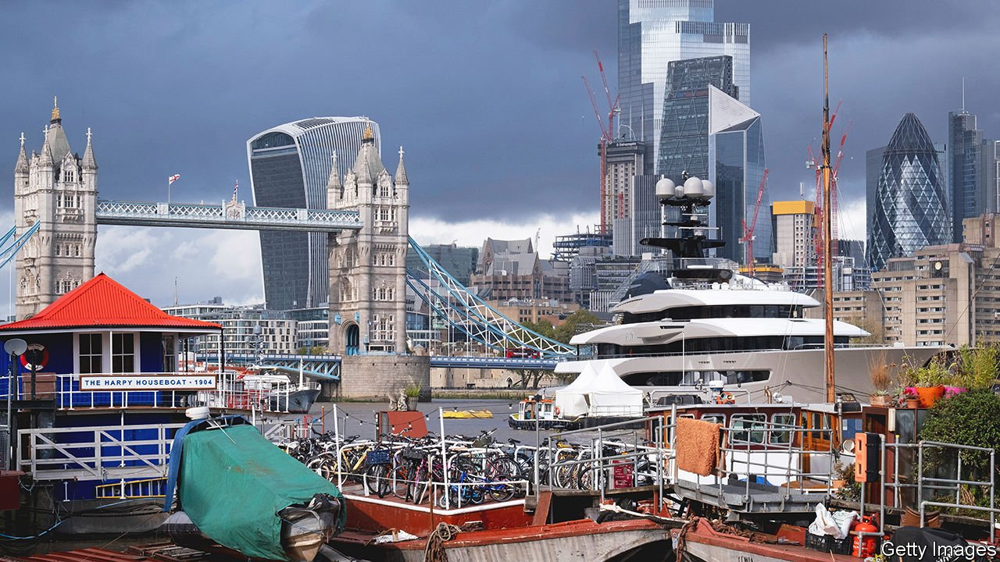

###### Balancing act

# Britain’s government is trying to protect national security 

##### Without throttling investment that will be tricky 

 

> Jan 8th 2022 

ON JANUARY 4TH a new investment-screening law came into effect, heralded by the government as “the biggest shake-up of the UK’s national-security regime for 20 years”. That is no exaggeration. It marks a shift away from economic openness towards suspicion and intervention. Kwasi Kwarteng, the business secretary, said it would show members of the public that “their security remains our number one priority”. What could go wrong?

The government is seeking to stop assets vital to national security falling into hostile hands. A report in 2017 warned that “ownership or control of critical businesses or infrastructure could provide opportunities to undertake espionage, sabotage or exert inappropriate leverage”. The context is concern about Chinese investment, and pressure to fall into line with allied countries such as America, Australia and Germany that have already tightened up.


Investors in 17 sectors, including artificial intelligence and communications, will have to notify the government if they are acquiring more than 25% of a company. The government will review, and may block, the transaction. It does not matter if the company is small or the investor British. If a deal should have been brought to the government’s attention but was not, it may be voided. Companies trying to sell overseas assets used “in connection with activities” in Britain could also face review.

This new regime is very broad. It is backdated, covering deals that went through since November 2020. “National security” is undefined, and the government can intervene in deals outside the 17 named sectors, if it so chooses. Other countries generally limit such screening to fewer sectors, to acquisitions of domestic entities and to foreign investors. The broad scope of Britain’s rules reflects how hard it is to protect against evolving, ill-defined threats. But it may also complicate enforcement, especially when it comes to overseas assets.

Another risk is of deterring welcome investments. Though the forms are quite straightforward, and the upfront costs relatively reasonable—as little as a few thousand pounds for small firms—the extra steps may cause delay. Extra information may be demanded before an application is processed, for example. Moreover, the government estimates that in complex cases a full national-security assessment could cost more than £120,000 ($160,000). Venture-capital and private-equity investors taking minority stakes in early-stage companies are especially likely to be put off, says Becket McGrath of Euclid Law, a legal firm, since they are unused to government departments nosing round deals.

Yet another worry is that uncertainty over the new system will clog it up. The government has tried to be clear in its definition of the 17 sectors where notifications are mandatory, but there will inevitably be borderline cases. Investors who fail to notify deals that should have been notified risk fines and prison time. They might therefore decide to err on the side of caution, slowing everything down. “I’m very concerned that from January 4th there’s going to be a flood of notifications,” says John Adebiyi of Skadden, Arps, Slate, Meagher &amp; Flom, a law firm.

A final risk is that the government is too enthusiastic with its red pen. Unlike some European regimes, Britain’s is not supposed to be used for industrial policy: national security is supposed to be the only criterion when deciding whether to allow a deal to go ahead. But there is sufficient discretion that political pressure to reject foreign takeovers may be hard to resist.

There is no doubt that the government is planning to become more meddlesome. Since 2002, when the previous regime came into effect, there were just 12 national-security interventions. An official impact assessment published in November 2020 estimated that the annual number of notifications under the new arrangements might be as high as 1,000-1,800, with around ten subjected to formal remedies. The government claims that the new rules should encourage investment by enhancing perceptions of Britain as a stable business environment. That reputation will have to be earned. ■

