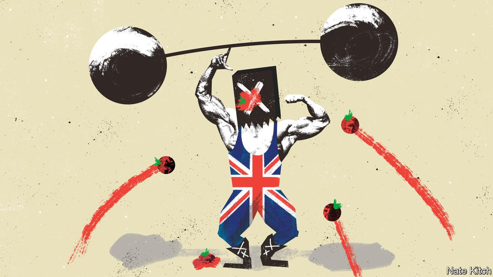

###### Bagehot

# Kicking winners: Britain’s political economy 

##### British politics has a unique disdain for the country’s strengths 

 

> Jan 8th 2022 

MOST COUNTRIES take pride in their successful industries. Olaf Scholz, the new German chancellor, hosted a rally for Volkswagen’s workers, ignoring a decade of corporate misdeeds by the carmaker. After his health minister suggested easing off the wine, Emmanuel Macron boasted that he drank it at lunch and dinner and shuddered at the idea of dry January.

In Britain politicians take a different tack, ignoring, disdaining or even actively despising the most successful sectors of the economy. Everything from banks to universities is denigrated. Two centuries ago David Ricardo came up with the notion of comparative advantage, that countries should focus on producing goods and services in areas where they are relatively efficient. Britain’s politicians have turned this on its head: comparative disadvantage is in vogue.


Part of the problem is political geography. Take London. During the past three decades it has been transformed from a shrinking husk into a global powerhouse. Its productivity means that it pays £36bn ($49bn; 2% of GDP) more in taxes than it gets back in public spending. Both Boris Johnson, the prime minister, and Sir Keir Starmer, his Labour counterpart, represent London seats. But they keep quiet about it—except when exchanging barbs. “You can take the lawyer out of Islington but you can’t take Islington out of the lawyer,” Mr Johnson once said. In fact, Sir Keir does not live in Islington, but Mr Johnson did for many years.

Both parties are desperate to avoid being painted as metropolitan. Lisa Nandy, the Labour shadow minister for “levelling up”, frequently laments high investment in cities, arguing that regeneration in Manchester has failed to boost Wigan, her constituency. But wealth flowed from London to Woking perfectly efficiently. The problem is not that places like Manchester became too much like London; it is that they are still not enough like London, with too little wealth to spread. But now that the frontline of British politics is in towns, such arguments go down poorly. Politicians do not follow growth, but votes.

If cities have fallen out of favour politically, the City has fallen furthest of all. Financial firms have few political friends. As mayor of London between 2008 and 2016, Mr Johnson was a booster of banks; as prime minister, his government is an enthusiastic basher. The finance sector was sacrificed during Brexit negotiations. Virtually none of its demands were met. Again, the negativity runs across party lines. Labour is twitchy about Tony Blair’s economic model, namely being intensely relaxed about people getting filthy rich as long as they paid their taxes. The era of encouraging prosperity and sharing out the gains is over.

One reason Britain’s strongest professions struggle to gain a sympathetic hearing is that they fall on the wrong side of the “Richard Scarry rule”. Named for the much-loved author and illustrator, this warns politicians against picking fights with workers depicted in children’s books. So fishermen will always find political allies; traders, lawyers and management consultants will struggle. The best-known reference to lawyers in the English canon comes in “Henry VI”, where a character suggests that the quickest way to improve the country would be to kill them all.

Another is that, when it comes to economic matters, British politicians can be puritanical. They seem to think the country’s thriving creative industries are not serious enough to merit praise. They talk about Premier League football as if it were a mere den of iniquity, rather than Britain’s most potent cultural export. Videogaming is dismissed as a hobby rather than acknowledged as a national strength. When Nadine Dorries became culture secretary in 2021, her main qualification was a willingness to put the boot into luvvies. In the same vein, politicians seem to see culture as easy and industry as hard. This gets things backwards. Any big European country could host a Nissan factory. But few could devise ITV’s teatime quiz, “The Chase”, which has been a global success.

Higher education is one of the few sectors where Britain can truly claim to be, in Westminster’s peculiar vernacular, “world-beating”. But the big rise in students going to university is cue for hand-wringing by (degree-holding) commentators, as if three more years of education over 80 years of life will lead to decadence. If the push to cut student numbers succeeds, it will be the University of Bolton that downsizes, not the University of Manchester. For a government set on levelling up—delinking opportunity from geography—this is a bad idea. In a place like Teesside, the new freeport may snatch headlines and be graced with visits by politicians in hi-vis jackets. The expanding university, which has helped stem the region’s decline, is sometimes ignored.

Many of these factors are long-standing—and indeed, Britain’s star industries may have flourished in part because of political neglect, rather than despite it. But Brexit ripped up its economic blueprint. Universities, financial and legal firms, and the creative industries were boosted by EU membership, and no party has identified a replacement. Many voters seem not to care. About two-thirds of pensioners supported the Conservatives, who promised a hard Brexit, at the election in 2019. So did nearly 60% of people who own their home outright. To someone with no rent or mortgage, and an inflation-linked pension, it may seem of little concern whether Britain’s strongest industries wither.

Hard hats v mortarboards

Indeed, comparative disadvantage has its fans. Politicians are kicking winners because they think it will be popular. After all, bankers deserved opprobrium after the financial crisis. And man cannot live by quiz shows alone. If a voter’s town struggles, it is easy to resent a thriving London. Many felt that the old system did not work for them, and so politicians stood on a platform of smashing it. Britain’s economy was lopsided. But it is easier to fix weakness if you also play to your strengths. ■

Read more from Bagehot, our columnist on British politics:

 (Dec 18th) (Dec 11th)

 (Dec 4th)

