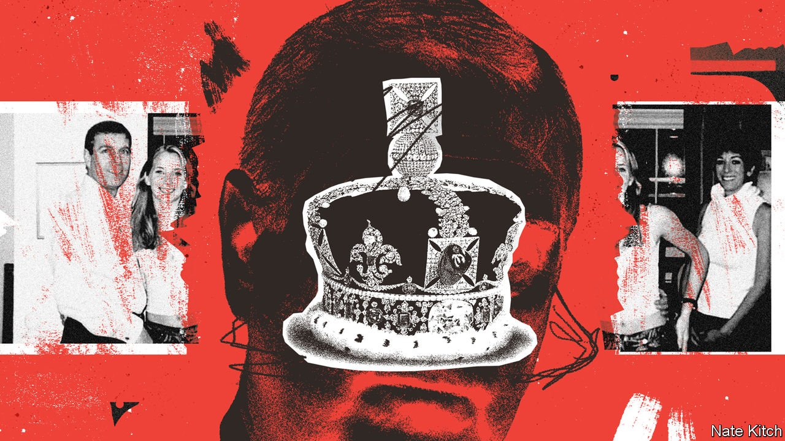

###### A question of consent

# The harm Prince Andrew does to the crown 

##### Hereditary monarchy rests on consent. A sexual-assault case undermines that 

 

> Jan 8th 2022 

 PRINCE ANDREW does not deny that it is him in the photograph. But is it really his hand clasped around the waist of 17-year-old Virginia Roberts? He cannot be sure. In fact, he told the BBC in 2019, he had no memory of the picture being taken. It showed him in travelling clothes, he mused, but when in London he would wear a suit and tie, and he certainly didn’t go around hugging people. He had never been upstairs in the house of Ghislaine Maxwell, his socialite friend, where the snap was taken. And had it really been Jeffrey Epstein behind the camera? The prince hadn’t ever seen his friend take a picture.


That photograph haunts the queen’s second son. Mr Epstein would later be convicted of procuring a minor for prostitution, and in 2019, after being charged with further sex offences, he hanged himself with a prison bedsheet. On December 29th Ms Maxwell, visible in the picture behind Ms Roberts, was convicted by a Manhattan court of sex-trafficking offences. As for the prince, Ms Roberts (who now goes by her married name, Giuffre) is suing him for “exemplary and punitive” damages.

In a civil case in New York, she has alleged that after the snap was taken, she was forced to have sex with the prince against her will. She claims that he abused her at Epstein’s homes in New York and the US Virgin Islands, while knowing that she was a victim of sex-trafficking. He vehemently denies the allegations and says he has no recollection of meeting her. At a hearing on January 4th his lawyers sought to have the case struck out on the basis of a settlement Ms Giuffre signed with Epstein in 2009; the judge said he would give his decision “pretty soon”, which has been widely interpreted as meaning within days.

However the case plays out from here, monarchists can try to argue that the crown is insulated from it. Although for his first 22 years Prince Andrew was second in line to the throne—just one nasty polo accident away from heir-apparent—his elder brother Charles’s children and grandchildren have pushed Andrew back to ninth in the line of succession. The monarchy is popular, too: a survey in 2021 by YouGov, a polling firm, found that voters prefer it to a republic by 61% to 24%. Prince Andrew’s difficulties have not dented the queen’s sky-high approval ratings. The royal family has weathered centuries of sexual misdeeds by dissolute princes. There is no republican caucus in Parliament. Europe’s defunct monarchies fell as a result of war and calamity: during peacetime they have survived through inertia.

Yet the allegations pose a threat to the monarchy, all the same. In June Britain is due to celebrate the 96-year-old Queen Elizabeth II’s platinum jubilee, marking 70 years since her accession. It may be the final grand spectacle of her reign. When it comes, the coronation of King Charles will be a renewal of the public’s consent to the hereditary monarchy that forms the apex of the British constitution.

Once upon a time, that consent rested on principle. The inheritance of titles, land and property through primogeniture was believed in as a good in itself. That belief was bolstered by widespread religious faith: a British monarch is sworn to defend the Protestant church. As late as 1956, a third of Britons thought the queen had been chosen by God.

But as her reign wore on, principle was no longer enough. Britain’s monarchy became what Vernon Bogdanor, a constitutional historian, calls “utilitarian”, with legitimacy resting on the good it does. It became necessary for royals to be hardworking and do-gooding. It embraced the rhetoric of meritocracy: never mind how the queen got her job, what mattered was that she performed it as well as any elected head of state. Intimacy succeeded reverence: nowadays, commoners love the royal family in part because they think they know it.

Ms Giuffre’s allegations have thrown all this into doubt. Britain’s main anti-monarchist movement, Republic, plans to step up its campaigning during the jubilee. It hopes the succession will open up debate on the constitution. The queen is the royal family’s “heat shield”, says its leader, Graham Smith. “When she is gone they’re going to be very vulnerable.”

A utilitarian monarchy is undermined by a prince who has been forced by scandal to abandon his duties, and now passes the time horse-riding in the grounds of Windsor Castle. A meritocratic monarchy is undermined by a prince unsuited to diplomacy, whose alibis have been widely ridiculed and who, even after Epstein’s death, declared he had no regrets about their “very useful” friendship. It is a reminder that heredity is a lottery, sometimes throwing up stars like Queen Elizabeth II, and sometimes duds. As for intimacy, the royal family’s affairs and divorces in the 1990s bound the monarchy closer to ordinary people, with their own messy marriages. The allegations made about Prince Andrew are hardly relatable.

The bare fact of Ms Giuffre’s case, whether it succeeds or fails, leaves the royal family with no good options for dealing with Prince Andrew. There is talk of sending him into internal exile: asking him not to use his titles and stripping him of his military ranks. That would leave him in the line of succession. But the alternative—him renouncing his claim to the throne—would probably be even more damaging. It is fundamental to a hereditary order that succession is automatic and beyond debate. Start tinkering with the line because one son is better qualified, more popular or more moral, and the logic falls apart.

As Edward Bulwer-Lytton, a Whig politician in the 19th century, once put it: “What suicide is to a man, abdication is to a king.” That is why Edward VIII’s abdication in 1936 was so traumatic, and why Prince Harry, despite having “stepped back” from royal duties for a more glamorous life in Hollywood, remains sixth in line. The monarchy cannot tolerate Prince Andrew on the inside, but it cannot eject him either. The best it can do is close its eyes, and pretend he was never there.

